# The $100M Business Framework
### From Raw Idea → Validated Product → Scaled Company

> **Source synthesis:** No Fluff Entrepreneurs (14-session program), Hossein Mehdipour's Design Thinking Scaling Framework (Stabokon University, Milan), CondoMateOS advisor meeting notes, and strategic AI augmentation.

---

## Master Roadmap

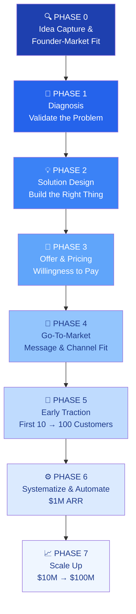

---

## PHASE 0 — Idea Capture & Founder-Market Fit

> **Core question:** *Are you the right person to solve this problem?*

### 0.1 The Idea Stress Test

Answer these 5 questions before doing anything else:

| Question | What You're Testing |
|---|---|
| Have you personally felt this pain? | Founder-market authenticity |
| Do you know 10+ people who share this pain? | Market existence |
| Can you explain the problem in one sentence? | Clarity of thinking |
| Is there money currently being spent on imperfect solutions? | Willingness to pay signal |
| Do you have unfair access to this market? | Competitive moat |

**Rule:** If you can't answer YES to at least 3 of 5, reconsider the idea before investing time.

### 0.2 Founder-Market Fit Score

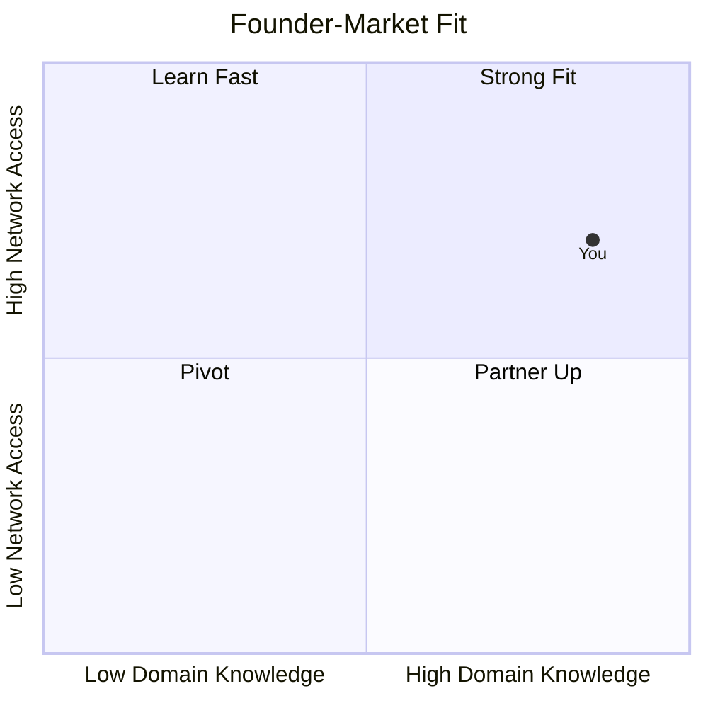

**Strong Fit** = You have lived the problem AND have access to people who share it. This is your most credible positioning asset. Never understate it.

### 0.3 Lightbulb Moment Journal

Write your backstory now. It becomes your core WHY:

```
My lightbulb moment was when I noticed _____________________.

I had been experiencing ______________________ for ______ years.

I looked for solutions and found _________________________, but they fell short because _________________________.

That's when I knew someone needed to build _________________________.
```

---

## PHASE 1 — Diagnosis: Validate the Problem

> **Core question:** *Is this a real, painful, and frequent enough problem?*

### 1.1 Niche Definition

**Do not skip this.** Every downstream decision flows from your niche.

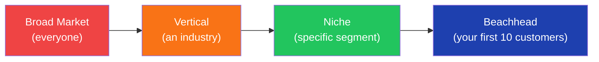

**Niche Definition Checklist:**

- [ ] Industry / vertical defined
- [ ] Company/customer size defined (e.g., 8–50 units, 100–500 employees)
- [ ] Geography defined (e.g., Calgary, AB → Western Canada)
- [ ] Role of buyer defined (e.g., volunteer board president)
- [ ] Frequency of pain defined (daily? monthly? annually?)
- [ ] Payment capacity confirmed (can they actually afford a solution?)
- [ ] Decision-making process mapped (who says yes?)

### 1.2 Ideal Customer Profile (ICP)

Build your ICP before talking to customers. Refine it after.

| Attribute | Your ICP |
|---|---|
| Segment Name | |
| Demographics | |
| Firmographics (if B2B) | |
| Core Role / Title | |
| Top 3 Pain Points | |
| Current Workarounds | |
| Trigger Events (what makes them seek a solution now?) | |
| Budget Range | |
| Decision-Making Authority | |
| Where They Spend Time Online | |

> "It cannot be that every customer is going to be your ideal client." — Hossein Mehdipour

### 1.3 Problem Validation: Real Person Interviews

**Target:** 10–15 interviews minimum before building anything.

**Interview Framework:**

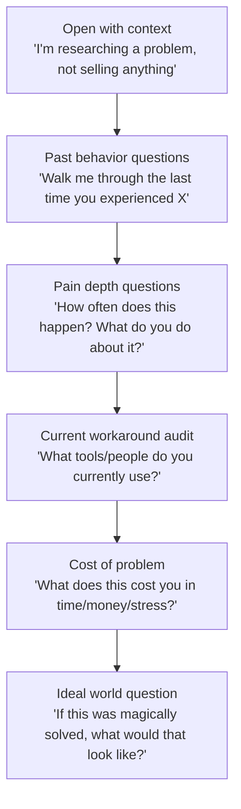

**Green flags in interviews:**
- They describe the problem without you prompting it
- They tell a specific story about when it hurt them
- They're already paying (time or money) for a workaround
- They lean forward and ask "so what are you building?"

**Red flags:**
- Vague agreement ("yeah that could be annoying")
- No current workaround (problem isn't painful enough)
- They say yes to everything you suggest

### 1.4 Problem Statement Definition

Use the Problem Tree to go deep:

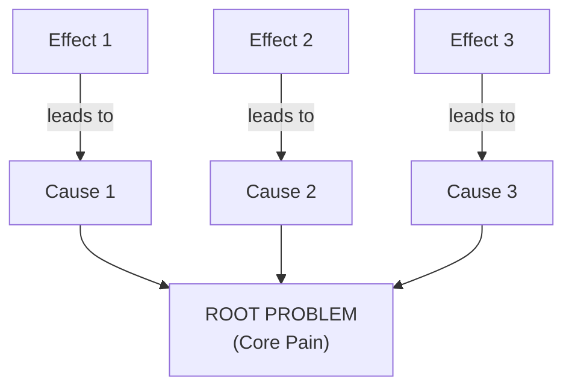

**Problem Statement Formula:**

> [Your ICP] struggle with [specific problem] when [context/trigger], which causes [quantified consequence], because [root cause]. Current solutions fail because [gap].

### 1.5 Empathy Map

For each ICP segment, complete this map:

| What They... | Content |
|---|---|
| **Think & Feel** | Worries, aspirations, what really matters |
| **See** | Environment, what they observe others doing |
| **Hear** | What colleagues, friends, and influencers say |
| **Say & Do** | Public attitude vs. private behavior |
| **Pain** | Frustrations, obstacles, fears |
| **Gain** | Wants, needs, measures of success |

---

## PHASE 2 — Solution Design: Build the Right Thing

> **Core question:** *Does my solution directly map to the top 3 pains?*

### 2.1 Ideation Methods

Run at least one of these before committing to a solution:

**Yes-And Brainstorm:** Build on every idea without rejection for 20 minutes.

**Challenging Orthodoxies:** List every "obvious" assumption about your industry and ask: *what if the opposite were true?*

**Mega-trends Mapping:** Which macro trends (AI, remote work, aging population, regulation) are making this problem worse right now? Your solution should ride a tailwind.

### 2.2 Idea Evaluation Matrix

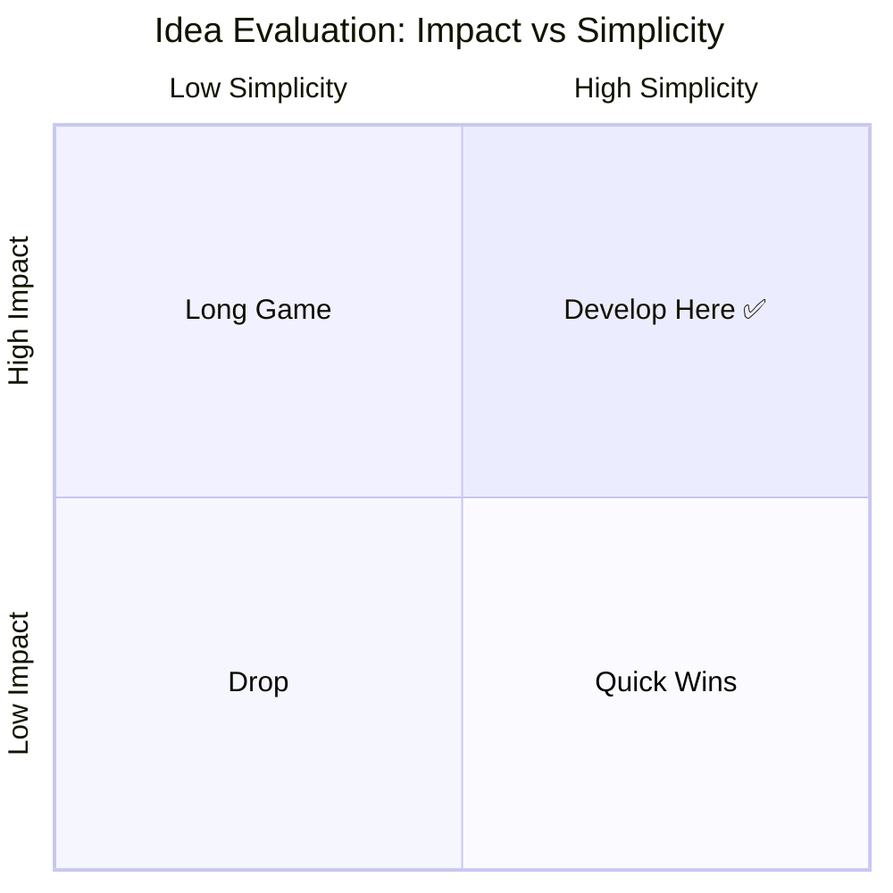

**Develop Here** = High Impact + High Simplicity. Start here. Always.

### 2.3 Solution–Problem Alignment

**Rule:** Every solution must directly answer one of your top 3 problems.

| Problem | Solution | Feature(s) | Priority |
|---|---|---|---|
| Pain Point 1 | Solution Statement 1 | Feature A, B | Must Have |
| Pain Point 2 | Solution Statement 2 | Feature C | Should Have |
| Pain Point 3 | Solution Statement 3 | Feature D, E | Nice to Have |

> "Solutions are NOT the same as features. The feature is how you deliver the solution." — No Fluff Entrepreneurs, Session 5

### 2.4 Feature Prioritization (MoSCoW)

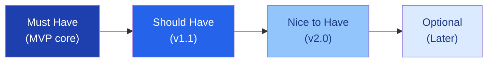

**Validate before building:** No feature gets built without at least one customer saying "I would pay for this."

### 2.5 Lean Canvas

Complete all 9 blocks before writing a single line of code or copy:

| Block | Your Answer |
|---|---|
| **Problem** (Top 3 pains) | |
| **Customer Segments** | |
| **Unique Value Proposition** | |
| **Solution** (Top 3 features) | |
| **Channels** | |
| **Revenue Streams** | |
| **Cost Structure** | |
| **Key Metrics** | |
| **Unfair Advantage** | |

> Lean Canvas is never finished. Revisit it every 90 days.

---

## PHASE 3 — Offer & Pricing: Willingness to Pay

> **Core question:** *Will they actually pay for this?*

### 3.1 The Killer Offer Stack

A great offer is not just a product. It's a value stack with urgency.

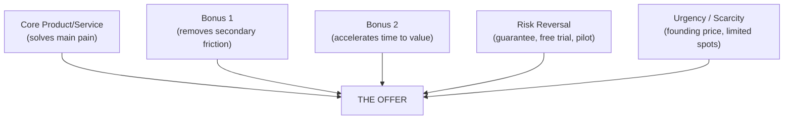

> "You have to think about promotions, urgency, scarcity. It should be an offer they jump on board for." — Hossein Mehdipour

### 3.2 Pricing Strategy

**Step 1:** Anchor on value, not cost.

| Method | Formula | Use When |
|---|---|---|
| Value-based | 10–20% of the problem's cost to customer | B2B, clear ROI |
| Comparable | Benchmark against closest alternative | Market exists |
| Willingness-to-Pay | Ask 10 customers: "At what price would this be a no-brainer?" | Early validation |

**Step 2:** Run the Van Westendorp Price Sensitivity Test with 5–10 customers:

- "At what price is this too cheap to trust?"
- "At what price is this good value?"
- "At what price is this getting expensive but still worth it?"
- "At what price is this too expensive?"

**Step 3:** Validate thresholds:

```
30–50% of ICP say YES = Strong market signal. Move forward.
10–29% say YES = Refine offer and retest.
0–9% say YES = Rework offer OR exit the idea.
```

### 3.3 Revenue Model Selection

| Model | Best For | $100M Path |
|---|---|---|
| SaaS Subscription | Software, recurring value | High LTV, low churn |
| Usage-Based | API, transactions | Scales with customer success |
| Service Retainer | Consulting, managed service | High margin, hard to scale |
| Marketplace | Network effects | Winner-takes-most |
| Hybrid | Product + service | Best for early B2B |

**Unit Economics to track from Day 1:**

- **LTV** = Average Revenue per Customer × Average Lifespan
- **CAC** = Total Sales & Marketing Cost ÷ New Customers Acquired
- **LTV:CAC ratio** target: ≥ 3:1
- **Gross Margin** target: ≥ 60% for software, ≥ 40% for services

### 3.4 Break-Even Analysis

| Item | Value |
|---|---|
| Fixed Costs (monthly) | $ |
| Variable Cost per Customer | $ |
| Price per Customer (monthly) | $ |
| Break-Even Customers | Fixed Costs ÷ (Price – Variable Cost) |

---

## PHASE 4 — Go-To-Market: Message & Channel Fit

> **Core question:** *How do I reach the right people with the right message?*

### 4.1 Unique Value Proposition (UVP)

**Formula:**

> [Product/Service] helps [Customer Segment] solve [Top Problem] by [Key Benefit], unlike [Existing Alternative].

**Test your UVP:**

- [ ] Does it connect directly to your top 3 problems?
- [ ] Does it target your early adopters specifically?
- [ ] Does it answer What, Who, and Why?
- [ ] Does it show a "finished story" benefit (outcome, not feature)?
- [ ] Can you say it in under 10 seconds?

**High-Level Concept (Elevator Version):**

> "It's like [familiar reference] for [your niche]."

### 4.2 Customer Segments & Personas

Identify 2–3 segments. For each, build a persona:

| Attribute | Persona |
|---|---|
| Name & Photo | |
| Role & Context | |
| Day in the Life | |
| Top 3 Frustrations | |
| What Success Looks Like | |
| Preferred Communication | |
| Decision-Making Style | |

### 4.3 Early Adopter Profile

Early adopters are NOT your mainstream customers. They:

- Have the problem acutely right now
- Are actively searching for a solution
- Are willing to tolerate rough edges
- Will give honest, detailed feedback
- Know others with the same problem

**Why them specifically?** Because they pull your product forward. Mainstream customers wait for proof. Early adopters create the proof.

### 4.4 Channel Strategy

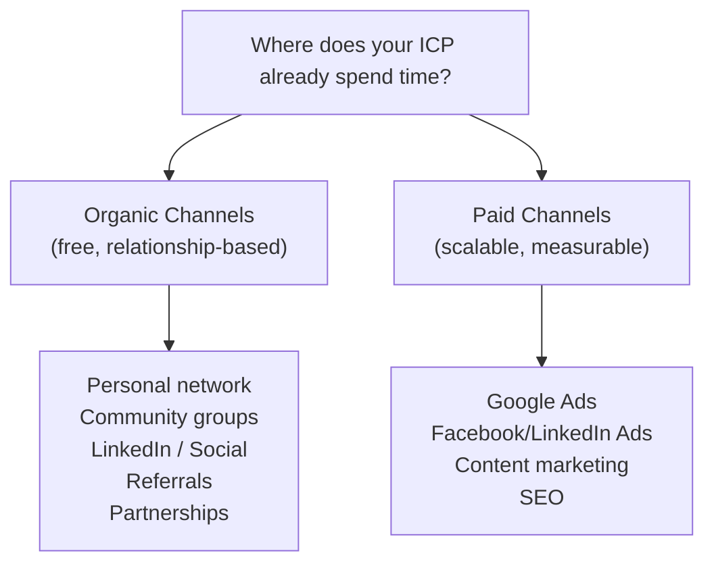

**Channel Testing Protocol:**

1. List ALL possible channels (free + paid)
2. Pick top 2 organic channels to test first
3. For each: define action, timeline, and success metric
4. Ask 3+ potential customers: "Where do you go to find solutions like this?"
5. Run for 30 days before judging results

### 4.5 Message-Channel Fit (A/B Test Matrix)

| Message Type | Channel 1 | Channel 2 | Channel 3 |
|---|---|---|---|
| Pain-point based | Test | Test | Test |
| Outcome/result based | Test | Test | Test |
| Features/benefits based | Test | Test | Test |

**Only invest in channels and messages that have tested positive.**

---

## PHASE 5 — Early Traction: First 10 → 100 Customers

> **Core question:** *Can I consistently find and convert my ideal customer?*

### 5.1 The First 10 Customers Playbook

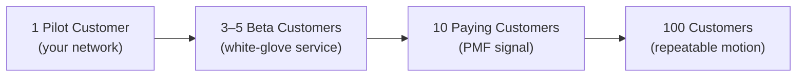

**Stages:**

**Customer 1:** Use your personal network. Do NOT charge full price. Get deep feedback. Treat as a partner.

**Customers 2–5:** Semi-warm outreach. Offer founding/beta pricing. Run white-glove onboarding. Document every bug, friction point, and success.

**Customers 6–10:** Apply learnings. Charge closer to full price. Measure NPS. Ask for referrals.

**Customer 11+:** You should now have a repeatable process, a case study, and a referral engine.

### 5.2 Beta Program Structure

| Element | Details |
|---|---|
| Duration | 30–90 days |
| Participants | 5–10 ideal customers |
| Pricing | 50–70% of planned price |
| Commitment | Weekly check-in calls |
| Deliverable | 3 detailed case studies |
| Exit criteria | NPS ≥ 8, 3 referrals generated |

### 5.3 Feedback Loop System

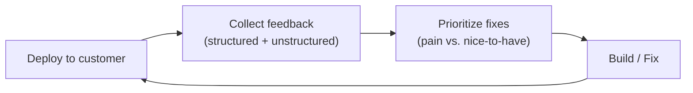

**Feedback collection methods:**
- Weekly 20-minute check-in calls
- In-product feedback widget
- Monthly NPS survey
- Quarterly strategic review

### 5.4 Product-Market Fit Signals

You have PMF when:

- [ ] NPS ≥ 40 (or >40% answer "very disappointed" if product disappeared)
- [ ] Churn rate < 5% monthly
- [ ] Customers referring others without being asked
- [ ] You're struggling to keep up with inbound demand
- [ ] Customers using the product in ways you didn't expect

---

## PHASE 6 — Systematize & Automate: Path to $1M ARR

> **Core question:** *Can the business run without you doing everything manually?*

### 6.1 Governance (Non-Negotiable)

Before scaling, establish team clarity:

| Decision | Answer |
|---|---|
| Who is full-time vs. part-time? | |
| What is each person's role? | |
| Commitment horizon (1–3 years)? | |
| Compensation / equity split? | |
| Commission structure for sales? | |
| Decision-making authority? | |

> "Without this clarity, expectations will diverge and execution will suffer." — Hossein Mehdipour

**Milestone-based governance works:** Define expectations at each milestone (first 5 clients, $50K ARR, $200K ARR) rather than trying to solve everything up front.

### 6.2 Process Mapping

Map every customer-facing and internal process:

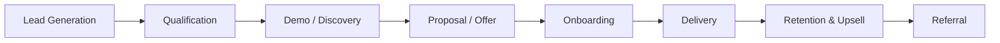

For each step: Who does it? How long does it take? What's the error rate? What's the bottleneck?

### 6.3 Automation Audit

**Only automate what you understand.** Do not automate broken processes.

| Process | Current State | Automation Candidate? | Tool |
|---|---|---|---|
| Lead capture | Manual | Yes | CRM |
| Onboarding checklist | Manual | Yes | Workflow automation |
| Invoice processing | Manual | Yes | AI + accounting |
| Customer communications | Manual | Partial | Templates + triggers |
| Reporting & metrics | Manual | Yes | Dashboard |

**Automation sequence:** Understand → Standardize → Automate → Monitor.

### 6.4 Advisory Board

Build a 4–5 person advisory board when targeting enterprise or scaling beyond $250K ARR.

| Advisor Profile | What They Bring |
|---|---|
| Business Development | Deals, partnerships, networks |
| Technical / Product | Credibility with technical buyers |
| Industry Insider | Domain trust, warm intros |
| Go-to-Market | Sales methodology, channel expertise |
| Former Founder | Pattern recognition, investor access |

**Compensation:** 0.25–1% equity (vesting over 2 years), no cash. Monthly meeting cadence.

### 6.5 Key Metrics Dashboard

Map your customer journey, then pick 3–5 metrics that show progress:

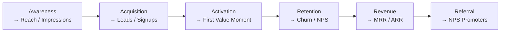

**North Star Metric:** One number that best captures the value you deliver to customers. Everything else is input to this.

---

## PHASE 7 — Scale Up: $10M → $100M

> **Core question:** *How do we build a machine that grows without being bottlenecked by founders?*

### 7.1 The Scaling Prerequisites

Do NOT enter Phase 7 without:

- [ ] Proven repeatable sales motion (close rate ≥ 20%)
- [ ] LTV:CAC ratio ≥ 3:1
- [ ] Gross margins ≥ 50%
- [ ] Documented playbooks for sales, onboarding, delivery
- [ ] A team that can execute without founder involvement in day-to-day
- [ ] PMF confirmed across multiple customer cohorts

### 7.2 Growth Levers by Stage

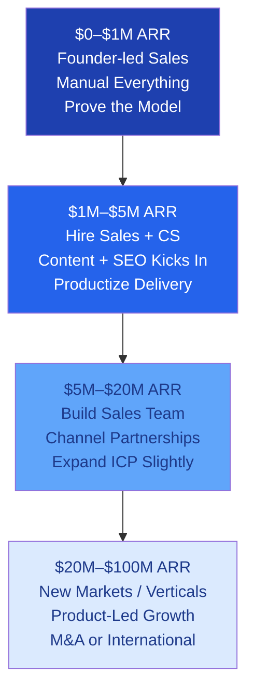

### 7.3 Team Building by Stage

| Stage | Key Hires |
|---|---|
| $0–$500K | Generalist operator, part-time finance |
| $500K–$2M | First sales hire, customer success, senior engineer |
| $2M–$10M | VP Sales, VP Product, Head of Marketing, Finance lead |
| $10M–$50M | C-suite (CMO, CTO, CFO), regional leads |
| $50M–$100M | Board of Directors, independent board members, COO |

### 7.4 Funding Strategy

| Stage | ARR | Likely Funding Source | Use of Capital |
|---|---|---|---|
| Pre-seed | $0 | Bootstrapped / Grants / Angels | MVP + first customers |
| Seed | $100K–$500K | Angels / Small VCs | Sales team + product |
| Series A | $1M–$3M ARR | VCs | Proven GTM, scale sales |
| Series B | $5M–$15M ARR | Growth VCs | New markets, product |
| Series C+ | $20M+ ARR | Late-stage VCs / PE | Dominance / international |

> **Bootstrapping to $1M ARR first** gives you leverage. You negotiate from a position of strength, not desperation.

### 7.5 Market Expansion Sequencing

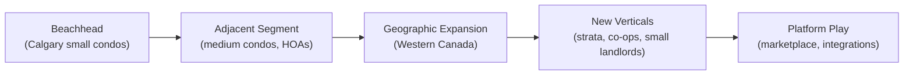

**Rule:** Dominate one niche before expanding. Premature expansion kills focus and burns cash.

### 7.6 Leadership Development

Theory without execution stays on paper. At scale, your job as a founder shifts:

| Stage | Founder Role |
|---|---|
| Idea → $1M | Chief Everything Officer |
| $1M → $10M | Chief Sales + Product Officer |
| $10M → $50M | Chief Storyteller + Talent Magnet |
| $50M → $100M | Chairman / Visionary / Board Member |

> "The market, in the end of the day, is all about execution and commitment." — Hossein Mehdipour

---

## Master Checklist: Gate Reviews

Pass each gate before moving to the next phase.

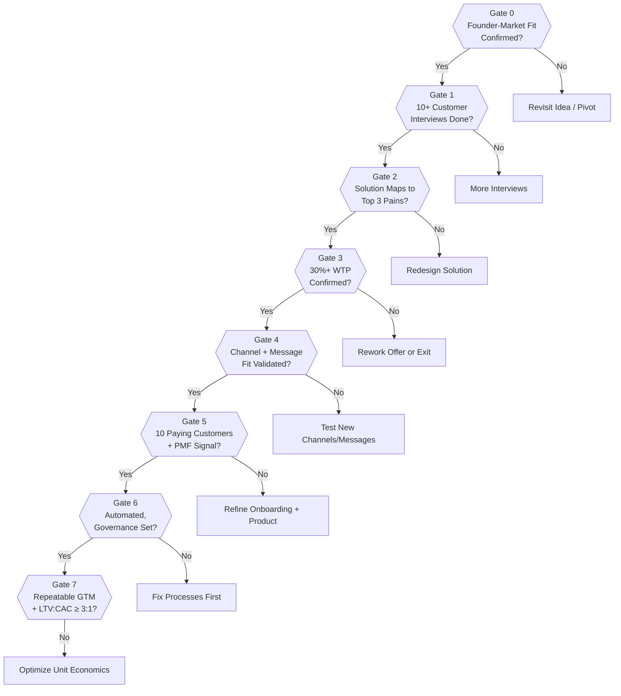

---

## Quick Reference: Key Formulas

| Metric | Formula |
|---|---|
| LTV | Avg Revenue per Customer × Avg Customer Lifespan |
| CAC | Total S&M Spend ÷ New Customers |
| LTV:CAC | LTV ÷ CAC (target ≥ 3:1) |
| Gross Margin | (Revenue – COGS) ÷ Revenue |
| Break-Even Customers | Fixed Costs ÷ (Price – Variable Cost per Customer) |
| MRR | Active Customers × Avg Monthly Revenue |
| ARR | MRR × 12 |
| Churn Rate | Lost Customers ÷ Customers at Start of Period |
| NPS | % Promoters – % Detractors |

---

## The 5 Principles That Run Through Every Phase

1. **Validate before building.** Customer evidence precedes investment of time or money.
2. **Niche is not a limitation — it's a launchpad.** Go deep before going wide.
3. **Founder-market fit is a permanent asset.** Lived experience beats slides every time.
4. **Execution is the only theory that matters.** Frameworks on paper are worthless without commitment.
5. **The offer is more important than the product.** People buy outcomes, not features.

---

*Framework synthesized from No Fluff Entrepreneurs (14-session program), Hossein Mehdipour's Design Thinking Scaling Methodology (Stabokon University, Milan), CondoMateOS strategic advisory session (March 2026), and AI-augmented business design principles.*

*Version 1.0 — March 2026*
