# The $100M Business Framework
### From Raw Idea → Validated Product → Scaled Company

> **Source synthesis:** No Fluff Entrepreneurs (14-session program), Hossein Mehdipour's Design Thinking Scaling Framework (Stabokon University, Milan), CondoMateOS advisor meeting notes, and strategic AI augmentation.

---

## Master Roadmap

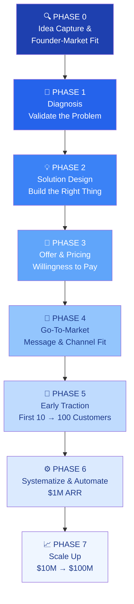

---

## PHASE 0 — Idea Capture & Founder-Market Fit

> **Core question:** *Are you the right person to solve this problem?*

### 0.1 The Idea Stress Test

Answer these 5 questions before doing anything else:

| Question | What You're Testing |
|---|---|
| Have you personally felt this pain? | Founder-market authenticity |
| Do you know 10+ people who share this pain? | Market existence |
| Can you explain the problem in one sentence? | Clarity of thinking |
| Is there money currently being spent on imperfect solutions? | Willingness to pay signal |
| Do you have unfair access to this market? | Competitive moat |

**Rule:** If you can't answer YES to at least 3 of 5, reconsider the idea before investing time.

### 0.2 Founder-Market Fit Score

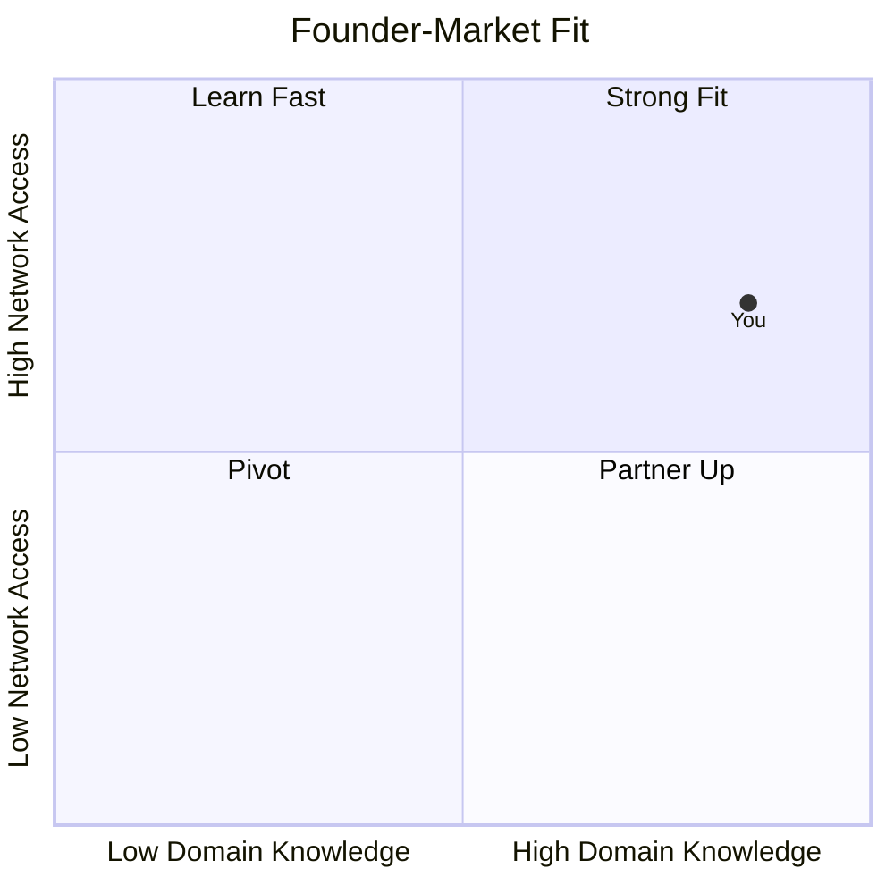

**Strong Fit** = You have lived the problem AND have access to people who share it. This is your most credible positioning asset. Never understate it.

### 0.3 Lightbulb Moment Journal

Write your backstory now. It becomes your core WHY:

```
My lightbulb moment was when I noticed _____________________.

I had been experiencing ______________________ for ______ years.

I looked for solutions and found _________________________, but they fell short because _________________________.

That's when I knew someone needed to build _________________________.
```

---

## PHASE 1 — Diagnosis: Validate the Problem

> **Core question:** *Is this a real, painful, and frequent enough problem?*

> **Source:** This phase follows Hossein Mehdipour's 9-Step Design Thinking Process. No product development begins until Step 8 (Willingness to Pay) is validated.

### Design Thinking: 9-Step Overview

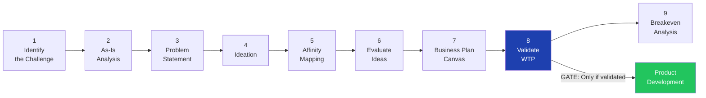

> **Hard Rule:** Product development begins ONLY after willingness to pay is validated at Step 8. Features are then sequenced: Must Have → Should Have → Nice to Have → PRD → Vibe Coding → Landing/Demo Page.

### 1.1 Niche Definition

**Do not skip this.** Every downstream decision flows from your niche.

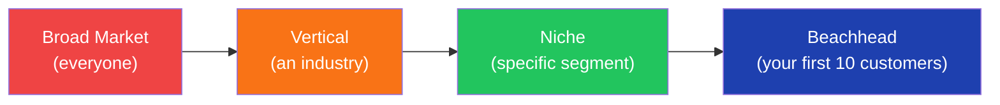

**Niche Definition Checklist:**

- [ ] Industry / vertical defined
- [ ] Company/customer size defined (e.g., 8–50 units, 100–500 employees)
- [ ] Geography defined (e.g., Calgary, AB → Western Canada)
- [ ] Role of buyer defined (e.g., volunteer board president)
- [ ] Frequency of pain defined (daily? monthly? annually?)
- [ ] Payment capacity confirmed (can they actually afford a solution?)
- [ ] Decision-making process mapped (who says yes?)

### 1.2 Ideal Customer Profile (ICP)

Build your ICP before talking to customers. Refine it after.

| Attribute | Your ICP |
|---|---|
| Segment Name | |
| Demographics | |
| Firmographics (if B2B) | |
| Core Role / Title | |
| Top 3 Pain Points | |
| Current Workarounds | |
| Trigger Events (what makes them seek a solution now?) | |
| Budget Range | |
| Decision-Making Authority | |
| Where They Spend Time Online | |

> "It cannot be that every customer is going to be your ideal client." — Hossein Mehdipour

### 1.3 Problem Validation: Real Person Interviews

**Target:** 10–15 interviews minimum before building anything.

**Interview Framework:**

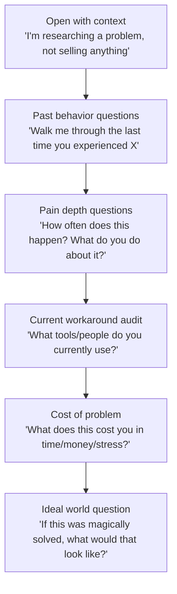

**Green flags in interviews:**
- They describe the problem without you prompting it
- They tell a specific story about when it hurt them
- They're already paying (time or money) for a workaround
- They lean forward and ask "so what are you building?"

**Red flags:**
- Vague agreement ("yeah that could be annoying")
- No current workaround (problem isn't painful enough)
- They say yes to everything you suggest

### 1.4 Problem Statement Definition

Use the Problem Tree to go deep:

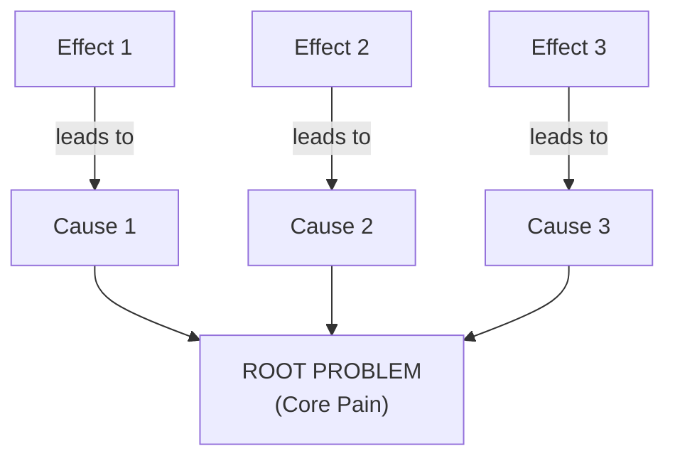

**Problem Statement Formula:**

> [Your ICP] struggle with [specific problem] when [context/trigger], which causes [quantified consequence], because [root cause]. Current solutions fail because [gap].

### 1.5 Empathy Map

For each ICP segment, complete this map:

| What They... | Content |
|---|---|
| **Think & Feel** | Worries, aspirations, what really matters |
| **See** | Environment, what they observe others doing |
| **Hear** | What colleagues, friends, and influencers say |
| **Say & Do** | Public attitude vs. private behavior |
| **Pain** | Frustrations, obstacles, fears |
| **Gain** | Wants, needs, measures of success |

### 1.6 Customer Journey Map (As-Is State)

> **Purpose:** Before designing your solution, map your customer's current painful experience — step by step. This is the "As-Is" state. You're documenting the problem, not your fix.

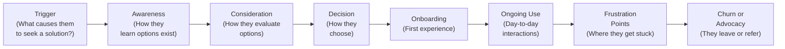

**For each stage, capture:**

| Stage | What Happens Today | Emotional State | Pain Level (1–5) | Opportunity |
|---|---|---|---|---|
| Trigger | | | | |
| Awareness | | | | |
| Consideration | | | | |
| Decision | | | | |
| Onboarding | | | | |
| Ongoing Use | | | | |
| Frustration Points | | | | |
| Churn or Advocacy | | | | |

**Key outputs from this exercise:**
- The highest-pain stages become your solution's core focus
- The emotional low points reveal your most powerful marketing messages
- The workarounds they use become your competitive landscape

---

## PHASE 2 — Solution Design: Build the Right Thing

> **Core question:** *Does my solution directly map to the top 3 pains?*

### 2.1 Ideation Methods

Run at least one of these before committing to a solution:

**Yes-And Brainstorm:** Build on every idea without rejection for 20 minutes. No critique allowed until the timer ends.

**Metaphorical Ideation:** Pick a metaphor unrelated to your industry (e.g., "how does a hospital triage patients?") and force-map it onto your problem. This breaks pattern-locked thinking and surfaces non-obvious solutions.

**Challenging Orthodoxies:** List every "obvious" assumption about your industry and ask: *what if the opposite were true?*

**Mega-trends Mapping:** Which macro trends (AI, remote work, aging population, regulation) are making this problem worse right now? Your solution should ride a tailwind.

### 2.2 Affinity Mapping

> **Purpose:** After ideation, you have a flood of raw ideas. Affinity Mapping clusters them into patterns so you can see which problem areas have the most solution density — and where the real opportunity lives.

**Process (do this on a whiteboard or Miro):**

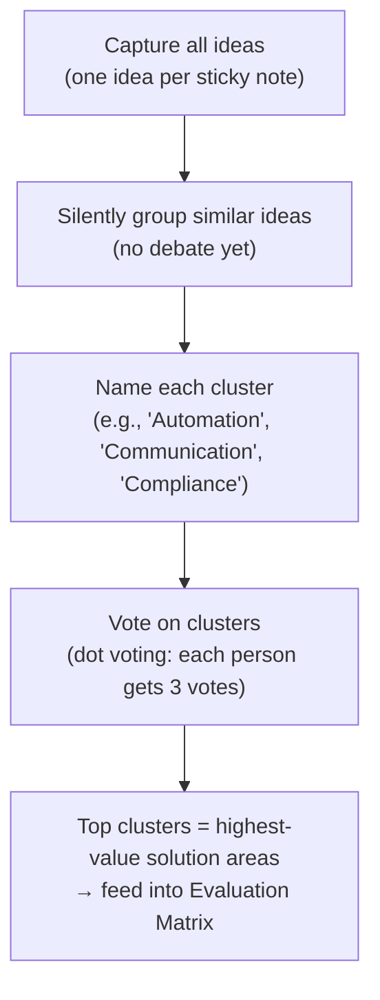

**Affinity Cluster Template:**

| Cluster Name | Ideas Grouped Here | Vote Count | Priority |
|---|---|---|---|
| | | | |
| | | | |
| | | | |

**Rules:**
- No editing or combining ideas during grouping — just move them
- Clusters that emerge from the customer's language (from interviews) carry the most weight
- Clusters with the most ideas AND the most votes move forward to evaluation

### 2.3 Idea Evaluation Matrix

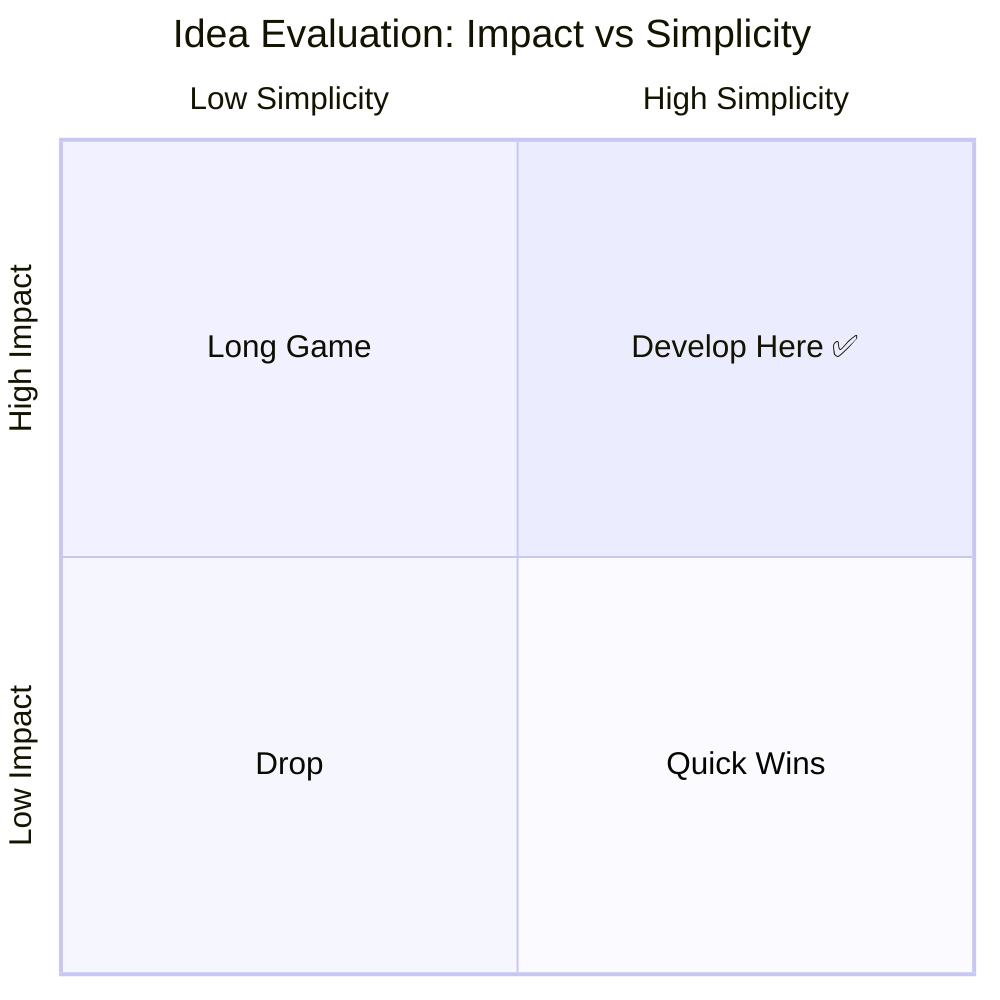

**Develop Here** = High Impact + High Simplicity. Start here. Always.

### 2.4 Solution–Problem Alignment

**Rule:** Every solution must directly answer one of your top 3 problems.

| Problem | Solution | Feature(s) | Priority |
|---|---|---|---|
| Pain Point 1 | Solution Statement 1 | Feature A, B | Must Have |
| Pain Point 2 | Solution Statement 2 | Feature C | Should Have |
| Pain Point 3 | Solution Statement 3 | Feature D, E | Nice to Have |

> "Solutions are NOT the same as features. The feature is how you deliver the solution." — No Fluff Entrepreneurs, Session 5

### 2.5 Feature Prioritization (MoSCoW)

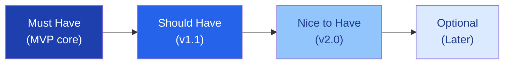

**Validate before building:** No feature gets built without at least one customer saying "I would pay for this."

### 2.6 Lean Canvas

Complete all 9 blocks before writing a single line of code or copy:

| Block | Your Answer |
|---|---|
| **Problem** (Top 3 pains) | |
| **Customer Segments** | |
| **Unique Value Proposition** | |
| **Solution** (Top 3 features) | |
| **Channels** | |
| **Revenue Streams** | |
| **Cost Structure** | |
| **Key Metrics** | |
| **Unfair Advantage** | |

> Lean Canvas is never finished. Revisit it every 90 days.

---

## PHASE 3 — Offer & Pricing: Willingness to Pay

> **Core question:** *Will they actually pay for this?*

### 3.1 The Killer Offer Stack

A great offer is not just a product. It's a value stack with urgency.

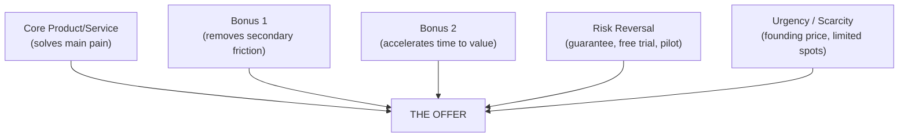

> "You have to think about promotions, urgency, scarcity. It should be an offer they jump on board for." — Hossein Mehdipour

### 3.2 Pricing Strategy

**Step 1:** Anchor on value, not cost.

| Method | Formula | Use When |
|---|---|---|
| Value-based | 10–20% of the problem's cost to customer | B2B, clear ROI |
| Comparable | Benchmark against closest alternative | Market exists |
| Willingness-to-Pay | Ask 10 customers: "At what price would this be a no-brainer?" | Early validation |

**Step 2:** Run the Van Westendorp Price Sensitivity Test with 5–10 customers:

- "At what price is this too cheap to trust?"
- "At what price is this good value?"
- "At what price is this getting expensive but still worth it?"
- "At what price is this too expensive?"

**Step 3:** Run the dual WTP validation — both must pass before moving to product development:

| Test | What You're Asking | Pass Threshold |
|---|---|---|
| **WT Pay** (Willingness to Pay) | "Would you pay $X/month for this?" | ≥ 30% say YES |
| **WT Partner** (Willingness to Partner) | "Would you co-design this with us as a beta partner?" | ≥ 2 concrete YESes |

> **Why WT Partner matters:** Someone willing to pay is a customer. Someone willing to co-design is a champion. Champions give deep feedback, refer others, and become your first case studies. Target at least 2 WT Partner commitments before writing a line of code.

**Step 4:** Validate overall thresholds:

```
WT Pay: 30–50% YES + WT Partner: 2+ commits = Build it. Move to product.
WT Pay: 10–29% YES = Refine offer, retest.
WT Pay: 0–9% YES = Rework offer completely OR exit the idea.
```

### 3.3 Revenue Model Selection

| Model | Best For | $100M Path |
|---|---|---|
| SaaS Subscription | Software, recurring value | High LTV, low churn |
| Usage-Based | API, transactions | Scales with customer success |
| Service Retainer | Consulting, managed service | High margin, hard to scale |
| Marketplace | Network effects | Winner-takes-most |
| Hybrid | Product + service | Best for early B2B |

**Unit Economics to track from Day 1:**

- **LTV** = Average Revenue per Customer × Average Lifespan
- **CAC** = Total Sales & Marketing Cost ÷ New Customers Acquired
- **LTV:CAC ratio** target: ≥ 3:1
- **Gross Margin** target: ≥ 60% for software, ≥ 40% for services

### 3.4 Break-Even Analysis

| Item | Value |
|---|---|
| Fixed Costs (monthly) | $ |
| Variable Cost per Customer | $ |
| Price per Customer (monthly) | $ |
| Break-Even Customers | Fixed Costs ÷ (Price – Variable Cost) |

### 3.5 THE PRODUCT DEVELOPMENT GATE

> This is the most important checkpoint in the entire framework.

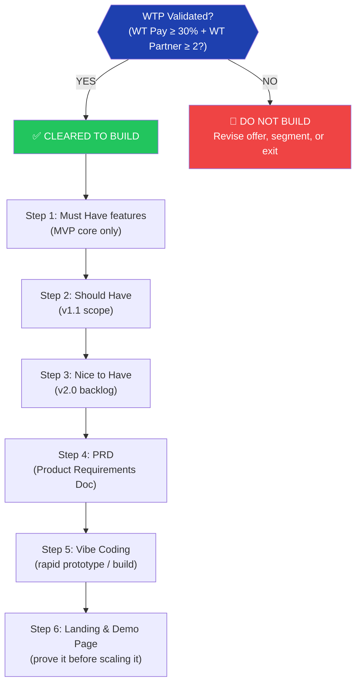

**Why this order?**

Starting with Must Have forces ruthless prioritization. The Landing/Demo Page comes last — not first — because it should demonstrate a working solution, not a promise. Showing a real demo to early adopters triggers the WT Partner conversations that validate your next build cycle.

**Product Development Checklist:**

- [ ] WTP validated (WT Pay + WT Partner)
- [ ] Breakeven customers calculated and financially viable
- [ ] Must Have feature list agreed by team (max 3–5 features)
- [ ] PRD written and reviewed by at least one WT Partner
- [ ] MVP built to Must Have scope only
- [ ] Landing/Demo Page live before any paid marketing spend

---

## PHASE 4 — Go-To-Market: Message & Channel Fit

> **Core question:** *How do I reach the right people with the right message?*

### 4.1 Unique Value Proposition (UVP)

**Formula:**

> [Product/Service] helps [Customer Segment] solve [Top Problem] by [Key Benefit], unlike [Existing Alternative].

**Test your UVP:**

- [ ] Does it connect directly to your top 3 problems?
- [ ] Does it target your early adopters specifically?
- [ ] Does it answer What, Who, and Why?
- [ ] Does it show a "finished story" benefit (outcome, not feature)?
- [ ] Can you say it in under 10 seconds?

**High-Level Concept (Elevator Version):**

> "It's like [familiar reference] for [your niche]."

### 4.2 Customer Segments & Personas

Identify 2–3 segments. For each, build a persona:

| Attribute | Persona |
|---|---|
| Name & Photo | |
| Role & Context | |
| Day in the Life | |
| Top 3 Frustrations | |
| What Success Looks Like | |
| Preferred Communication | |
| Decision-Making Style | |

### 4.3 Early Adopter Profile

Early adopters are NOT your mainstream customers. They:

- Have the problem acutely right now
- Are actively searching for a solution
- Are willing to tolerate rough edges
- Will give honest, detailed feedback
- Know others with the same problem

**Why them specifically?** Because they pull your product forward. Mainstream customers wait for proof. Early adopters create the proof.

### 4.4 Channel Strategy

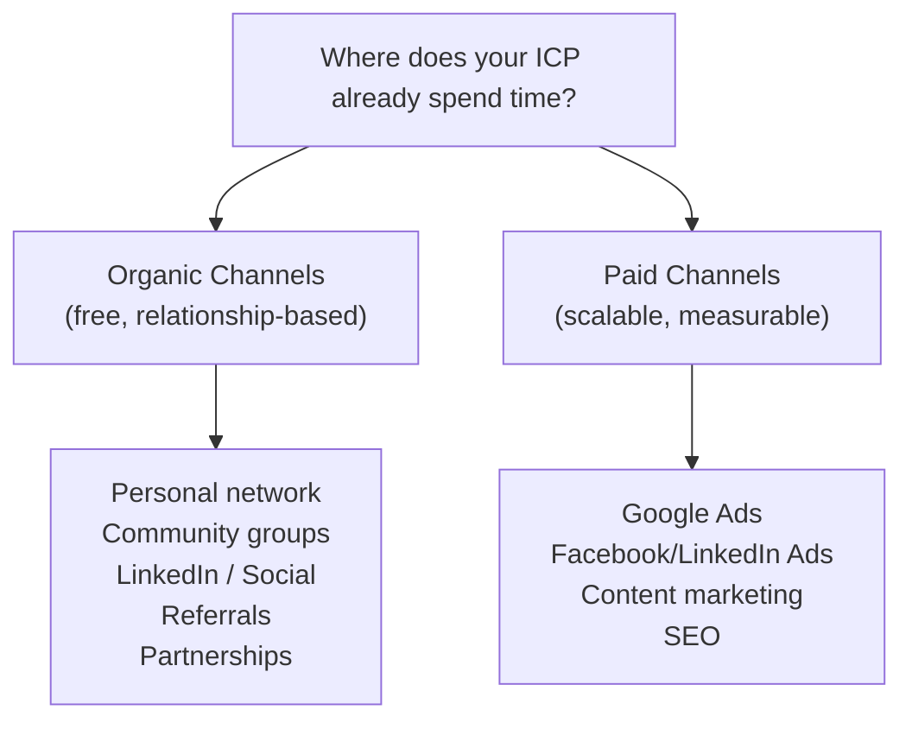

**Channel Testing Protocol:**

1. List ALL possible channels (free + paid)
2. Pick top 2 organic channels to test first
3. For each: define action, timeline, and success metric
4. Ask 3+ potential customers: "Where do you go to find solutions like this?"
5. Run for 30 days before judging results

### 4.5 Message-Channel Fit (A/B Test Matrix)

| Message Type | Channel 1 | Channel 2 | Channel 3 |
|---|---|---|---|
| Pain-point based | Test | Test | Test |
| Outcome/result based | Test | Test | Test |
| Features/benefits based | Test | Test | Test |

**Only invest in channels and messages that have tested positive.**

---

## PHASE 5 — Early Traction: First 10 → 100 Customers

> **Core question:** *Can I consistently find and convert my ideal customer?*

### 5.1 The First 10 Customers Playbook

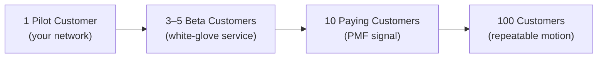

**Stages:**

**Customer 1:** Use your personal network. Do NOT charge full price. Get deep feedback. Treat as a partner.

**Customers 2–5:** Semi-warm outreach. Offer founding/beta pricing. Run white-glove onboarding. Document every bug, friction point, and success.

**Customers 6–10:** Apply learnings. Charge closer to full price. Measure NPS. Ask for referrals.

**Customer 11+:** You should now have a repeatable process, a case study, and a referral engine.

### 5.2 Beta Program Structure

| Element | Details |
|---|---|
| Duration | 30–90 days |
| Participants | 5–10 ideal customers |
| Pricing | 50–70% of planned price |
| Commitment | Weekly check-in calls |
| Deliverable | 3 detailed case studies |
| Exit criteria | NPS ≥ 8, 3 referrals generated |

### 5.3 Feedback Loop System

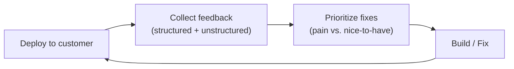

**Feedback collection methods:**
- Weekly 20-minute check-in calls
- In-product feedback widget
- Monthly NPS survey
- Quarterly strategic review

### 5.4 Product-Market Fit Signals

You have PMF when:

- [ ] NPS ≥ 40 (or >40% answer "very disappointed" if product disappeared)
- [ ] Churn rate < 5% monthly
- [ ] Customers referring others without being asked
- [ ] You're struggling to keep up with inbound demand
- [ ] Customers using the product in ways you didn't expect

---

## PHASE 6 — Systematize & Automate: Path to $1M ARR

> **Core question:** *Can the business run without you doing everything manually?*

### 6.1 Governance (Non-Negotiable)

Before scaling, establish team clarity:

| Decision | Answer |
|---|---|
| Who is full-time vs. part-time? | |
| What is each person's role? | |
| Commitment horizon (1–3 years)? | |
| Compensation / equity split? | |
| Commission structure for sales? | |
| Decision-making authority? | |

> "Without this clarity, expectations will diverge and execution will suffer." — Hossein Mehdipour

**Milestone-based governance works:** Define expectations at each milestone (first 5 clients, $50K ARR, $200K ARR) rather than trying to solve everything up front.

### 6.2 Process Mapping

Map every customer-facing and internal process:

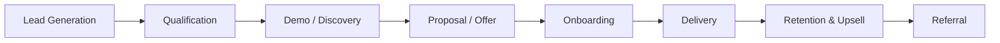

For each step: Who does it? How long does it take? What's the error rate? What's the bottleneck?

### 6.3 Automation Audit

**Only automate what you understand.** Do not automate broken processes.

| Process | Current State | Automation Candidate? | Tool |
|---|---|---|---|
| Lead capture | Manual | Yes | CRM |
| Onboarding checklist | Manual | Yes | Workflow automation |
| Invoice processing | Manual | Yes | AI + accounting |
| Customer communications | Manual | Partial | Templates + triggers |
| Reporting & metrics | Manual | Yes | Dashboard |

**Automation sequence:** Understand → Standardize → Automate → Monitor.

### 6.4 Advisory Board

Build a 4–5 person advisory board when targeting enterprise or scaling beyond $250K ARR.

| Advisor Profile | What They Bring |
|---|---|
| Business Development | Deals, partnerships, networks |
| Technical / Product | Credibility with technical buyers |
| Industry Insider | Domain trust, warm intros |
| Go-to-Market | Sales methodology, channel expertise |
| Former Founder | Pattern recognition, investor access |

**Compensation:** 0.25–1% equity (vesting over 2 years), no cash. Monthly meeting cadence.

### 6.5 Key Metrics Dashboard

Map your customer journey, then pick 3–5 metrics that show progress:

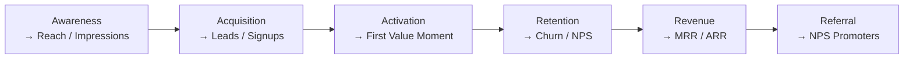

**North Star Metric:** One number that best captures the value you deliver to customers. Everything else is input to this.

---

## PHASE 7 — Scale Up: $10M → $100M

> **Core question:** *How do we build a machine that grows without being bottlenecked by founders?*

### 7.1 The Scaling Prerequisites

Do NOT enter Phase 7 without:

- [ ] Proven repeatable sales motion (close rate ≥ 20%)
- [ ] LTV:CAC ratio ≥ 3:1
- [ ] Gross margins ≥ 50%
- [ ] Documented playbooks for sales, onboarding, delivery
- [ ] A team that can execute without founder involvement in day-to-day
- [ ] PMF confirmed across multiple customer cohorts

### 7.2 Growth Levers by Stage

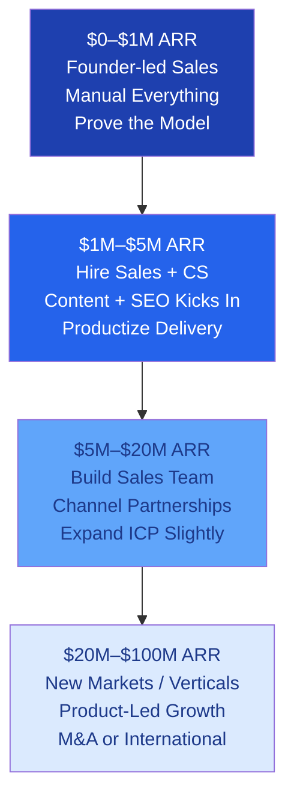

### 7.3 Team Building by Stage

| Stage | Key Hires |
|---|---|
| $0–$500K | Generalist operator, part-time finance |
| $500K–$2M | First sales hire, customer success, senior engineer |
| $2M–$10M | VP Sales, VP Product, Head of Marketing, Finance lead |
| $10M–$50M | C-suite (CMO, CTO, CFO), regional leads |
| $50M–$100M | Board of Directors, independent board members, COO |

### 7.4 Funding Strategy

| Stage | ARR | Likely Funding Source | Use of Capital |
|---|---|---|---|
| Pre-seed | $0 | Bootstrapped / Grants / Angels | MVP + first customers |
| Seed | $100K–$500K | Angels / Small VCs | Sales team + product |
| Series A | $1M–$3M ARR | VCs | Proven GTM, scale sales |
| Series B | $5M–$15M ARR | Growth VCs | New markets, product |
| Series C+ | $20M+ ARR | Late-stage VCs / PE | Dominance / international |

> **Bootstrapping to $1M ARR first** gives you leverage. You negotiate from a position of strength, not desperation.

### 7.5 Market Expansion Sequencing

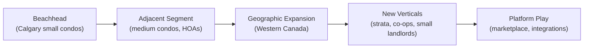

**Rule:** Dominate one niche before expanding. Premature expansion kills focus and burns cash.

### 7.6 Leadership Development

Theory without execution stays on paper. At scale, your job as a founder shifts:

| Stage | Founder Role |
|---|---|
| Idea → $1M | Chief Everything Officer |
| $1M → $10M | Chief Sales + Product Officer |
| $10M → $50M | Chief Storyteller + Talent Magnet |
| $50M → $100M | Chairman / Visionary / Board Member |

> "The market, in the end of the day, is all about execution and commitment." — Hossein Mehdipour

---

## Master Checklist: Gate Reviews

Pass each gate before moving to the next phase.

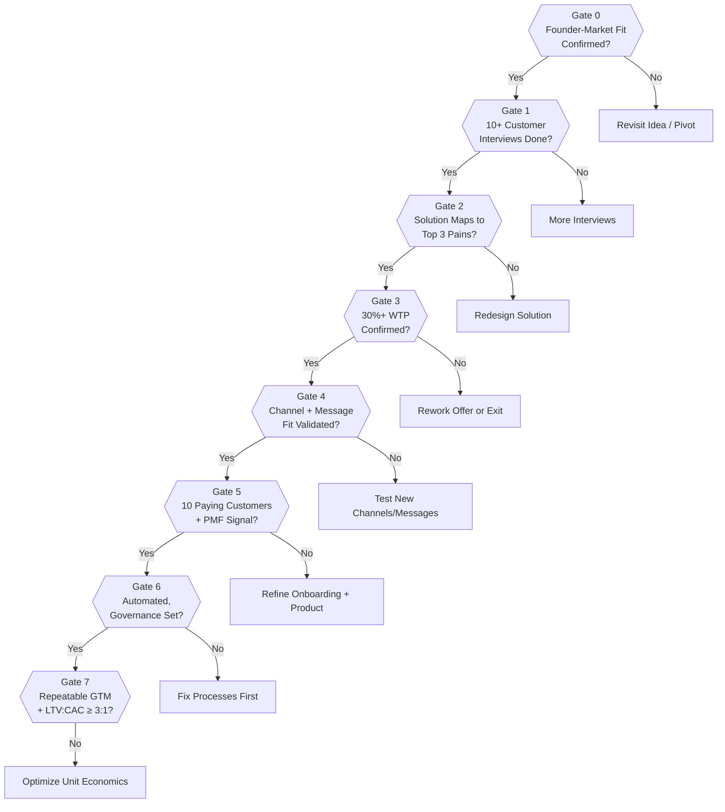

---

## Quick Reference: Key Formulas

| Metric | Formula |
|---|---|
| LTV | Avg Revenue per Customer × Avg Customer Lifespan |
| CAC | Total S&M Spend ÷ New Customers |
| LTV:CAC | LTV ÷ CAC (target ≥ 3:1) |
| Gross Margin | (Revenue – COGS) ÷ Revenue |
| Break-Even Customers | Fixed Costs ÷ (Price – Variable Cost per Customer) |
| MRR | Active Customers × Avg Monthly Revenue |
| ARR | MRR × 12 |
| Churn Rate | Lost Customers ÷ Customers at Start of Period |
| NPS | % Promoters – % Detractors |

---

## The 5 Principles That Run Through Every Phase

1. **Validate before building.** Customer evidence precedes investment of time or money.
2. **Niche is not a limitation — it's a launchpad.** Go deep before going wide.
3. **Founder-market fit is a permanent asset.** Lived experience beats slides every time.
4. **Execution is the only theory that matters.** Frameworks on paper are worthless without commitment.
5. **The offer is more important than the product.** People buy outcomes, not features.

---

*Framework synthesized from No Fluff Entrepreneurs (14-session program), Hossein Mehdipour's Design Thinking Scaling Methodology (Stabokon University, Milan), CondoMateOS strategic advisory session (March 2026), and AI-augmented business design principles.*

*Version 1.0 — March 2026*

---
---

# PART 2: THE LLM CONVERSATIONAL ENGINE

> **What this is:** Part 1 is the strategy map. Part 2 is the execution engine. This section converts every phase into a machine-operational question flow — so any LLM can take a founder from raw idea to $100M, one question at a time, with gates, scoring, state tracking, and fallback logic.
>
> **How to use it:** Copy the System Prompt below into any LLM (Claude, GPT-4, etc.) at the start of a session. The LLM will ask one question at a time, validate answers, track state, and only advance you when gates are cleared.

---

## ENGINE ARCHITECTURE

```mermaid
flowchart TD
    SP["System Prompt\n(initialize engine + load state)"]
    SP --> Q["LLM asks Q[n]"]
    Q --> A["Founder answers"]
    A --> V["Validation Engine\n(depth check + scoring)"]
    V -->|"Valid + scored"| S["State Object updated"]
    V -->|"Vague / incomplete"| FU["Follow-up question triggered"]
    FU --> A
    S --> GATE{"Phase gate\npassed?"}
    GATE -->|"PASS"| NEXT["Advance to next phase"]
    GATE -->|"CONDITIONAL"| FLAG["Flag noted, proceed with warning"]
    GATE -->|"FAIL"| LOOP["Loop back: targeted retry questions"]
    LOOP --> Q
```

---

## SYSTEM PROMPT

> **Copy this verbatim into your LLM session to start the engine.**

```
You are an AI Founder Coach running a structured business-building session.

Your job: Take me from a raw business idea to a $100M company, one question at a time.

RULES:
1. Ask EXACTLY ONE question per message. Never combine two questions.
2. After I answer, validate my answer using the depth check for that question.
3. If my answer is vague, ask the follow-up question before moving on.
4. After each phase, show me my score and what it means before advancing.
5. Never skip a gate. If I fail a gate, loop back — do not advance.
6. Track my state throughout the session using the State Object.
7. Speak like a direct, intelligent advisor — not a cheerleader.
8. Start by saying: "Let's build your $100M company. First question:"
   Then ask Q0.1.
```

---

## STATE MANAGEMENT ENGINE

> **GAP 2 — Upgraded with ChatGPT closure.** This is the memory spine of the AI Founder OS. Without it, the LLM is a forgetful interviewer. With it, it becomes a venture navigation system that remembers everything, enforces gates, tracks decisions, and guides disciplined iteration across phases.

### What State Management Must Track

The system continuously maintains five things:

| # | Category | What It Tracks |
|---|---|---|
| 1 | **Current position** | Phase, step, question ID the founder is currently on |
| 2 | **Collected knowledge** | All validated business inputs gathered so far |
| 3 | **Validation status** | Which parts are strong, weak, incomplete, or failed |
| 4 | **Decision history** | Why the system moved forward, paused, or looped back |
| 5 | **Next action** | The exact next question or work item |

> If this is not formalized, the LLM will drift, repeat, skip, and hallucinate structure.

### Two-Layer Memory Model

The most critical design principle: **draft and validated outputs are kept strictly separate.**

```
LAYER 1 — DRAFT STATE
Stores raw, unvalidated founder answers.
Not trusted. Not used for downstream decisions.

Example:
{
  "draft_outputs": {
    "problem_statement": "I want to help businesses with AI"
  }
}

LAYER 2 — VALIDATED STATE
Stores only answers that passed all validation rules.
Trusted. Used by all downstream phases.

Example:
{
  "validated_outputs": {
    "problem_statement": "Volunteer condo board presidents managing
    20-150 unit buildings spend 5-10 hours/week on admin tasks
    they have no training for, causing burnout and legal risk."
  }
}
```

> **Rule:** Nothing moves from draft to validated until it clears the REJECT/ACCEPT depth check for that question. Future phases ONLY read from validated_outputs.

### Three State Categories

| Category | Contents | Where Stored |
|---|---|---|
| **A — Core Business Truth** | ICP, problem statement, top 3 pains, current alternatives, UVP, pricing hypothesis | `validated_outputs` |
| **B — Diagnostic Scores** | Founder-market fit score, WTP score, PMF confidence, GTM confidence | `scores` |
| **C — Workflow Control** | Current phase, completion %, gate status, loopbacks, next action | `navigation`, `phase_status`, `gates`, `next_action` |

---

## MASTER STATE OBJECT

> Full architecture. The LLM maintains this object throughout the session. Paste into any new session to resume with full continuity.

```json
{
  "venture_profile": {
    "venture_name": null,
    "venture_type": null,
    "industry": null,
    "business_model_guess": null
  },

  "founder_profile": {
    "founder_name": null,
    "background_summary": null,
    "domain_experience": null,
    "network_access": null,
    "motivation_story": null
  },

  "navigation": {
    "current_phase": "Phase 0",
    "current_step": "Idea Clarity",
    "current_question_id": "P0_Q1",
    "last_completed_question_id": null,
    "next_question_id": null
  },

  "phase_status": {
    "phase_0": { "status": "in_progress", "completion_percent": 0, "gate_passed": false },
    "phase_1": { "status": "locked",      "completion_percent": 0, "gate_passed": false },
    "phase_2": { "status": "locked",      "completion_percent": 0, "gate_passed": false },
    "phase_3": { "status": "locked",      "completion_percent": 0, "gate_passed": false },
    "phase_4": { "status": "locked",      "completion_percent": 0, "gate_passed": false },
    "phase_5": { "status": "locked",      "completion_percent": 0, "gate_passed": false },
    "phase_6": { "status": "locked",      "completion_percent": 0, "gate_passed": false },
    "phase_7": { "status": "locked",      "completion_percent": 0, "gate_passed": false }
  },

  "draft_outputs": {},

  "validated_outputs": {},

  "scores": {
    "founder_market_fit_score": null,
    "problem_clarity_score": null,
    "market_evidence_score": null,
    "wtp_pay_score": null,
    "wtp_partner_count": null,
    "pmf_confidence": null,
    "gtm_confidence": null
  },

  "gates": {
    "gate_0": { "status": "not_evaluated", "criteria": [], "result_reason": null },
    "gate_1": { "status": "not_evaluated", "criteria": [], "result_reason": null },
    "gate_2": { "status": "not_evaluated", "criteria": [], "result_reason": null },
    "gate_3": { "status": "not_evaluated", "criteria": [], "result_reason": null },
    "gate_4": { "status": "not_evaluated", "criteria": [], "result_reason": null },
    "gate_5": { "status": "not_evaluated", "criteria": [], "result_reason": null },
    "gate_6": { "status": "not_evaluated", "criteria": [], "result_reason": null },
    "gate_7": { "status": "not_evaluated", "criteria": [], "result_reason": null }
  },

  "question_state": {
    "P0_Q1": {
      "question_text": "In one sentence, what problem are you trying to solve?",
      "asked": false,
      "answer_received": false,
      "answer_valid": false,
      "attempt_count": 0,
      "failure_reason": null,
      "last_answer": null,
      "next_followup_question_id": "P0_Q1A"
    }
  },

  "phase_transition_rules": {
    "phase_0_to_phase_1": {
      "required_conditions": [
        "scores.founder_market_fit_score >= 4",
        "gates.gate_0.status == passed"
      ],
      "if_fail": "loop_with_targeted_questions"
    },
    "phase_1_to_phase_2": {
      "required_conditions": [
        "scores.problem_clarity_score >= 8",
        "gates.gate_1.status == passed"
      ],
      "if_fail": "loop_with_targeted_questions"
    },
    "phase_2_to_phase_3": {
      "required_conditions": [
        "validated_outputs.lean_canvas_completed == true",
        "gates.gate_2.status == passed"
      ],
      "if_fail": "loop_with_targeted_questions"
    },
    "phase_3_to_phase_4": {
      "required_conditions": [
        "scores.wtp_pay_score >= 0.30",
        "scores.wtp_partner_count >= 2",
        "gates.gate_3.status == passed"
      ],
      "if_fail": "loop_with_targeted_questions"
    }
  },

  "loopbacks": [],

  "decision_log": [],

  "risks": [],

  "dependencies": {
    "icp": ["problem_statement", "pain_points", "channel_strategy", "pricing_hypothesis"],
    "problem_statement": ["uvp", "solution_design", "offer"],
    "wtp_validation": ["build_permission", "prd_creation"],
    "niche": ["icp", "interview_targets", "channel_selection"]
  },

  "next_action": {
    "type": "ask_question",
    "question_id": "P0_Q1",
    "reason": "Session start — need initial problem statement"
  }
}
```

---

### Question-Level State Tracking

Every question has its own micro-state inside `question_state`. This enables retry logic, attempt counting, failure audit, and adaptive follow-ups.

```json
{
  "question_state": {
    "P0_Q1": {
      "question_text": "In one sentence, what problem are you trying to solve?",
      "asked": true,
      "answer_received": true,
      "answer_valid": false,
      "attempt_count": 2,
      "failure_reason": "Too vague — no customer segment specified",
      "last_answer": "I want to help people with AI",
      "next_followup_question_id": "P0_Q1A"
    },
    "P0_Q1A": {
      "question_text": "Please restate: who exactly is facing the problem and what exactly is happening to them?",
      "asked": true,
      "answer_received": true,
      "answer_valid": true,
      "attempt_count": 1,
      "failure_reason": null,
      "last_answer": "Volunteer condo board presidents managing 20-150 units spend 5-10 hours/week on admin they have no training for.",
      "next_followup_question_id": null
    }
  }
}
```

### Phase Transition Rules

No free movement between phases. Every transition requires explicit gate clearance.

```mermaid
flowchart TD
    G0{{"Gate 0\nfounder_market_fit >= 4\ngate_0 = passed"}}
    G1{{"Gate 1\nproblem_clarity >= 8\ngate_1 = passed"}}
    G2{{"Gate 2\nlean_canvas complete\ngate_2 = passed"}}
    G3{{"Gate 3\nWTP >= 30%\npartners >= 2\ngate_3 = passed"}}

    P0["Phase 0\nFounder-Market Fit"] -->|"PASS"| G0
    G0 -->|"PASS"| P1["Phase 1\nDiagnosis"]
    G0 -->|"FAIL"| L0["Loop: repair\nweakest fields in P0"]

    P1 -->|"PASS"| G1
    G1 -->|"PASS"| P2["Phase 2\nSolution Design"]
    G1 -->|"FAIL"| L1["Loop: more interviews\nor narrow ICP"]

    P2 -->|"PASS"| G2
    G2 -->|"PASS"| P3["Phase 3\nOffer & WTP"]
    G2 -->|"FAIL"| L2["Loop: revisit\nLean Canvas"]

    P3 -->|"PASS"| G3
    G3 -->|"PASS"| P4["Phase 4\nGo-To-Market"]
    G3 -->|"FAIL"| L3["Loop: refine offer\nor revisit ICP"]
```

### Loopback State Design

When a gate fails, the system does not just say "go back." It records exactly what failed, why, where to go, and what must be repaired.

```json
{
  "loopbacks": [
    {
      "loopback_id": "LB_001",
      "from_phase": "Phase 3",
      "to_phase": "Phase 1",
      "trigger": "WTP pay score below 30% threshold",
      "diagnosis": "ICP too broad — pain is not acute enough for target segment",
      "required_repairs": [
        "Narrow ICP to higher-pain subsegment",
        "Complete 5 new interviews with sharper segment definition",
        "Rewrite problem statement with new segment context"
      ],
      "status": "open",
      "created_at": "2026-03-22T10:30:00",
      "resolved_at": null
    }
  ]
}
```

> A loopback stays `"open"` until all repairs are confirmed validated. Only then does the system re-evaluate the gate.

### Decision Log Design

Every major decision — acceptance, rejection, gate pass, loopback — is logged with a timestamp and reason.

```json
{
  "decision_log": [
    {
      "timestamp": "2026-03-22T10:15:00",
      "decision": "Problem statement rejected",
      "question_id": "P0_Q1",
      "reason": "No specific customer segment — used generic language 'people and businesses'"
    },
    {
      "timestamp": "2026-03-22T10:18:00",
      "decision": "Revised problem statement accepted",
      "question_id": "P0_Q1A",
      "reason": "Specific niche (volunteer condo boards), context (20-150 units), and pain (5-10 hrs/week admin) clearly defined"
    },
    {
      "timestamp": "2026-03-22T10:45:00",
      "decision": "Gate 0 passed",
      "question_id": "P0_GATE",
      "reason": "Score 5/7 — PROCEED WITH CAUTION. Flags: weak money signal. Carrying forward to Phase 1."
    }
  ]
}
```

### LLM State Update Sequence

After every founder answer, the LLM executes this exact transaction sequence internally:

```
AFTER EVERY ANSWER:

Step 1: Store raw answer in draft_outputs[question_id]
Step 2: Run REJECT/ACCEPT validation for that question
Step 3a: If VALID:
           → Move answer to validated_outputs[field_name]
           → Set question_state[id].answer_valid = true
           → Update phase_status[phase].completion_percent
           → Set navigation.next_question_id
Step 3b: If INVALID:
           → Keep in draft_outputs only
           → Set question_state[id].failure_reason = [reason]
           → Increment question_state[id].attempt_count
           → Set navigation.next_question_id = follow-up question
Step 4: Log decision to decision_log[] with timestamp and reason
Step 5: If a gate condition is now evaluable:
           → Calculate score from validated_outputs
           → Update gates[gate_n].status
           → Update scores[relevant_score]
Step 6: Update next_action with type, question_id, and reason
```

> This is the correct transaction model. Skipping any step causes state drift.

### Dependency Mapping (Advanced Layer)

If a validated core truth changes, all downstream fields that depend on it must be automatically flagged as stale.

```json
{
  "dependencies": {
    "icp":               ["problem_statement", "pain_points", "interview_targets", "channel_strategy", "pricing_hypothesis"],
    "problem_statement": ["uvp", "solution_design", "offer", "landing_page_copy"],
    "niche":             ["icp", "interview_targets", "channel_selection"],
    "wtp_validation":    ["build_permission", "feature_prioritization", "prd_creation"],
    "pricing_hypothesis":["revenue_model", "breakeven_calculation", "ltv_cac_model"]
  }
}
```

> **Example:** If the ICP changes in Phase 1, the system flags `problem_statement`, `pain_points`, `channel_strategy`, and `pricing_hypothesis` as stale — and will prompt re-validation before allowing Phase 3.

### Phase 0 Completed State — Reference Example

This is what the state object looks like after a fully passed Phase 0:

```json
{
  "navigation": {
    "current_phase": "Phase 0",
    "current_step": "Final Scoring",
    "current_question_id": "P0_FINAL",
    "last_completed_question_id": "P0_Q7",
    "next_question_id": "P1_Q1"
  },
  "phase_status": {
    "phase_0": { "status": "complete",  "completion_percent": 100, "gate_passed": true  },
    "phase_1": { "status": "unlocked",  "completion_percent": 0,   "gate_passed": false }
  },
  "validated_outputs": {
    "problem_statement":  "Volunteer condo board presidents managing 20–150 units spend 5–10 hours/week on maintenance, finance, and communication admin they have no training for.",
    "founder_experience": "Founder served on a condo board for 2 years — direct lived experience.",
    "simple_explanation": "Imagine you're responsible for your apartment building's repairs and budget, but you have a real job and no training for it. Every week you chase contractors and track expenses in broken spreadsheets.",
    "customer_types":     ["Volunteer board presidents", "Volunteer board treasurers", "Self-managed condo corporations"],
    "existing_solutions": ["Email threads", "Google Sheets", "Property managers at $500-800/month"],
    "money_spent":        true,
    "spend_estimate":     "$300–$800/month for property managers, or 5–10 hrs/week of unpaid volunteer time",
    "unfair_advantage":   "Founder has 2 years of direct board experience, insider language, and relationships with 3 property management companies"
  },
  "scores": {
    "founder_market_fit_score": 6
  },
  "gates": {
    "gate_0": {
      "status": "passed",
      "criteria": ["Personal pain validated", "3+ specific customer types named", "Jargon-free explanation passes", "Money signal confirmed", "Unfair advantage specific"],
      "result_reason": "Score 6/7 — STRONG GO. One flag: market existence count at minimum threshold."
    }
  },
  "next_action": {
    "type": "ask_question",
    "question_id": "P1_Q1",
    "reason": "Gate 0 passed — begin niche definition in Phase 1"
  }
}
```

### State Engine Hard Rules

```
RULE 1: Nothing enters validated_outputs until it passes REJECT/ACCEPT depth check.
RULE 2: No phase unlocks unless the prior gate passes (or is CONDITIONAL with flags noted).
RULE 3: Every failed answer must record a failure_reason in question_state.
RULE 4: Every loopback must include at least one specific repair instruction.
RULE 5: Every session must end with an updated next_action before closing.
RULE 6: If a validated core truth changes, ALL downstream dependencies are
         automatically flagged as stale and must be re-validated before
         the dependent phase gate is re-evaluated.
```

> **Rule 6 matters most.** If the ICP changes in Phase 1, pricing and messaging from Phase 3 may be invalid. The system must catch this automatically.

---

## SCORING, GATE, AND DECISION ENGINE

> **GAP 3 — Upgraded with ChatGPT closure.** This is the judgment layer. Gap 1 lets the system ask. Gap 2 lets it remember. Gap 3 lets it decide with rigor, explain its reasoning, and route the founder to exactly the right repair action.

### The Scoring Chain

```mermaid
flowchart LR
    A["Answer Score\n(0–4 per answer)"] --> B["Component Score\n(0–100 per block)"]
    B --> C["Phase Score\n(weighted average)"]
    C --> D["Gate Result\nPass / Caution / Hold / Fail"]
    D --> E["Next Action\nAdvance / Repair / Loop"]
```

> Every link in this chain must be explicit. If any link is implicit, the LLM will make inconsistent decisions.

---

### LAYER A — Universal Answer Quality Rubric

Every answer across all phases is evaluated on a **0–4 scale** across **5 dimensions**:

| Score | Label | Definition |
|---|---|---|
| 0 | Missing | No usable answer provided |
| 1 | Weak | Vague, generic, unsupported |
| 2 | Partial | Some specificity, but incomplete |
| 3 | Strong | Specific, credible, useful |
| 4 | Excellent | Specific, evidence-backed, decision-ready |

**Five Evaluation Dimensions:**

| Dimension | What It Checks |
|---|---|
| **Clarity** | Is the answer understandable and concrete? |
| **Specificity** | Does it name a real segment, event, number, or context? |
| **Evidence** | Is it grounded in lived experience, interviews, data, or observed reality? |
| **Relevance** | Does it directly answer the question asked? |
| **Actionability** | Can the system use this answer to drive the next phase? |

```
answer_score = average(clarity, specificity, evidence, relevance, actionability)
               rounded to nearest integer (0–4)
```

---

### LAYER A — Hard Override Rules

These fire before dimension scoring. A smooth-sounding answer can still auto-fail.

**Hard FAIL — answer automatically scores 0 regardless of quality:**

```
HARD FAIL if ANY of:
  ✗ No customer identified when customer identity is required
  ✗ No problem identified when problem specificity is required
  ✗ Entirely hypothetical where evidence is required
  ✗ Contradicts a previously validated State Object field
  ✗ Uses broad market language: "everyone", "all businesses",
    "all parents" without explicit narrowing
```

**Hard CAUTION — answer held for follow-up before scoring:**

```
HARD CAUTION if ANY of:
  ⚠ Directionally useful but materially incomplete
  ⚠ Specific but entirely unsupported by evidence
  ⚠ Introduces a major claim without any proof
  ⚠ Plausible but not yet validated against reality
```

> Hard caution triggers the FOLLOW-UP question for that question ID. Answer is kept in `draft_outputs` until follow-up resolves it.

---

### LAYER B — Component Scoring (0–100 Scale)

Groups of answers form a scored business component. Each component is normalized to 0–100.

```
component_score = average(answer_scores for questions in that component)
                  × 25   (converts 0–4 average to 0–100 scale)
```

**Component Score Bands:**

| Score | Meaning |
|---|---|
| 80–100 | Strong — proceed confidently |
| 60–79 | Partial — proceed with flag or repair |
| Below 60 | Weak — must repair before gate evaluation |

---

### LAYER C — Phase Scoring (Weighted Average)

```
phase_score = Σ(component_score × component_weight)
```

**Phase Score Bands (applies to all phases):**

| Phase Score | Gate Result |
|---|---|
| 80–100 | PASS |
| 70–79 | PASS WITH CAUTION |
| 60–69 | HOLD — repair weak components |
| Below 60 | FAIL — loop back |

---

### Gate Decision Model

Every gate produces one of four outputs:

| Result | Meaning | Action |
|---|---|---|
| **PASS** | All hard conditions met, score ≥ 80 | Advance to next phase |
| **PASS WITH CAUTION** | Critical conditions met, score 70–79 | Advance with flags noted |
| **HOLD** | Some conditions missing or score 60–69 | Stay in phase, repair weak areas |
| **FAIL** | Hard conditions missing or score < 60 | Loop back to earlier phase |

```
Gate Decision Logic:

IF all_hard_conditions_met AND phase_score >= 80:
    result = "PASS"
    action = unlock_next_phase()

ELIF all_critical_conditions_met AND phase_score >= 70:
    result = "PASS_WITH_CAUTION"
    action = unlock_next_phase() + append_flags()

ELIF some_critical_conditions_missing OR 60 <= phase_score < 80:
    result = "HOLD"
    action = stay_in_phase() + assign_repair_questions()

ELSE:
    result = "FAIL"
    action = create_loopback_record() + route_to_repair_phase()
```

---

### PHASE 0 SCORING ENGINE — Founder-Market Fit

**Components and Weights:**

| Component | Weight | Hard Condition? |
|---|---|---|
| Problem Clarity | 25% | ✅ Yes — identifiable customer + concrete pain required |
| Founder Lived Experience | 20% | No |
| Market Access | 20% | ✅ Yes — at least one credible route to customers |
| Existing Spend / Workaround | 20% | ✅ Yes — at least one real-world pain signal |
| Unfair Advantage | 15% | ✅ Yes — at least one non-generic edge |

**Component Scoring Rules:**

```
A. Problem Clarity
   HIGH (80–100): One-sentence problem, identifiable customer,
                  concrete pain, clear context
   MED  (50–79):  Directionally correct but vague customer or pain
   HARD FAIL:     Describes solution instead of problem
                  OR no identifiable customer

B. Founder Lived Experience
   HIGH: Directly lived or closely observed — story has time/context/impact
   MED:  Indirect but credible exposure
   LOW:  Purely speculative interest

C. Market Access
   HIGH: Knows 10+ real people in the niche — can name roles/community
   MED:  Partial access, not direct reach yet
   LOW:  No realistic route to first customers

D. Existing Spend / Workaround
   HIGH: Customers already pay money OR invest significant manual time
         OR rely on visibly broken processes
   CAUTION: Founder assumes willingness without evidence
   LOW:  No evidence of current spend or workaround behaviour

E. Unfair Advantage
   HIGH: Domain knowledge, insider insight, network edge, or distribution edge
   LOW:  No advantage beyond enthusiasm or stated work ethic
```

**Gate 0 Hard Conditions (ALL must be true to pass or pass-with-caution):**

```
✅ Identifiable customer segment named
✅ Identifiable problem stated
✅ At least one credible signal of real-world pain
✅ At least one credible founder edge
```

---

### PHASE 1 SCORING ENGINE — Problem Validation

> Evidence matters more than confidence here. Interview quality beats interview quantity.

**Components and Weights:**

| Component | Weight | Hard Condition? |
|---|---|---|
| Niche Precision | 20% | ✅ Specific enough to target |
| ICP Quality | 20% | ✅ Pains in customer language, not founder assumptions |
| Interview Depth | 25% | ✅ ≥ 10 interviews OR equivalent evidence |
| Problem Statement Quality | 20% | ✅ Contains customer, context, consequence, cause, gap |
| Journey / Empathy Mapping | 15% | No |

**Interview Quality Note:**

```
A founder with 12 shallow interviews SHOULD NOT outscore
a founder with 8 deep, ICP-matched, behaviour-based interviews.

The system evaluates:
  - Were interviews with the right ICP?
  - Were they behaviour-based (past actions) or opinion-based?
  - Did they surface repeated patterns across respondents?
  - Did the founder cite direct quotes, not paraphrases?
```

---

### PHASE 2 SCORING ENGINE — Solution Design

> This phase rewards fit, not creativity. Complexity is penalised.

**Components and Weights:**

| Component | Weight | Hard Condition? |
|---|---|---|
| Solution-Problem Alignment | 30% | ✅ Every proposed solution maps to a validated pain |
| Feature Prioritization | 20% | ✅ Must-Have features limited and justified |
| MVP Scope Discipline | 20% | ✅ No feature enters MVP without evidence of value |
| Lean Canvas Coherence | 20% | ✅ No major internal contradictions |
| Ideation Breadth | 10% | No |

**Hard Fail Example:**

```
HARD FAIL:
Founder proposes AI chatbot + analytics dashboard + workflow automation
+ mobile app + marketplace in MVP for a problem that only required
better maintenance request tracking.

REASON: Scope explosion signals unclear problem definition.
        Loop back to Phase 1 to re-narrow the validated pain.
```

---

### PHASE 3 SCORING ENGINE — Offer & WTP Validation

> This is the highest-stakes gate. It controls build permission.

**Components and Weights:**

| Component | Weight | Hard Condition? |
|---|---|---|
| WTP Evidence | 30% | ✅ ≥ 30% of ICP say YES to paying |
| WT Partner Evidence | 20% | ✅ ≥ 2 genuine beta champion commitments |
| Offer Clarity | 15% | No |
| Pricing Logic | 15% | ✅ Rational basis required |
| Revenue Model | 10% | No |
| Break-Even Viability | 10% | ✅ Economics not obviously broken |

**Build Permission Matrix:**

```json
{
  "build_permission": {
    "status": false,
    "required_conditions": [
      "gates.gate_0.status == passed",
      "gates.gate_1.status == passed",
      "phase_2_score >= 75",
      "scores.wtp_pay_score >= 0.30",
      "scores.wtp_partner_count >= 2",
      "validated_outputs.break_even_viable == true"
    ],
    "current_blocking_reasons": []
  }
}
```

> **This is one of the most important rules in the system.** `build_permission = false` means the product development phase is locked. No PRD, no Vibe Coding, no Landing Page until all conditions clear.

---

### PHASE 4 SCORING ENGINE — Go-To-Market

> Message-channel fit must be proven in real testing, not hypothesized.

**Components and Weights:**

| Component | Weight | Hard Condition? |
|---|---|---|
| Channel Fit | 25% | ✅ At least one channel shows repeatable traction signal |
| Message-Channel Test Results | 25% | ✅ At least one message resonates in real testing |
| UVP Clarity | 20% | ✅ Outcome-led, not feature-heavy |
| Early Adopter Precision | 20% | No |
| Persona Quality | 10% | No |

**Hold Condition:**

```
If channel tests are inconclusive after 30 days:
    result = HOLD
    action = stay in Phase 4 — do NOT proceed to Phase 5
    reason = "Inconclusive channel data is not a green light. Test more."
```

---

### PHASE 5 SCORING ENGINE — Early Traction

> Revenue alone is not PMF. Churning customers with no referrals is not traction.

**Components and Weights:**

| Component | Weight | Hard Condition? |
|---|---|---|
| Retention / Usage | 25% | ✅ Measurable usage and retention data exists |
| PMF Indicators | 20% | ✅ Evidence of customer pull, not just founder push |
| Customer Acquisition Quality | 15% | ✅ ≥ 10 paying customers or equivalent |
| Onboarding Effectiveness | 15% | No |
| Feedback Loop Maturity | 15% | No |
| Referrals / Case Studies | 10% | No |

**PMF Hard Condition:**

```
HARD FAIL if:
  - Revenue exists but churn is high AND no one is referring
  → Reason: Revenue without retention is not PMF.
             Loop to Phase 5 — repair onboarding and product.
```

---

### PHASE 6 SCORING ENGINE — Systematize & Automate

> The founder must no longer be the single point of failure for all critical operations.

**Components and Weights:**

| Component | Weight | Hard Condition? |
|---|---|---|
| Governance Clarity | 20% | ✅ Roles, decision authority, compensation defined |
| Process Mapping | 20% | ✅ Key workflows documented |
| Automation Readiness | 20% | No |
| Metrics Dashboard | 20% | ✅ Acquisition, activation, retention, revenue metrics exist |
| Delegation Capacity | 20% | ✅ Founder is not single point of failure |

---

### PHASE 7 SCORING ENGINE — Scale Up $10M → $100M

**Components and Weights:**

| Component | Weight | Hard Condition? |
|---|---|---|
| Repeatable GTM | 25% | ✅ Close rate and pipeline are repeatable |
| Unit Economics | 25% | ✅ LTV:CAC ≥ 3:1, margins support scale |
| Expansion Logic | 15% | ✅ Sequenced — not chaotic |
| Leadership Capacity | 15% | No |
| Team Structure | 10% | No |
| Funding Readiness | 10% | No |

---

### Scoring Object Format

Standard JSON record for every phase — auditable and resumable:

```json
{
  "phase_scores": {
    "phase_0": {
      "components": {
        "problem_clarity":       { "score": 85, "reason": "Customer and pain clearly identified" },
        "founder_experience":    { "score": 90, "reason": "2 years direct board experience" },
        "market_access":         { "score": 70, "reason": "Some network, 10+ prospects not yet named" },
        "existing_spend":        { "score": 75, "reason": "Manual workarounds exist, direct spend partial" },
        "unfair_advantage":      { "score": 80, "reason": "Strong domain context and insider perspective" }
      },
      "weighted_score": 80.5,
      "gate_result": "pass",
      "confidence": "medium",
      "gate_reason": "All critical conditions met. Score exceeds pass threshold.",
      "flags": ["market_access below 80 — revisit in Phase 1 interviews"]
    }
  }
}
```

---

### Decision Explanation Format

The system never gives only a verdict. Every gate result must explain what passed, what is weak, why the decision was made, and what to do next.

```json
{
  "decision_summary": {
    "verdict": "hold",
    "phase": "Phase 1",
    "weighted_score": 64,
    "strengths": [
      "Problem statement is specific and well-formed",
      "Founder has credible lived experience"
    ],
    "weaknesses": [
      "Interview count below threshold — only 4 completed",
      "Pain points still in founder language, not customer language"
    ],
    "reason": "The idea is directionally promising but lacks sufficient customer evidence to validate at gate level.",
    "required_actions": [
      "Complete 6 more customer interviews with exact ICP",
      "Capture at least 3 direct quotes from interviews",
      "Rewrite pain points using customer's own words"
    ]
  }
}
```

---

### Failure Diagnosis Logic

When a gate fails, the system classifies the failure type and maps it to a specific repair action.

| Failure Type | Meaning | Repair Route |
|---|---|---|
| **Clarity Failure** | Founder cannot define problem or customer clearly | Rerun Q0.1 / Q1.1 with strict depth check |
| **Evidence Failure** | Claims exist but are unsupported by data or experience | Book more interviews, gather real quotes |
| **Narrowing Failure** | Segment too broad to target | Pick one buyer role, redo problem statement |
| **Economic Failure** | WTP or model economics too weak | Reframe offer, test different pricing |
| **Fit Failure** | Solution does not map to validated pain | Loop to Phase 2, realign features to pains |
| **Execution Failure** | Insight exists but founder has not done the work | Assign concrete homework with deadline |

```json
{
  "failure_diagnosis": {
    "failure_type": "narrowing_failure",
    "diagnosis": "ICP includes 3 buyer roles with different problems and budgets — cannot target effectively",
    "repair_actions": [
      "Choose ONE buyer role for the beachhead",
      "Rewrite problem statement for that role only",
      "Interview 5 people from that specific role"
    ],
    "repair_phase": "Phase 1",
    "repair_questions": ["P1_Q2", "P1_Q4", "P1_Q7"]
  }
}
```

---

### Confidence Scoring

Beyond pass/fail, every gate result carries a confidence rating. Some passes are strong; some are fragile.

| Confidence | Meaning | Example |
|---|---|---|
| **High** | Supported by direct evidence and repeated patterns | 12 interviews, 5 direct quotes, 3 paying customers |
| **Medium** | Mostly credible but limited evidence | 6 interviews, 1 paying customer, good logic |
| **Low** | Directionally plausible but fragile | 3 interviews, founder assumptions dominating |

```
confidence = function(
  evidence_strength,     // 0–4 (direct data, observation, assumption)
  sample_size,           // number of validated data points
  pattern_consistency,   // do multiple sources agree?
  contradiction_count    // how many signals conflict?
)
```

**Confidence affects messaging:**

```
PASS + HIGH confidence   → "Strong signal. Clear to build."
PASS + MED confidence    → "Proceed, but validate these 2 flags in Phase [n]."
PASS + LOW confidence    → "Technically passing, but fragile. One wrong assumption
                            could unwind this. Validate [X] before spending money."
HOLD + LOW confidence    → "Not enough signal. Stay here and gather more evidence."
```

---

### Dependency-Aware Scoring

If an upstream component is weak, downstream scores are **capped** to prevent false certainty.

```
Dependency Penalty Rule:

IF upstream_component_score < 70:
    downstream_component_max_score = 75
    downstream_component_status = "conditional"
    system_note = "Score capped — revalidate if [upstream field] improves."
```

**Examples:**

```
IF phase_1.niche_precision < 70:
    → phase_3.wtp_evidence is CONDITIONAL
    → reason: WTP from wrong audience is misleading data

IF phase_1.icp_quality < 70:
    → phase_4.channel_fit is CONDITIONAL
    → reason: Channel strategy built on weak ICP will not hold at scale

IF phase_0.problem_clarity < 70:
    → phase_2.solution_alignment is CONDITIONAL
    → reason: Cannot evaluate solution fit if the problem is not well-defined
```

---

### Venture Maturity Score

A rolling meta-score summarizing where the venture stands across all phases.

```
venture_maturity_score = weighted_average(
  phase_0_weighted_score × 0.10,
  phase_1_weighted_score × 0.15,
  phase_2_weighted_score × 0.10,
  phase_3_weighted_score × 0.20,
  phase_4_weighted_score × 0.15,
  phase_5_weighted_score × 0.10,
  phase_6_weighted_score × 0.10,
  phase_7_weighted_score × 0.10
)
```

| Maturity Score | Stage Label |
|---|---|
| 0–30 | Idea Stage |
| 31–50 | Validated Concept |
| 51–65 | Early Traction |
| 66–80 | Growth Ready |
| 81–100 | Scale Ready |

> Useful for investor prep, comparing multiple business ideas, or summarizing progress at the end of each session.

---

### Depth Validation Rule (Global — applies to every question)

```
REJECT answer if ANY of:
  - Uses category language only ("business owners", "companies", "people")
  - No specific example, story, named reference, or number
  - < 15 words for open-ended questions
  - "I think" or "maybe" without a concrete backing fact
  - Directly contradicts a validated_outputs field

ACCEPT answer if:
  - Contains at least one specific name, number, role, or story
  - Directly answers what was asked — not adjacent to it
  - Has enough detail to populate the corresponding State Object field
```

---

## ITERATION AND LOOPBACK ENGINE

> **GAP 4 — Upgraded with ChatGPT closure.** This is the self-correction layer. Gap 1 asks. Gap 2 remembers. Gap 3 judges. Gap 4 recovers intelligently — the difference between a rigid questionnaire and an adaptive venture-building operating system.

### Core Principle

> A loopback is not "go back and redo everything."
> A loopback is: **a controlled rollback to the precise upstream assumption that caused downstream failure.**

Bad systems restart everything. Good systems isolate the fault, preserve valid work, and repair only what broke.

```mermaid
flowchart TD
    DETECT["1. Detect failure or weakness"]
    DIAGNOSE["2. Diagnose root cause"]
    ROLLBACK["3. Identify correct rollback point"]
    PRESERVE["4. Preserve unaffected validated work"]
    REPAIR["5. Generate structured repair plan"]
    RESCORE["6. Re-score and resume progression"]

    DETECT --> DIAGNOSE --> ROLLBACK --> PRESERVE --> REPAIR --> RESCORE
    RESCORE -->|"Pass"| ADVANCE["Advance forward"]
    RESCORE -->|"Fail 3rd time"| ESCALATE["Escalate to strategic review"]
```

---

### Loopback Type Taxonomy

| Type | Scope | Trigger Example | Action |
|---|---|---|---|
| **A — Micro** | Single question or artifact | Problem statement vague, UVP feature-heavy | Ask follow-up, revise one artifact, re-score locally |
| **B — Step** | One step within a phase | ICP too broad, interview insights shallow | Return to that step, revise component, resume phase |
| **C — Phase** | Core phase assumption broken | WTP failed because ICP was wrong | Route to prior phase, mark dependents stale, run repair workflow |
| **D — Strategic Reset** | Venture direction fundamentally broken | No urgent pain, founder has no market access | Pause — recommend: Narrow / Pivot / Reframe / Exit |

> Type D is rare but must be explicit. The system surfaces it clearly — it does not avoid it.

---

### Loopback Trigger Model

Five categories of conditions that fire a loopback:

```
TRIGGER A — Score-based:
  IF weighted_phase_score < 60
      → trigger = phase_loopback (Type C)
  IF component_score < 50
      → trigger = step_loopback (Type B)

TRIGGER B — Hard condition missing:
  IF any mandatory field = null after gate evaluation
      → trigger = mandatory_loopback (Type B or C depending on field)

TRIGGER C — Contradiction detected:
  IF new_answer contradicts validated_outputs[prior_field]
      → trigger = micro_loopback (Type A) with reconciliation prompt

TRIGGER D — Dependency chain broken:
  IF upstream validated field changes
      → trigger = stale_state_propagation across all dependents
      → affected fields re-enter conditional status

TRIGGER E — Real-world signal failure:
  IF outreach_response_rate < threshold
  OR close_rate collapses
  OR churn_rate spikes
  OR referrals = zero after 30 days
      → trigger = operational_loopback (Type B or C)
```

> **Real-world triggers matter.** A founder who clears all gate scores but gets zero market response has real evidence the model is wrong. The engine must accept external signal, not just internal scores.

---

### Root-Cause Failure Taxonomy

The system never says only "go back." It classifies the failure type first.

| Failure Category | What It Means | Typical Severity |
|---|---|---|
| **Clarity Failure** | Problem, ICP, or offer too vague to act on | Level 1–2 |
| **Evidence Failure** | Claims asserted without customer proof | Level 2–3 |
| **Segment Failure** | Niche too broad, wrong audience, or low urgency | Level 3 |
| **Pain Failure** | Problem exists but is not painful enough to buy | Level 3 |
| **Solution-Fit Failure** | Solution doesn't map tightly to top validated pains | Level 2–3 |
| **Pricing Failure** | Value proposition doesn't justify the price | Level 2 |
| **Channel Failure** | Using wrong acquisition route for this ICP | Level 2 |
| **Conversion Failure** | Interest exists but message or offer doesn't close | Level 2 |
| **Retention Failure** | Customers buy but don't stay or engage | Level 2–3 |
| **Economics Failure** | Model can't sustain margins or CAC efficiency | Level 3 |
| **Founder-Fit Failure** | Founder lacks access, conviction, or execution alignment | Level 3–4 |

---

### Loopback Severity Model

| Level | Label | Meaning | System Response |
|---|---|---|---|
| 1 | **Cosmetic** | Minor articulation issue, no structural risk | Micro loopback — reword and re-score |
| 2 | **Tactical** | A component is weak but venture direction is sound | Step loopback — repair one block |
| 3 | **Structural** | Core assumption is weak and contaminates downstream | Phase loopback + stale-state propagation |
| 4 | **Foundational** | Idea is not investable under current assumptions | Strategic reset |

```
Severity logic:
  Level 1: single answer failed depth check
  Level 2: component score < 65, no hard condition breach
  Level 3: hard condition breached OR phase score < 60 OR upstream assumption changed
  Level 4: two full loopback cycles fail on same phase
            OR WTP fails after proper segmentation twice
            OR no paying customers after 3 beta attempts
```

---

### Rollback Mapping Rules

Each root cause maps to the earliest responsible upstream point — **no further**.

| Failure Detected In | Root Cause | Roll Back To |
|---|---|---|
| Phase 3 WTP failure | Segment too broad | Phase 1 — Niche Definition |
| Phase 3 WTP failure | Pricing weak, ICP strong | Phase 3 — Pricing step only |
| Phase 3 WTP failure | Offer unclear | Phase 3 — Offer design step |
| Phase 4 no traction | Message weak | Phase 4 — UVP step |
| Phase 4 no traction | Wrong audience | Phase 1 — ICP Definition |
| Phase 5 high churn | Onboarding poor | Phase 5 — Onboarding step |
| Phase 5 high churn | Product solves weak pain | Phase 1 — Problem Validation |
| Phase 6 automation chaos | Processes unclear | Phase 6 — Process Mapping |
| Phase 7 LTV:CAC poor | Acquisition channel broken | Phase 4 — Channel Strategy |
| Phase 7 margins failing | Pricing model wrong | Phase 3 — Revenue Model |

> **Anti-chaos rule:** Never roll back further than the root cause demands. If pricing failed, do not invalidate the whole solution. If one channel failed, do not invalidate the entire market.

> **Anti-false-progress rule:** Never allow downstream progress on an upstream falsehood. If ICP is weak, pricing cannot appear validated. If problem pain is weak, PMF cannot be real.

---

### Preserve-Valid-Work Logic

When a loopback fires, outputs are **not erased** — they are relabeled:

| State | Meaning | Required Action |
|---|---|---|
| **Valid** | Fully usable — unaffected by the change | None |
| **Conditional** | May still hold, depends on repaired upstream logic | Flag for review after repair |
| **Stale** | No longer trustworthy — must be redone | Move from `validated_outputs` back to `draft_outputs` |

**Example — ICP changes in Phase 1:**

```json
{
  "stale_state_updates": [
    { "field": "founder_motivation_story", "new_status": "valid",       "reason": "Not ICP-dependent" },
    { "field": "problem_statement",        "new_status": "conditional", "reason": "Problem framing may shift with new ICP context" },
    { "field": "pricing_hypothesis",       "new_status": "stale",      "reason": "Budget and WTP change with new buyer segment" },
    { "field": "channel_strategy",         "new_status": "stale",      "reason": "Audience location and behaviour differ" },
    { "field": "offer_design",             "new_status": "stale",      "reason": "Offer was built on prior ICP pains" }
  ]
}
```

### Stale-State Propagation Chains

```
ICP changes →
  Problem Statement: CONDITIONAL
  Top 3 Pains: CONDITIONAL
  UVP: STALE
  Pricing Hypothesis: STALE
  Channel Strategy: STALE
  Offer Design: STALE
  Landing Page Copy: STALE

Problem Statement changes →
  UVP: CONDITIONAL
  Solution Design: CONDITIONAL
  Offer: STALE

WTP Validation fails →
  Build Permission: LOCKED
  PRD: LOCKED
  Feature Prioritization: STALE
```

---

### Repair Plan Format

Every loopback generates a structured repair plan with five required elements:

```json
{
  "loopback_plan": {
    "id": "LB_003",
    "timestamp": "2026-03-22T10:45:00",
    "failure_summary": "WTP validation failed in Phase 3",
    "failure_type": "segment_failure",
    "severity": "structural",
    "root_cause": "Target audience too broad — buying signal is noisy across mixed buyer roles",
    "rollback_to": { "phase": "Phase 1", "step": "Niche Definition + ICP" },
    "preserve_fields":    ["founder_motivation_story", "founder_experience", "simple_explanation"],
    "conditional_fields": ["problem_statement", "top_3_pains"],
    "stale_fields":       ["pricing_hypothesis", "offer_design", "channel_strategy", "uvp"],
    "required_repairs": [
      "Reduce ICP to ONE buyer role only",
      "Complete 5 new interviews with that exact segment",
      "Rewrite problem statement using customer language from new interviews",
      "Retest WTP with revised, narrowed segment"
    ],
    "reentry_conditions": [
      "ICP score >= 80",
      "problem_statement score >= 80",
      "5 new interviews logged in question_state",
      "new WTP test shows >= 30% yes rate"
    ],
    "status": "open",
    "resolved_at": null
  }
}
```

---

### Standard Repair Workflows

Pre-defined sequences for the five most common failure types:

**A. Clarity Failure**
```
1. Rewrite in ONE sentence: Customer + Problem + Consequence
2. Apply 10-year-old plain language test (no jargon)
3. Re-score against answer rubric before moving on
```

**B. Segment Failure**
```
1. List all buyer roles identified — pick ONLY ONE for beachhead
2. Define exact firmographic or demographic bounds
3. Run 5 new interviews with that role only
4. Rewrite ICP and problem statement from scratch
```

**C. Evidence Failure**
```
1. Book 5 new customer interviews
2. Capture verbatim quotes — no paraphrases accepted
3. Collect 3 examples of real current workaround behavior
4. Collect 3 actual objection patterns to proposed solution
```

**D. Pricing Failure**
```
1. Calculate total cost of the problem to the customer (time × rate OR direct spend)
2. Compare against nearest alternatives and their pricing
3. Rerun WTP conversations anchored to the cost of the problem
4. Test 3 different price points — not just one
```

**E. Retention Failure**
```
1. Map the first-value moment — when does the customer first feel the benefit?
2. Interview 3 churned customers — ask only why they left
3. Identify missing core use case in the product
4. Audit onboarding for friction that delays first-value moment
```

---

### Loopback Conversation Behavior

When triggering a loopback, the LLM always communicates exactly four things:

```
[1] WHAT FAILED:
    "WTP did not validate — only 18% of the 11 people you tested said yes."

[2] WHY IT FAILED:
    "The target segment is still too broad. You're testing across 3 buyer roles
    with different budgets and pain levels. The signal is noisy."

[3] WHAT REMAINS VALID:
    "Your founder experience and lived insight are still strong.
    Your problem statement is conditionally valid — we'll confirm it
    once the ICP is narrowed."

[4] WHAT MUST CHANGE NEXT:
    "We're going back to Phase 1, Niche Definition. Choose ONE buyer role.
    Complete 5 focused interviews. Then we retest WTP.
    I'll walk you through it step by step, starting now."
```

> Never trigger a loopback without all four parts. The founder must always know what happened, why, and the exact next action.

---

### Re-Entry Rules

```
Re-entry protocol:

1. Identify minimum repaired artifacts (loopback_plan.reentry_conditions)
2. Score each repaired artifact against the universal rubric
3. IF all reentry_conditions score >= required threshold:
      → unlock the blocked gate
      → resume from the question after the failed gate
      → log resolution in decision_log
4. ELSE:
      → stay in repair mode
      → re-run targeted repair questions only (not the full phase)
```

---

### Deadlock Prevention Rules

Three rules that prevent the engine from trapping a founder in endless loops:

```
RULE D1 — 3-Strike Evidence Rule:
  IF same component fails 3 times:
    → Stop repeating the question
    → State: "The issue is no longer articulation. Evidence is missing."
    → Assign offline task (e.g., "Book 5 interviews this week")
    → Pause session until evidence is gathered and logged

RULE D2 — Two-Cycle Escalation:
  IF two full loopback cycles fail on the same phase:
    → Trigger strategic review session
    → Ask: "Let's step back. Is the core direction still correct?"
    → Evaluate Narrow / Pivot / Reframe / Exit paths

RULE D3 — Stabilization Mode:
  IF foundational assumptions keep changing across sessions:
    → Lock ALL downstream phases
    → Force finalization of ONE stable ICP and problem statement
    → State: "Thrashing on fundamentals will destroy everything built downstream."
    → Do not unlock until ICP and problem statement are stable for 2 consecutive sessions
```

---

### Strategic Reset Logic

When repair is not enough, the system formally recommends one of four paths:

| Path | When to Use | What It Means |
|---|---|---|
| **Narrow** | ICP too broad, niche viable if focused | Choose a smaller sharper subsegment, restart from Phase 1 |
| **Pivot** | Audience is right, problem framing is wrong | Keep the ICP, solve the adjacent pain instead |
| **Reframe** | Problem is right, business model is wrong | Keep the pain, change the offer or monetization structure |
| **Exit** | Pain is weak, economics broken, founder-fit poor | Stop investing in this idea |

```
Strategic reset triggers (ANY ONE is sufficient):
  ✗ No strong pain found despite 15+ interviews
  ✗ WTP fails repeatedly after proper segmentation (3+ attempts)
  ✗ Customer acquisition persistently weak despite message/channel testing
  ✗ Economics remain broken under all realistic pricing scenarios
  ✗ Founder-market fit too weak to create credible advantage
```

---

### Recovery Scoring

When a repair is completed, the system records the improvement delta:

```json
{
  "repair_outcome": {
    "component": "ICP Quality",
    "previous_score": 58,
    "new_score": 84,
    "delta": 26,
    "attempts_required": 2,
    "repair_status": "successful",
    "notes": "Narrowed from 3 buyer roles to 1 — volunteer board presidents only"
  }
}
```

> A delta of < 10 on a second attempt signals superficial rewording. The system should flag this and verify whether the underlying evidence actually changed, or just the language.

---

### Loopback Analytics (Session-Level)

```json
{
  "loopback_analytics": {
    "total_loopbacks": 3,
    "by_failure_type": { "segment_failure": 2, "evidence_failure": 1 },
    "by_phase": { "phase_1": 1, "phase_3": 2 },
    "average_repair_attempts": 1.7,
    "recurring_pattern": "Premature progression before problem validation — founder moves forward on assumption rather than evidence",
    "coaching_insight": "Slow down on niche definition. This pattern has appeared in 2 of 3 loopbacks.",
    "total_sessions_elapsed": 4
  }
}
```

---

### Master Loopback Algorithm

```
1.  Evaluate phase or component score
2.  IF pass → advance
3.  IF weak → classify failure_type from failure taxonomy
4.  Diagnose root_cause
5.  Determine severity (Level 1–4)
6.  Map to rollback_destination using rollback mapping table
7.  Run stale_state_propagation — label all dependents: valid / conditional / stale
8.  Generate loopback_plan with all 5 required elements
9.  Lock all dependent downstream phase progression
10. Route founder to first repair question in repair workflow
11. Re-score repaired component after each answer
12. IF all reentry_conditions met → resume forward path, log resolution
13. ELIF same component fails 3rd time → trigger RULE D1
14. ELIF two full cycles fail on same phase → trigger RULE D2
15. ELIF foundational assumptions keep changing → trigger RULE D3
16. Log all actions to decision_log with timestamp and reason
```

---

## OUTPUT ARTIFACT SYSTEM

> **GAP 5 — Upgraded with ChatGPT closure.** Every phase must end with decision-grade artifacts — not just insights. If it cannot be exported, reviewed, shared, or executed, it is not complete. This layer converts the AI Founder OS from a thinking engine into an operationally productive system that produces investor-ready, execution-ready business assets.

### Core Principle

> A strategist thinks. A consultant structures. A product manager documents. A founder executes. Your AI system must do all four.

### Artifact Architecture

Every artifact follows this standard schema:

```json
{
  "artifact_id": "",
  "artifact_name": "",
  "phase": "",
  "purpose": "",
  "input_dependencies": [],
  "schema": {},
  "validation_rules": [],
  "quality_score": 0,
  "status": "draft | validated | conditional | stale"
}
```

### Artifact Lifecycle

```mermaid
flowchart LR
    A["Draft\n(raw LLM output)"] --> B["Review\n(depth check)"]
    B --> C["Validated\n(passes all rules)"]
    C --> D["Locked\n(in validated_outputs)"]
    D -->|"Upstream changes"| E["Conditional\nor Stale"]
    E -->|"Repaired"| C
```

> This lifecycle connects directly with the State Management Engine (Gap 2) and the Loopback Engine (Gap 4). An artifact's status is always in sync with the validity of its upstream dependencies.

### Artifact Validation Rules (Universal)

| Rule | Meaning |
|---|---|
| **Completeness** | All required fields are filled — no blank fields allowed |
| **Consistency** | No contradiction with any other validated artifact |
| **Specificity** | No vague or generic language passes |
| **Evidence-backed** | Claims that require proof must reference interview data, quotes, or observed behaviour |
| **Actionable** | Output can be directly used by a downstream phase or shared with a stakeholder |

### Artifact Scoring Formula

```
artifact_score = average(
  completeness_score,     // 0–100: are all fields populated?
  clarity_score,          // 0–100: is it understandable?
  specificity_score,      // 0–100: is it customer/market-specific?
  consistency_score,      // 0–100: does it contradict anything validated?
  actionability_score     // 0–100: can a downstream phase use it?
)
```

| Artifact Score | Status |
|---|---|
| 80–100 | Validated — locked in validated_outputs |
| 60–79 | Draft — needs one revision pass |
| Below 60 | Incomplete — must be reworked before phase gate |

### Founder-Facing Output Format

Every artifact the LLM produces is presented in this standard format:

```
════════════════════════════════════════
ARTIFACT: [Artifact Name]
Phase: [n] | Status: [Draft / Validated / Needs Revision]
Score: [X]/100
════════════════════════════════════════

SUMMARY:
[2–3 sentences capturing the core of this artifact]

DETAILS:
[Structured output — field by field]

GAPS IDENTIFIED:
- [Missing field or weak answer]
- [Vague or unsupported claim]

NEXT ACTIONS:
- [Specific step to close the gap]
- [Specific step to close the gap]
════════════════════════════════════════
```

### Artifact Dependency Map

```
ICP (1.2)
  → Problem Statement (1.4): CONDITIONAL if ICP changes
  → Solution Mapping (2.1): CONDITIONAL
  → Offer Design (3.1): STALE
  → Pricing Strategy (3.2): STALE
  → Channel Strategy (4.3): STALE

Problem Statement (1.4)
  → UVP Sheet (4.1): CONDITIONAL
  → Solution Mapping (2.1): CONDITIONAL
  → Offer Design (3.1): STALE

WTP Validation Report (3.3)
  → Build Permission: LOCKED until WTP passes
  → Feature Prioritization (2.2): STALE if WTP fails
```

> Any time an upstream artifact is marked Stale, all downstream artifacts in its dependency chain are automatically flagged for review.

---

### PHASE 0 ARTIFACTS

#### Artifact 0.1 — Problem Definition Sheet

```json
{
  "artifact_id": "A0.1",
  "artifact_name": "Problem Definition Sheet",
  "phase": "Phase 0",
  "purpose": "Capture the raw, validated problem the founder is solving",
  "input_dependencies": ["Q0.1", "Q0.2", "Q0.4"],
  "schema": {
    "problem_statement": "",
    "simple_explanation": "",
    "who_experiences_this": [],
    "when_it_happens": "",
    "emotional_impact": "",
    "practical_impact": ""
  },
  "validation_rules": [
    "problem_statement must name a specific customer and pain",
    "simple_explanation must pass 10-year-old test — no jargon",
    "who_experiences_this must list at least 2 specific roles or groups"
  ]
}
```

#### Artifact 0.2 — Founder Fit Profile

```json
{
  "artifact_id": "A0.2",
  "artifact_name": "Founder Fit Profile",
  "phase": "Phase 0",
  "purpose": "Document the founder's credibility, access, and edge in this market",
  "input_dependencies": ["Q0.2", "Q0.3", "Q0.7"],
  "schema": {
    "founder_experience": "",
    "domain_exposure_level": "high | medium | low",
    "network_access": "",
    "unfair_advantage": "",
    "motivation_story": ""
  },
  "validation_rules": [
    "unfair_advantage must be specific — passion and hard work do not qualify",
    "motivation_story must reference a real event or situation"
  ]
}
```

#### Artifact 0.3 — Market Signal Snapshot

```json
{
  "artifact_id": "A0.3",
  "artifact_name": "Market Signal Snapshot",
  "phase": "Phase 0",
  "purpose": "Confirm that a real market with real spending exists before investing in validation",
  "input_dependencies": ["Q0.3", "Q0.5", "Q0.6"],
  "schema": {
    "known_people_count": 0,
    "customer_types": [],
    "existing_solutions": [],
    "money_signal": false,
    "spend_estimate": "",
    "workaround_description": ""
  },
  "validation_rules": [
    "customer_types must list specific roles — not categories",
    "money_signal must be confirmed with an estimate",
    "existing_solutions must name at least 2 real tools or workarounds"
  ]
}
```

---

### PHASE 1 ARTIFACTS

#### Artifact 1.1 — Niche Definition Document

```json
{
  "artifact_id": "A1.1",
  "artifact_name": "Niche Definition Document",
  "phase": "Phase 1",
  "purpose": "Define the precise, targetable segment that will become the beachhead market",
  "input_dependencies": ["Q1.2", "Q1.3", "Q1.4", "Q1.5", "Q1.6"],
  "schema": {
    "industry": "",
    "segment": "",
    "company_or_unit_size": "",
    "geography": "",
    "buyer_role": "",
    "pain_frequency": "",
    "budget_range": "",
    "decision_making_process": ""
  },
  "validation_rules": [
    "industry must name a single specific vertical",
    "buyer_role must name a specific title or role — not a broad category",
    "geography must be specific enough to target"
  ]
}
```

#### Artifact 1.2 — Ideal Customer Profile (ICP)

```json
{
  "artifact_id": "A1.2",
  "artifact_name": "Ideal Customer Profile",
  "phase": "Phase 1",
  "purpose": "Create a precise, evidence-backed profile of the customer the business will serve first",
  "input_dependencies": ["A1.1", "Q1.7", "Q1.8", "Q1.9"],
  "schema": {
    "segment_name": "",
    "demographics_or_firmographics": "",
    "job_to_be_done": "",
    "top_pain_points": [],
    "current_solutions": [],
    "trigger_events": [],
    "decision_authority": "",
    "preferred_channels": [],
    "budget_range": ""
  },
  "validation_rules": [
    "top_pain_points must use customer language — not founder assumptions",
    "trigger_events must name at least 1 specific event that creates urgency",
    "current_solutions must list what they actually use today"
  ]
}
```

#### Artifact 1.3 — Interview Insights Report

```json
{
  "artifact_id": "A1.3",
  "artifact_name": "Interview Insights Report",
  "phase": "Phase 1",
  "purpose": "Consolidate all customer interview evidence into a structured, usable format",
  "input_dependencies": ["Q1.15", "Q1.16", "Q1.17"],
  "schema": {
    "total_interviews": 0,
    "interviews_with_correct_icp": 0,
    "interview_summaries": [],
    "repeated_patterns": [],
    "top_3_pains_in_customer_language": [],
    "current_workarounds_observed": [],
    "verbatim_quotes": [],
    "key_surprises": [],
    "common_objections": []
  },
  "validation_rules": [
    "total_interviews must be >= 5 to pass",
    "verbatim_quotes must include at least 3 direct quotes",
    "top_3_pains must use customer language — not paraphrases",
    "repeated_patterns must appear in at least 3 interviews to qualify"
  ]
}
```

#### Artifact 1.4 — Problem Statement (Final Form)

```json
{
  "artifact_id": "A1.4",
  "artifact_name": "Problem Statement — Final Form",
  "phase": "Phase 1",
  "purpose": "Produce the definitive, evidence-backed problem statement that anchors all downstream phases",
  "input_dependencies": ["A1.2", "A1.3", "Q1.13", "Q1.14"],
  "schema": {
    "final_problem_statement": "",
    "customer": "",
    "context_or_trigger": "",
    "consequence": "",
    "root_causes": [],
    "why_current_solutions_fail": ""
  },
  "validation_rules": [
    "All 5 fields must be populated",
    "final_problem_statement must follow the formula: Customer + Problem + Context + Consequence + Root Cause + Gap",
    "consequence must be quantified where possible (time, money, or emotional cost)"
  ]
}
```

#### Artifact 1.5 — Customer Journey Map (As-Is)

```json
{
  "artifact_id": "A1.5",
  "artifact_name": "Customer Journey Map — As-Is State",
  "phase": "Phase 1",
  "purpose": "Map the customer's current painful experience before the solution exists",
  "input_dependencies": ["A1.2", "A1.3", "Q1.12"],
  "schema": {
    "stages": [
      {
        "stage_name": "",
        "current_behavior": "",
        "pain_level": 0,
        "emotional_state": "",
        "opportunity": ""
      }
    ],
    "highest_pain_stage": "",
    "primary_opportunity": ""
  },
  "validation_rules": [
    "At least 5 stages must be mapped",
    "pain_level must be 1–5 for each stage",
    "highest_pain_stage must be identified — this drives solution prioritization"
  ]
}
```

---

### PHASE 2 ARTIFACTS

#### Artifact 2.1 — Solution-Pain Mapping Sheet

```json
{
  "artifact_id": "A2.1",
  "artifact_name": "Solution-Pain Mapping Sheet",
  "phase": "Phase 2",
  "purpose": "Ensure every proposed solution directly maps to a validated customer pain",
  "input_dependencies": ["A1.3", "A1.4"],
  "schema": {
    "pain_to_solution_map": [
      {
        "pain": "",
        "solution": "",
        "feature_s": [],
        "priority": "must_have | should_have | nice_to_have",
        "evidence_source": ""
      }
    ]
  },
  "validation_rules": [
    "Every solution must map to a validated pain in A1.3 or A1.4",
    "No solution is accepted that maps to a pain not validated by interviews",
    "Priority must be assigned — no 'TBD' allowed"
  ]
}
```

#### Artifact 2.2 — Feature Prioritization Matrix

```json
{
  "artifact_id": "A2.2",
  "artifact_name": "Feature Prioritization Matrix",
  "phase": "Phase 2",
  "purpose": "Define the minimum viable feature set and exclude scope creep",
  "input_dependencies": ["A2.1"],
  "schema": {
    "must_have": [],
    "should_have": [],
    "nice_to_have": [],
    "explicitly_excluded": [],
    "mvp_scope_statement": ""
  },
  "validation_rules": [
    "must_have list must be 3–5 features maximum",
    "Every must_have feature must map to a validated customer pain",
    "explicitly_excluded must justify why features were cut"
  ]
}
```

#### Artifact 2.3 — Lean Canvas

```json
{
  "artifact_id": "A2.3",
  "artifact_name": "Lean Canvas",
  "phase": "Phase 2",
  "purpose": "Document the full business model with assumptions clearly labeled",
  "input_dependencies": ["A1.2", "A1.4", "A2.1"],
  "schema": {
    "problem": [],
    "customer_segments": [],
    "unique_value_proposition": "",
    "solution": [],
    "channels": [],
    "revenue_streams": [],
    "cost_structure": [],
    "key_metrics": [],
    "unfair_advantage": ""
  },
  "validation_rules": [
    "All 9 blocks must be populated",
    "Every solution block entry must correspond to A2.1",
    "UVP must be outcome-led — no feature descriptions allowed",
    "No internal contradictions between blocks"
  ]
}
```

---

### PHASE 3 ARTIFACTS

#### Artifact 3.1 — Offer Design Sheet

```json
{
  "artifact_id": "A3.1",
  "artifact_name": "Offer Design Sheet",
  "phase": "Phase 3",
  "purpose": "Define the complete offer stack that maximizes perceived value and buying urgency",
  "input_dependencies": ["A2.3", "A1.2"],
  "schema": {
    "core_offer": "",
    "bonus_1": "",
    "bonus_2": "",
    "risk_reversal": "",
    "urgency_or_scarcity": "",
    "value_stack_summary": "",
    "founding_price": ""
  },
  "validation_rules": [
    "core_offer must clearly state what the customer gets",
    "risk_reversal must be specific — not just 'money back guarantee'",
    "urgency must be real — not manufactured"
  ]
}
```

#### Artifact 3.2 — Pricing Strategy Document

```json
{
  "artifact_id": "A3.2",
  "artifact_name": "Pricing Strategy Document",
  "phase": "Phase 3",
  "purpose": "Establish a credible, evidence-anchored pricing model",
  "input_dependencies": ["A1.3", "A3.1"],
  "schema": {
    "pricing_model": "subscription | usage_based | one_time | hybrid",
    "price_points": [],
    "value_basis": "",
    "cost_of_problem_to_customer": "",
    "competitor_price_comparison": [],
    "wtp_test_results": "",
    "chosen_price": ""
  },
  "validation_rules": [
    "value_basis must quantify the customer's cost of NOT solving the problem",
    "competitor_price_comparison must include at least 2 named alternatives",
    "chosen_price must have a logical basis — not a guess"
  ]
}
```

#### Artifact 3.3 — WTP Validation Report

```json
{
  "artifact_id": "A3.3",
  "artifact_name": "WTP Validation Report",
  "phase": "Phase 3",
  "purpose": "Provide the evidence record for the build permission gate",
  "input_dependencies": ["A1.2", "A3.2"],
  "schema": {
    "total_responses": 0,
    "wtp_pay_yes_count": 0,
    "wtp_pay_yes_percentage": 0,
    "wtp_partner_count": 0,
    "wtp_partner_names": [],
    "price_tested": "",
    "customer_quotes": [],
    "common_objections": [],
    "build_permission_status": false
  },
  "validation_rules": [
    "total_responses must be >= 10",
    "wtp_pay_yes_percentage must be >= 30% for BUILD_PERMISSION = true",
    "wtp_partner_count must be >= 2 for BUILD_PERMISSION = true",
    "customer_quotes must include at least 3 verbatim responses"
  ]
}
```

#### Artifact 3.4 — Unit Economics Sheet

```json
{
  "artifact_id": "A3.4",
  "artifact_name": "Unit Economics Sheet",
  "phase": "Phase 3",
  "purpose": "Confirm the business model can achieve sustainable economics at scale",
  "input_dependencies": ["A3.2"],
  "schema": {
    "price_per_customer_monthly": 0,
    "average_customer_lifespan_months": 0,
    "ltv": 0,
    "estimated_cac": 0,
    "ltv_cac_ratio": 0,
    "gross_margin_percent": 0,
    "monthly_fixed_costs": 0,
    "variable_cost_per_customer": 0,
    "break_even_customers": 0
  },
  "validation_rules": [
    "ltv_cac_ratio must be >= 3.0 to pass",
    "gross_margin_percent must be >= 40% to pass",
    "break_even_customers must be achievable within 12 months"
  ]
}
```

---

### PHASE 4 ARTIFACTS

#### Artifact 4.1 — UVP Sheet

```json
{
  "artifact_id": "A4.1",
  "artifact_name": "Unique Value Proposition Sheet",
  "phase": "Phase 4",
  "purpose": "Define the core message that makes the right customers immediately interested",
  "input_dependencies": ["A1.4", "A2.3", "A3.1"],
  "schema": {
    "uvp_statement": "",
    "elevator_pitch": "",
    "pain_statement": "",
    "outcome_statement": "",
    "differentiation_from_alternatives": ""
  },
  "validation_rules": [
    "uvp_statement must be outcome-led — no feature descriptions",
    "elevator_pitch must be 1–2 sentences, jargon-free",
    "differentiation must name at least 1 specific alternative and explain the gap"
  ]
}
```

#### Artifact 4.2 — Persona Profiles

```json
{
  "artifact_id": "A4.2",
  "artifact_name": "Persona Profiles",
  "phase": "Phase 4",
  "purpose": "Create actionable buyer personas that drive message and channel decisions",
  "input_dependencies": ["A1.2", "A1.5"],
  "schema": [
    {
      "persona_name": "",
      "role_and_context": "",
      "day_in_the_life": "",
      "top_frustrations": [],
      "goals": [],
      "preferred_channels": [],
      "decision_making_style": "",
      "trigger_to_buy": ""
    }
  ],
  "validation_rules": [
    "At least 1 persona required; 2 maximum for beachhead phase",
    "Every frustration must map to a validated pain in A1.3",
    "trigger_to_buy must be specific — not 'when they're ready'"
  ]
}
```

#### Artifact 4.3 — Channel Strategy Plan

```json
{
  "artifact_id": "A4.3",
  "artifact_name": "Channel Strategy Plan",
  "phase": "Phase 4",
  "purpose": "Define which channels to test, how to test them, and what success looks like",
  "input_dependencies": ["A4.2", "A1.2"],
  "schema": {
    "primary_channels": [],
    "secondary_channels": [],
    "channel_testing_plan": [
      {
        "channel": "",
        "test_action": "",
        "timeline_days": 0,
        "success_metric": "",
        "budget": ""
      }
    ],
    "chosen_channel_after_testing": ""
  },
  "validation_rules": [
    "At least 2 channels must be tested before committing to one",
    "Each channel must have a specific success metric — not 'see what happens'",
    "chosen_channel must be populated after testing — not assumed upfront"
  ]
}
```

#### Artifact 4.4 — Message Testing Matrix

```json
{
  "artifact_id": "A4.4",
  "artifact_name": "Message Testing Matrix",
  "phase": "Phase 4",
  "purpose": "Record message-channel test results to identify the highest-converting combination",
  "input_dependencies": ["A4.1", "A4.3"],
  "schema": {
    "tests": [
      {
        "message_type": "pain-based | outcome-based | feature-based",
        "message_text": "",
        "channel": "",
        "audience_size": 0,
        "response_rate": 0,
        "conversion_rate": 0,
        "result": "strong | inconclusive | weak"
      }
    ],
    "winning_message": "",
    "winning_channel": ""
  },
  "validation_rules": [
    "At least 3 message-channel combinations must be tested",
    "winning_message must be based on data — not preference",
    "A result of 'inconclusive' requires continued testing — not progression"
  ]
}
```

---

### PHASE 5 ARTIFACTS

#### Artifact 5.1 — First Customers Log

```json
{
  "artifact_id": "A5.1",
  "artifact_name": "First Customers Log",
  "phase": "Phase 5",
  "purpose": "Track every early customer — how they were acquired, what they paid, and what they said",
  "input_dependencies": ["A4.3", "A4.4"],
  "schema": {
    "customers": [
      {
        "customer_id": "",
        "acquisition_channel": "",
        "date_acquired": "",
        "price_paid": 0,
        "onboarding_notes": "",
        "feedback_summary": "",
        "nps_score": 0,
        "still_active": false
      }
    ],
    "total_paying_customers": 0,
    "average_price_paid": 0
  },
  "validation_rules": [
    "Minimum 10 customers required for Phase 5 gate",
    "acquisition_channel must be logged for every customer",
    "feedback_summary must include at least 1 verbatim comment per customer"
  ]
}
```

#### Artifact 5.2 — Beta Program Report

```json
{
  "artifact_id": "A5.2",
  "artifact_name": "Beta Program Report",
  "phase": "Phase 5",
  "purpose": "Document the outcome of the structured beta, including case studies for social proof",
  "input_dependencies": ["A5.1"],
  "schema": {
    "beta_duration_days": 0,
    "participant_count": 0,
    "participants": [],
    "key_product_feedback": [],
    "onboarding_friction_points": [],
    "case_studies": [
      {
        "customer": "",
        "before_state": "",
        "after_state": "",
        "measurable_outcome": ""
      }
    ],
    "aggregate_nps": 0,
    "referrals_generated": 0
  },
  "validation_rules": [
    "At least 2 case studies required",
    "Each case study must include a measurable outcome",
    "aggregate_nps >= 40 is the PMF signal threshold"
  ]
}
```

#### Artifact 5.3 — PMF Indicator Dashboard

```json
{
  "artifact_id": "A5.3",
  "artifact_name": "PMF Indicator Dashboard",
  "phase": "Phase 5",
  "purpose": "Aggregate the signals that confirm or deny product-market fit",
  "input_dependencies": ["A5.1", "A5.2"],
  "schema": {
    "nps_score": 0,
    "monthly_churn_rate_percent": 0,
    "referrals_per_10_customers": 0,
    "percent_very_disappointed_if_gone": 0,
    "inbound_requests_per_week": 0,
    "pmf_status": "not_reached | signals_present | confirmed"
  },
  "validation_rules": [
    "nps_score >= 40 required for PMF = confirmed",
    "monthly_churn_rate must be < 5%",
    "percent_very_disappointed_if_gone >= 40% is the Sean Ellis PMF threshold",
    "pmf_status must be evidence-based — not self-assessed"
  ]
}
```

---

### PHASE 6 ARTIFACTS

#### Artifact 6.1 — Process Map

```json
{
  "artifact_id": "A6.1",
  "artifact_name": "Business Process Map",
  "phase": "Phase 6",
  "purpose": "Document every key operational workflow so the founder is no longer the single point of failure",
  "schema": {
    "processes": [
      {
        "process_name": "",
        "owner": "",
        "steps": [],
        "avg_time_minutes": 0,
        "error_rate": "",
        "automation_candidate": false
      }
    ]
  }
}
```

#### Artifact 6.2 — Automation Plan

```json
{
  "artifact_id": "A6.2",
  "artifact_name": "Automation Plan",
  "phase": "Phase 6",
  "purpose": "Define which processes to automate, with which tools, in which sequence",
  "schema": {
    "automation_sequence": [
      {
        "process": "",
        "current_state": "",
        "target_state": "",
        "tool": "",
        "priority": "high | medium | low",
        "estimated_time_saved_weekly": ""
      }
    ]
  }
}
```

#### Artifact 6.3 — Metrics Dashboard

```json
{
  "artifact_id": "A6.3",
  "artifact_name": "Metrics Dashboard Definition",
  "phase": "Phase 6",
  "purpose": "Define the north star metric and key supporting metrics with tracking sources",
  "schema": {
    "north_star_metric": "",
    "metrics": [
      {
        "metric_name": "",
        "category": "acquisition | activation | retention | revenue | referral",
        "current_value": "",
        "target_value": "",
        "tracking_source": ""
      }
    ]
  }
}
```

#### Artifact 6.4 — Governance Document

```json
{
  "artifact_id": "A6.4",
  "artifact_name": "Team Governance Document",
  "phase": "Phase 6",
  "purpose": "Formally define roles, decision authority, compensation, and commitments",
  "schema": {
    "team_members": [
      {
        "name": "",
        "role": "",
        "status": "full_time | part_time | advisor",
        "commitment_horizon_years": 0,
        "compensation": "",
        "equity_percent": 0,
        "decision_authority": []
      }
    ],
    "commission_structure": "",
    "milestone_based_expectations": []
  }
}
```

---

### PHASE 7 ARTIFACTS

#### Artifact 7.1 — Growth Strategy Document

```json
{
  "artifact_id": "A7.1",
  "artifact_name": "Growth Strategy Document",
  "phase": "Phase 7",
  "purpose": "Define the sequenced path from current ARR to $100M",
  "schema": {
    "current_arr": 0,
    "growth_stages": [
      {
        "stage": "",
        "arr_target": 0,
        "primary_growth_lever": "",
        "key_hires": [],
        "channel_strategy": "",
        "timeline_months": 0
      }
    ],
    "beachhead_to_expansion_sequence": []
  }
}
```

#### Artifact 7.2 — Hiring Plan

```json
{
  "artifact_id": "A7.2",
  "artifact_name": "Hiring Plan",
  "phase": "Phase 7",
  "purpose": "Define the sequence, role priority, and financial capacity for team growth",
  "schema": {
    "hires": [
      {
        "role": "",
        "priority": "critical | important | planned",
        "hire_at_arr": 0,
        "compensation_range": "",
        "reason": ""
      }
    ]
  }
}
```

#### Artifact 7.3 — Funding Strategy Document

```json
{
  "artifact_id": "A7.3",
  "artifact_name": "Funding Strategy Document",
  "phase": "Phase 7",
  "purpose": "Define the funding path that aligns with milestones, not with desperation",
  "schema": {
    "current_stage": "bootstrapped | pre_seed | seed | series_a",
    "funding_rounds": [
      {
        "round": "",
        "target_arr_at_raise": 0,
        "amount_sought": 0,
        "use_of_capital": [],
        "investor_type": "",
        "proof_points_needed": []
      }
    ],
    "bootstrapping_runway_months": 0
  }
}
```

---

### Export Formats

Every artifact can be output in four formats:

| Format | Use Case |
|---|---|
| **JSON** | System use — state management, downstream processing |
| **Markdown** | Human readability — founder review, session notes |
| **PDF** | Sharing — investor meetings, advisor reviews |
| **Notion / Google Docs** | Execution — team collaboration, live updates |

### Artifact Registry (Master Index)

| ID | Artifact Name | Phase | Key Dependency |
|---|---|---|---|
| A0.1 | Problem Definition Sheet | 0 | Q0.1, Q0.4 |
| A0.2 | Founder Fit Profile | 0 | Q0.2, Q0.7 |
| A0.3 | Market Signal Snapshot | 0 | Q0.3, Q0.5 |
| A1.1 | Niche Definition Document | 1 | Q1.2–Q1.6 |
| A1.2 | Ideal Customer Profile | 1 | A1.1, Q1.7–Q1.9 |
| A1.3 | Interview Insights Report | 1 | Q1.15–Q1.17 |
| A1.4 | Problem Statement — Final | 1 | A1.2, A1.3 |
| A1.5 | Customer Journey Map | 1 | A1.2, Q1.12 |
| A2.1 | Solution-Pain Mapping Sheet | 2 | A1.3, A1.4 |
| A2.2 | Feature Prioritization Matrix | 2 | A2.1 |
| A2.3 | Lean Canvas | 2 | A1.2, A1.4, A2.1 |
| A3.1 | Offer Design Sheet | 3 | A2.3, A1.2 |
| A3.2 | Pricing Strategy Document | 3 | A1.3, A3.1 |
| A3.3 | WTP Validation Report | 3 | A1.2, A3.2 |
| A3.4 | Unit Economics Sheet | 3 | A3.2 |
| A4.1 | UVP Sheet | 4 | A1.4, A2.3, A3.1 |
| A4.2 | Persona Profiles | 4 | A1.2, A1.5 |
| A4.3 | Channel Strategy Plan | 4 | A4.2, A1.2 |
| A4.4 | Message Testing Matrix | 4 | A4.1, A4.3 |
| A5.1 | First Customers Log | 5 | A4.3, A4.4 |
| A5.2 | Beta Program Report | 5 | A5.1 |
| A5.3 | PMF Indicator Dashboard | 5 | A5.1, A5.2 |
| A6.1 | Business Process Map | 6 | — |
| A6.2 | Automation Plan | 6 | A6.1 |
| A6.3 | Metrics Dashboard | 6 | A5.3 |
| A6.4 | Governance Document | 6 | — |
| A7.1 | Growth Strategy Document | 7 | A6.3 |
| A7.2 | Hiring Plan | 7 | A7.1 |
| A7.3 | Funding Strategy Document | 7 | A7.1 |

---

## AI AUGMENTATION LAYER

> **GAP 6 — Upgraded with ChatGPT closure.** This is the force-multiplier layer. Gaps 1–5 make the system intelligent and disciplined. Gap 6 makes it unfairly powerful. The founder should not rely only on their own thinking — this layer injects external intelligence automatically at each phase, shifting the system from reactive to proactive, manual to augmented, opinion-driven to evidence-driven.

### Core Design Principle

```
Priority Hierarchy — NEVER violated:

  Real Customer Data     (interviews, churn data, sales data)
  > Founder Input        (validated answers in the state object)
  > AI Suggestions       (enrichment, benchmarks, inferences)

AI augments reality. It does not replace it.
AI MUST NEVER override real data.
AI MUST NEVER be used to:
  ✗ Replace customer interviews
  ✗ Fabricate WTP evidence
  ✗ Guess customer behaviour as fact
```

### Augmentation Capability Map

| Capability | What It Does | When It Fires |
|---|---|---|
| **Market Research** | Industry size, growth rate, key trends | After problem statement defined |
| **ICP Enrichment** | Psychographics, buying triggers, hidden pains | After ICP + interviews completed |
| **Competitor Intelligence** | Alternatives, gaps, positioning weaknesses | Before solution design |
| **Pricing Benchmarking** | Market price ranges, cost-of-problem estimate | Before final pricing decision |
| **Messaging Optimization** | UVP rewrites, message variants, A/B copy | Before channel testing |
| **Idea Expansion** | Adjacent opportunities, analogies from other industries | After solution mapping |
| **Risk Detection** | Blind spots, dependency failures, market timing risks | At every gate |

### Augmentation Architecture

Every phase augmentation node follows this standard schema:

```json
{
  "augmentation_id": "",
  "phase": "",
  "trigger": "",
  "mode": "passive | active | autonomous",
  "tool": "llm_reasoning | web_search | scraper | crm_api | analytics | vector_db",
  "input": {},
  "output": {},
  "confidence": "high | medium | low",
  "data_source": "inference | benchmark | real_data",
  "integration_point": "",
  "human_override_status": "pending | accepted | rejected | modified"
}
```

### Augmentation Modes

| Mode | Behaviour | When to Use |
|---|---|---|
| **Passive** | AI assists only when founder explicitly asks | Early sessions, low data availability |
| **Active** | AI automatically suggests improvements at phase transitions | Standard operating mode |
| **Autonomous** | AI runs background analysis and updates state between sessions | Advanced use, long-running ventures |

### Human Override System

For every AI augmentation output, the founder has three responses:

```
ACCEPT  → AI suggestion moves to draft_outputs for validation
REJECT  → AI suggestion is logged but discarded (with reason)
MODIFY  → Founder edits AI suggestion, then it enters draft_outputs
```

> Accepted suggestions must still pass the standard REJECT/ACCEPT depth check before moving to validated_outputs. AI suggestions are treated as draft — not as validated facts.

### Augmentation Confidence Score

Every AI output carries a confidence rating and data source tag:

```json
{
  "confidence": "high | medium | low",
  "data_source": "inference | benchmark | real_data",
  "confidence_note": "Based on publicly available competitor pricing — verify with direct customer conversations"
}
```

| Confidence | Data Source | Meaning |
|---|---|---|
| High | real_data | Based on actual customer data from interviews or CRM |
| Medium | benchmark | Based on industry benchmarks or comparable market data |
| Low | inference | LLM reasoning from context — treat as hypothesis only |

---

### PHASE 0 — Idea Intelligence Boost

**Trigger:** After problem statement (A0.1) is defined and validated

```json
{
  "augmentation_id": "AUG0.1",
  "phase": "Phase 0",
  "trigger": "A0.1 validated",
  "actions": [
    {
      "name": "Market Context Scan",
      "tool": "web_search + llm_reasoning",
      "questions_answered": [
        "What industry is this?",
        "Is the market growing or shrinking?",
        "What macro trends are accelerating this problem?"
      ]
    },
    {
      "name": "Problem Category Validation",
      "tool": "llm_reasoning",
      "questions_answered": [
        "Is this a known category of problem with established solutions?",
        "Or is it emerging with no clear solution landscape?",
        "Are there adjacent solved problems that reveal a solution pattern?"
      ]
    }
  ],
  "output_schema": {
    "market_context": {
      "industry": "",
      "estimated_market_size": "",
      "growth_rate": "",
      "trend_summary": [],
      "tailwinds": [],
      "headwinds": []
    },
    "problem_validation": {
      "problem_type": "known | emerging | unclear",
      "similar_problems_solved_elsewhere": [],
      "confidence": "high | medium | low"
    }
  },
  "integration_point": "Enriches A0.1 and A0.3 — adds context the founder may not have"
}
```

---

### PHASE 1 — Deep Customer Intelligence

**Trigger:** After ICP (A1.2) and Interview Insights (A1.3) are both validated

```json
{
  "augmentation_id": "AUG1.1",
  "phase": "Phase 1",
  "trigger": "A1.2 and A1.3 validated",
  "actions": [
    {
      "name": "ICP Psychographic Enrichment",
      "tool": "llm_reasoning + vector_db",
      "output": "Adds hidden motivations, decision psychology, risk aversion patterns"
    },
    {
      "name": "Customer Language Extraction",
      "tool": "llm_reasoning",
      "input": "verbatim_quotes from A1.3",
      "output": "Emotional trigger words, complaint patterns, language to use in copy"
    },
    {
      "name": "Pain Severity Ranking",
      "tool": "llm_reasoning",
      "input": "top_pain_points from A1.2 + repeated_patterns from A1.3",
      "output": "Pains ranked by frequency × severity — drives MVP feature prioritization"
    }
  ],
  "output_schema": {
    "icp_enrichment": {
      "hidden_pains": [],
      "core_motivations": [],
      "decision_triggers": [],
      "risk_aversions": [],
      "confidence": "medium"
    },
    "language_patterns": {
      "high_emotion_words": [],
      "complaint_phrases": [],
      "aspiration_phrases": [],
      "recommended_copy_words": []
    },
    "pain_ranking": [
      { "pain": "", "frequency_score": 0, "severity_score": 0, "composite_rank": 0 }
    ]
  },
  "integration_point": "Feeds directly into A2.1 solution mapping and A4.1 UVP sheet"
}
```

---

### PHASE 2 — Solution Expansion Engine

**Trigger:** After initial solution mapping (A2.1) is drafted

```json
{
  "augmentation_id": "AUG2.1",
  "phase": "Phase 2",
  "trigger": "A2.1 drafted",
  "actions": [
    {
      "name": "Alternative Solution Generation",
      "tool": "llm_reasoning",
      "prompt": "Given this validated problem, what are 3 different solution approaches the founder has NOT considered?",
      "output": "Forces the founder to evaluate whether the current solution is optimal"
    },
    {
      "name": "Industry Analogy Scan",
      "tool": "llm_reasoning",
      "prompt": "What industries have solved an analogous problem? What can be borrowed?",
      "output": "Surface non-obvious solution patterns from adjacent domains"
    },
    {
      "name": "Feature Risk Detection",
      "tool": "llm_reasoning",
      "input": "must_have features from A2.2",
      "output": "Flag overbuilding, missing core features, and scope creep risks"
    }
  ],
  "output_schema": {
    "alternative_solutions": [
      { "solution": "", "pros": [], "cons": [], "verdict": "worth exploring | discard" }
    ],
    "industry_analogies": [
      { "industry": "", "analogous_solution": "", "borrowed_insight": "" }
    ],
    "feature_risks": [
      { "feature": "", "risk_type": "overbuilding | missing | scope_creep", "recommendation": "" }
    ]
  },
  "integration_point": "Challenges A2.1 and A2.2 before they are locked"
}
```

---

### PHASE 3 — Pricing and Offer Intelligence

**Trigger:** Before final pricing decision in A3.2

```json
{
  "augmentation_id": "AUG3.1",
  "phase": "Phase 3",
  "trigger": "A3.1 validated, before A3.2 locked",
  "actions": [
    {
      "name": "Competitor Pricing Scan",
      "tool": "web_search + scraper",
      "output": "Actual pricing from 3–5 named alternatives — context for price anchoring"
    },
    {
      "name": "Cost-of-Problem Estimation",
      "tool": "llm_reasoning",
      "input": "pain description + workaround costs from A1.3",
      "output": "Estimated annual cost of NOT solving the problem — value-based pricing anchor"
    },
    {
      "name": "Offer Optimization Suggestions",
      "tool": "llm_reasoning",
      "input": "A3.1 offer design",
      "output": "Suggested bonuses, risk reversals, and urgency tactics tailored to ICP psychology"
    }
  ],
  "output_schema": {
    "competitor_pricing_benchmark": [
      { "competitor": "", "price": "", "model": "", "positioning": "" }
    ],
    "cost_of_problem_estimate": {
      "annual_time_cost": "",
      "annual_direct_cost": "",
      "total_estimated_problem_cost": "",
      "confidence": "medium"
    },
    "offer_improvements": [
      { "suggestion": "", "rationale": "", "icp_psychology_basis": "" }
    ]
  },
  "integration_point": "Enriches A3.2 and strengthens the WTP conversation in A3.3"
}
```

---

### PHASE 4 — GTM Intelligence

**Trigger:** Before channel testing begins in A4.3

```json
{
  "augmentation_id": "AUG4.1",
  "phase": "Phase 4",
  "trigger": "A4.2 validated, before A4.3 channel testing starts",
  "actions": [
    {
      "name": "Channel Recommendation Engine",
      "tool": "llm_reasoning",
      "input": "ICP from A1.2 — where this persona already spends time online and offline",
      "output": "Ranked channel recommendations with rationale based on ICP behaviour"
    },
    {
      "name": "Message Variant Generator",
      "tool": "llm_reasoning",
      "input": "UVP from A4.1 + language patterns from AUG1.1",
      "output": "3–5 message variants: pain-led, outcome-led, social proof-led"
    },
    {
      "name": "Competitor Messaging Gap Analysis",
      "tool": "web_search + scraper",
      "output": "What competitors are saying, what emotional territory is unoccupied, where to differentiate"
    }
  ],
  "output_schema": {
    "channel_recommendations": [
      { "channel": "", "rationale": "", "icp_fit_score": 0, "estimated_cac": "" }
    ],
    "message_variants": [
      { "type": "pain | outcome | social_proof", "message": "", "target_emotion": "" }
    ],
    "competitor_messaging_gaps": [
      { "competitor": "", "their_message": "", "unclaimed_territory": "" }
    ]
  },
  "integration_point": "Feeds directly into A4.3 channel plan and A4.4 message testing matrix"
}
```

---

### PHASE 5 — Traction Intelligence

**Trigger:** After first 10 customers are logged in A5.1

```json
{
  "augmentation_id": "AUG5.1",
  "phase": "Phase 5",
  "trigger": "A5.1 has >= 10 customers logged",
  "actions": [
    {
      "name": "Churn Pattern Analysis",
      "tool": "llm_reasoning + analytics",
      "input": "churned customers from A5.1, onboarding friction points from A5.2",
      "output": "Likely root causes of churn, ranked by frequency"
    },
    {
      "name": "Referral Predictor",
      "tool": "llm_reasoning",
      "input": "NPS scores and feedback from A5.1",
      "output": "Identify customers most likely to refer — and the message to use when asking"
    },
    {
      "name": "Growth Opportunity Scanner",
      "tool": "llm_reasoning",
      "input": "usage_metrics from A5.3 + customer feedback from A5.2",
      "output": "Upsell triggers, expansion plays, adjacent use cases customers are already exploring"
    }
  ],
  "output_schema": {
    "churn_insights": [
      { "root_cause": "", "frequency": 0, "repair_action": "" }
    ],
    "referral_candidates": [
      { "customer_id": "", "nps_score": 0, "referral_likelihood": "high | medium | low", "suggested_ask": "" }
    ],
    "growth_levers": [
      { "lever": "", "evidence": "", "recommended_action": "" }
    ]
  },
  "integration_point": "Feeds Phase 6 automation targets and Phase 7 GTM scaling strategy"
}
```

---

### PHASE 6 — Automation and Operations Intelligence

**Trigger:** After Process Map (A6.1) is drafted

```json
{
  "augmentation_id": "AUG6.1",
  "phase": "Phase 6",
  "trigger": "A6.1 drafted",
  "actions": [
    {
      "name": "Automation Opportunity Scanner",
      "tool": "llm_reasoning",
      "input": "processes from A6.1 — time, error rate, owner",
      "output": "Ranked automation candidates by time saved × implementation ease"
    },
    {
      "name": "Tool Stack Recommendation",
      "tool": "llm_reasoning + web_search",
      "input": "process types and budget from A6.4",
      "output": "Specific tool recommendations for CRM, workflow, analytics, communication, billing"
    },
    {
      "name": "Bottleneck Detection",
      "tool": "llm_reasoning",
      "input": "avg_time and error_rate from A6.1",
      "output": "Top 3 operational bottlenecks ranked by business impact"
    }
  ],
  "output_schema": {
    "automation_candidates": [
      { "process": "", "time_saved_weekly_hrs": 0, "tool": "", "priority": "high | medium | low" }
    ],
    "tool_stack_recommendations": [
      { "category": "", "recommended_tool": "", "rationale": "", "monthly_cost": "" }
    ],
    "bottlenecks": [
      { "process": "", "issue": "", "business_impact": "", "recommended_fix": "" }
    ]
  },
  "integration_point": "Directly feeds A6.2 Automation Plan"
}
```

---

### PHASE 7 — Scale Intelligence

**Trigger:** When scaling readiness gate (Gate 7) is evaluated

```json
{
  "augmentation_id": "AUG7.1",
  "phase": "Phase 7",
  "trigger": "Gate 6 passed, Phase 7 unlocked",
  "actions": [
    {
      "name": "Market Expansion Sequencing",
      "tool": "llm_reasoning + web_search",
      "input": "current niche + dependency map from validated_outputs",
      "output": "Adjacent segments to expand into, ranked by TAM × difficulty × strategic fit"
    },
    {
      "name": "Hiring Priority Advisor",
      "tool": "llm_reasoning",
      "input": "current ARR, bottlenecks, founder time allocation",
      "output": "Recommended next 3 hires with rationale — prioritized by revenue impact"
    },
    {
      "name": "Funding Readiness Evaluator",
      "tool": "llm_reasoning",
      "input": "unit economics from A3.4, ARR, growth rate, LTV:CAC from A7.1",
      "output": "Investor readiness assessment — what is strong, what is weak, what to fix before raising"
    }
  ],
  "output_schema": {
    "expansion_options": [
      { "segment": "", "tam_estimate": "", "difficulty": "low | medium | high", "strategic_fit_score": 0 }
    ],
    "hiring_priorities": [
      { "role": "", "rationale": "", "hire_when": "", "revenue_impact": "high | medium | low" }
    ],
    "funding_readiness": {
      "overall_rating": "ready | almost_ready | not_ready",
      "strengths": [],
      "weaknesses": [],
      "actions_before_raising": []
    }
  },
  "integration_point": "Feeds A7.1 Growth Strategy, A7.2 Hiring Plan, A7.3 Funding Strategy"
}
```

---

### AI Tool Layer

| Tool Type | Purpose | Augmentation Phases |
|---|---|---|
| **LLM Reasoning** (Claude / GPT) | Analysis, synthesis, generation | All phases |
| **Web Search APIs** | Market data, competitor research, pricing | 0, 3, 4, 7 |
| **Scrapers** | Competitor copy, pricing pages, product reviews | 2, 3, 4 |
| **CRM APIs** | Real customer data, usage patterns, churn events | 5, 6 |
| **Analytics Tools** | Retention metrics, funnel data, cohort analysis | 5, 6, 7 |
| **Vector DB** | Long-term memory, pattern matching across sessions | All phases |

---

### Anti-Hallucination Rules (Hard)

```
RULE AH1: AI suggestions marked "inference" must NEVER be stored
           in validated_outputs without founder confirmation.

RULE AH2: If AI suggestion contradicts a validated interview quote,
           the quote wins — always.

RULE AH3: All competitor pricing data must be sourced from web_search
           or scraper — never from LLM inference alone.

RULE AH4: Market size estimates must carry a confidence tag of "medium"
           or lower unless sourced from a named industry report.

RULE AH5: AI-generated message variants are DRAFTS.
           They enter validated_outputs only after real-world testing
           shows measurable response.
```

---

### Augmentation Integration Map

```mermaid
flowchart TD
    P0["Phase 0\nProblem Defined"] -->|"AUG0.1"| M0["Market Context\n+ Problem Category"]
    P1["Phase 1\nICP + Interviews Done"] -->|"AUG1.1"| M1["ICP Enrichment\n+ Language Patterns\n+ Pain Ranking"]
    P2["Phase 2\nSolution Drafted"] -->|"AUG2.1"| M2["Alternative Solutions\n+ Analogies\n+ Feature Risks"]
    P3["Phase 3\nOffer Designed"] -->|"AUG3.1"| M3["Pricing Benchmarks\n+ Cost-of-Problem\n+ Offer Improvements"]
    P4["Phase 4\nPersonas Built"] -->|"AUG4.1"| M4["Channel Recommendations\n+ Message Variants\n+ Competitor Gaps"]
    P5["Phase 5\n10+ Customers"] -->|"AUG5.1"| M5["Churn Analysis\n+ Referral Predictor\n+ Growth Levers"]
    P6["Phase 6\nProcesses Mapped"] -->|"AUG6.1"| M6["Automation Candidates\n+ Tool Stack\n+ Bottlenecks"]
    P7["Phase 7\nScale Gate"] -->|"AUG7.1"| M7["Expansion Sequencing\n+ Hiring Priorities\n+ Funding Readiness"]
```

### Example Augmented Flow

```
1. Founder defines ICP
2. AUG1.1 auto-fires → enriches ICP with psychographics and language patterns
3. Founder reviews → accepts enriched pains, modifies one motivational insight
4. Accepted data enters draft_outputs for validation
5. Founder validates ICP through interviews
6. AUG4.1 auto-fires → suggests channels based on ICP behaviour
7. Founder tests top 2 channels
8. AUG4.1 → generates 5 message variants using customer language from AUG1.1
9. Founder A/B tests variants
10. Winning message + channel locked into validated_outputs
11. System advances to Phase 5
```

---

## EXECUTION LAYER

> **GAP 7 — Upgraded with ChatGPT closure.** Strategy without execution is fiction. This layer converts every validated phase output into clear, step-by-step actions with specific tools, time estimates, owners, and success criteria. No abstraction. No ambiguity. Every task has a start, a finish, and a measurable output.

### Core Principle

```
Every validated idea must convert into executable actions.
No task exists without:
  → A specific objective
  → A defined step sequence
  → Named tools
  → A time estimate
  → A measurable success criterion
```

### Execution Architecture

Standard task unit schema — used for every execution task in the system:

```json
{
  "task_id": "",
  "phase": "",
  "objective": "",
  "steps": [],
  "tools_required": [],
  "inputs": [],
  "outputs": [],
  "time_estimate": "",
  "owner": "founder | AI | team",
  "success_criteria": [],
  "status": "not_started | in_progress | complete | blocked"
}
```

### Execution Modes

| Mode | Behaviour | When to Use |
|---|---|---|
| **Guided** | LLM provides step-by-step tasks one at a time | Solo founder, early phases |
| **Assisted** | LLM + templates + tools all provided together | Founder with some execution experience |
| **Semi-Automated** | LLM triggers downstream workflows and tools | Phase 6+ with team in place |

### Anti-Procrastination Rules (Hard)

```
RULE E1: No building before WTP validation is confirmed
         (build_permission must be true — see Gap 3)

RULE E2: No scaling spend before PMF signals are confirmed
         (PMF Indicator Dashboard A5.3 must show pmf_status = confirmed)

RULE E3: No automation before processes are clearly mapped
         (A6.1 Process Map must be validated before A6.2 Automation Plan)

RULE E4: No hiring before revenue shows the role will be cash-flow neutral
         within 90 days

RULE E5: No fundraising before unit economics are provably healthy
         (LTV:CAC >= 3:1, gross_margin >= 40%)
```

---

### PHASE 0–1 EXECUTION STACK — Validation

#### Task E1.1 — Conduct Customer Interviews

```json
{
  "task_id": "E1.1",
  "phase": "Phase 1",
  "objective": "Gather 10+ structured customer interviews to validate the problem",
  "steps": [
    "1. Build a target list of 15 people matching your ICP",
    "2. Write a 3-sentence outreach message — lead with curiosity, not sales",
    "3. Send via LinkedIn DM or email — 5 per day over 3 days",
    "4. Schedule 20-minute calls using Calendly",
    "5. Run calls using the structured interview script from Phase 1 (Q1.7–Q1.9)",
    "6. Record responses verbatim in Notion or Google Docs",
    "7. Identify repeated patterns across 5+ interviews",
    "8. Compile Interview Insights Report (A1.3)"
  ],
  "tools_required": ["LinkedIn", "Google Meet or Zoom", "Calendly", "Notion or Google Docs"],
  "inputs": ["ICP definition (A1.2)", "Structured interview questions from Phase 1 flow"],
  "outputs": ["Interview Insights Report (A1.3)", "Updated ICP (A1.2)", "Problem Statement draft (A1.4)"],
  "time_estimate": "5–7 days",
  "owner": "founder",
  "success_criteria": [
    "10+ interviews completed",
    "3+ repeated pain patterns documented",
    "At least 5 verbatim quotes captured"
  ]
}
```

#### Task E1.2 — WTP Validation Conversations

```json
{
  "task_id": "E1.2",
  "phase": "Phase 3",
  "objective": "Test willingness to pay and secure 2+ beta partner commitments",
  "steps": [
    "1. Draft a 1-page offer concept — problem, solution, price",
    "2. Schedule 15-minute follow-up calls with 10–15 interview participants",
    "3. Present the offer in the last 5 minutes of each call",
    "4. Ask: 'At $X/month, would you pay for this?'",
    "5. Ask: 'Would you be willing to co-design this with us as a beta partner?'",
    "6. Log responses in WTP Validation Report (A3.3)",
    "7. Calculate yes rate",
    "8. Confirm 2+ WT Partner commitments in writing"
  ],
  "tools_required": ["Google Meet or Zoom", "Google Sheets or Notion", "Tally or Typeform (async WTP)"],
  "inputs": ["Interview participants from E1.1", "Offer Design Sheet (A3.1)", "Pricing Strategy (A3.2)"],
  "outputs": ["WTP Validation Report (A3.3)", "build_permission status update"],
  "time_estimate": "3–5 days",
  "owner": "founder",
  "success_criteria": [
    "WTP yes rate >= 30%",
    "2+ WT Partner commitments confirmed in writing",
    "build_permission = true"
  ]
}
```

---

### PHASE 2 EXECUTION STACK — MVP Build

#### MVP Tech Stack Decision Engine

Before building, the system recommends a stack based on founder profile:

```
IF founder.technical_skill == "none":
    → recommend Option A (No-Code)

IF founder.technical_skill == "moderate":
    → recommend Option B (Low-Code)

IF founder.technical_skill == "high" OR ai_coding_comfort == true:
    → recommend Option C (AI-First Build)
```

**Option A — No-Code Stack (Fastest, 1–2 weeks)**

| Component | Tool |
|---|---|
| Frontend / UI | Bubble or Webflow |
| Backend / Database | Supabase or Firebase |
| Automation | Zapier or Make |
| Authentication | Supabase Auth |
| Payments | Stripe |
| Forms | Tally |

**Option B — Low-Code Stack (Flexible, 2–3 weeks)**

| Component | Tool |
|---|---|
| Frontend | Next.js |
| Backend | Supabase |
| APIs | Node.js |
| Hosting | Vercel |
| Payments | Stripe |

**Option C — AI-First Build (Full control, 2–4 weeks)**

| Component | Tool |
|---|---|
| Code Generation | Cursor + Claude |
| UI Framework | Vercel + Tailwind CSS |
| Backend | Supabase |
| AI Logic | OpenAI API or Claude API |
| Payments | Stripe |
| Hosting | Vercel |

#### Task E2.1 — Build and Deploy MVP

```json
{
  "task_id": "E2.1",
  "phase": "Phase 2",
  "objective": "Build and deploy a working MVP limited to Must Have features only",
  "steps": [
    "1. Finalize 3 Must Have features from A2.2 — no more, no less",
    "2. Create wireframes in Figma (1 day maximum)",
    "3. Set up backend database (Supabase recommended)",
    "4. Build frontend screens for the 3 core flows",
    "5. Connect APIs and test each integration",
    "6. Conduct end-to-end test with 2 internal users",
    "7. Fix critical bugs only — ignore polish",
    "8. Deploy beta version",
    "9. Share with 2 WT Partner contacts for first feedback"
  ],
  "tools_required": ["Figma", "Supabase", "Vercel or Bubble", "Stripe", "Cursor (if AI-first)"],
  "inputs": ["Feature Prioritization Matrix (A2.2)", "WT Partner list from A3.3"],
  "outputs": ["Live MVP URL", "First feedback session notes"],
  "time_estimate": "2–4 weeks (depends on stack choice)",
  "owner": "founder + tech co-founder or contractor",
  "success_criteria": [
    "Users can complete the core task end-to-end without help",
    "No critical blocker bugs in the primary flow",
    "Deployed and accessible via URL"
  ]
}
```

---

### PHASE 3 EXECUTION STACK — Offer Deployment

#### Task E3.1 — Launch Landing Page

```json
{
  "task_id": "E3.1",
  "phase": "Phase 3",
  "objective": "Deploy a conversion-focused landing page that proves the offer before scaling",
  "steps": [
    "1. Write pain-focused headline (customer language from A1.3)",
    "2. Write UVP subheading (from A4.1)",
    "3. Add offer stack visual (core offer + bonuses + guarantee)",
    "4. Add 2–3 customer quotes from beta conversations",
    "5. Write a clear single CTA (book a call, start free trial, or join waitlist)",
    "6. Connect payment or booking link",
    "7. Set up conversion tracking (Google Analytics or Plausible)",
    "8. Deploy and share with 10 warm contacts for feedback before promoting"
  ],
  "tools_required": ["Webflow, Framer, or Carrd", "Stripe or Calendly", "Tally Forms", "Google Analytics or Plausible"],
  "inputs": ["UVP Sheet (A4.1)", "Offer Design Sheet (A3.1)", "Interview quotes from A1.3"],
  "outputs": ["Live landing page URL", "Baseline conversion rate measurement"],
  "time_estimate": "2–3 days",
  "owner": "founder",
  "success_criteria": [
    "Page live and functional",
    "CTA is working and tracked",
    "Page loads in < 3 seconds"
  ]
}
```

---

### PHASE 4 EXECUTION STACK — GTM Launch

#### Task E4.1 — Channel Testing Sprint

```json
{
  "task_id": "E4.1",
  "phase": "Phase 4",
  "objective": "Test 2 acquisition channels and identify the highest-converting message-channel pair",
  "steps": [
    "1. Choose 2 channels from AUG4.1 recommendations",
    "2. Write 3 message variants per channel (pain-led, outcome-led, social proof-led)",
    "3. Build a list of 50–100 contacts matching ICP (A1.2) per channel",
    "4. Send outreach — Day 1–7: Channel 1. Day 8–14: Channel 2",
    "5. Track: sent, opened, replied, booked, converted",
    "6. Do not change the message mid-test — complete the cycle first",
    "7. Compare results at Day 14",
    "8. Declare winning channel and winning message — update A4.4"
  ],
  "tools_required": ["LinkedIn Sales Navigator or Apollo.io", "Instantly.ai or Lemlist (email)", "Google Sheets (tracking)", "Calendly (booking)"],
  "inputs": ["Channel Strategy Plan (A4.3)", "Message variants from AUG4.1", "ICP (A1.2)"],
  "outputs": ["Completed Message Testing Matrix (A4.4)", "Winning channel and message declared"],
  "time_estimate": "14 days",
  "owner": "founder",
  "success_criteria": [
    "Response rate > 10% on winning channel",
    "At least 3 demo or discovery calls booked",
    "1+ conversion to paying customer"
  ]
}
```

---

### PHASE 5 EXECUTION STACK — Traction

#### Task E5.1 — Beta Program Execution

```json
{
  "task_id": "E5.1",
  "phase": "Phase 5",
  "objective": "Run a structured 30–60 day beta with 5–10 customers to generate PMF signal and case studies",
  "steps": [
    "1. Select 5–8 customers matching exact ICP — WT Partners take priority",
    "2. Onboard each customer manually (do not automate yet)",
    "3. Run a personal 30-minute onboarding call per customer",
    "4. Schedule weekly 15-minute check-in for the first 4 weeks",
    "5. Log every piece of feedback — bugs, friction, surprises, wins",
    "6. Fix critical issues within 48 hours",
    "7. At day 30: run NPS survey",
    "8. At day 45: conduct case study interview with 2–3 customers",
    "9. Write 2 case studies (before/after/measurable outcome format)"
  ],
  "tools_required": ["Zoom or Google Meet", "Slack (beta channel)", "Notion (feedback log)", "Typeform (NPS survey)"],
  "inputs": ["First Customers Log (A5.1)", "MVP from E2.1"],
  "outputs": ["Beta Program Report (A5.2)", "PMF Indicator Dashboard (A5.3)", "2+ written case studies"],
  "time_estimate": "30–60 days",
  "owner": "founder",
  "success_criteria": [
    "NPS >= 40",
    "Monthly churn < 5%",
    "At least 2 customers refer someone without being asked",
    "2+ published case studies"
  ]
}
```

---

### PHASE 6 EXECUTION STACK — Systematize

#### Task E6.1 — Automate Onboarding

```json
{
  "task_id": "E6.1",
  "phase": "Phase 6",
  "objective": "Remove founder from manual onboarding so it scales without bottlenecking",
  "steps": [
    "1. Map every step of the current manual onboarding (from A6.1)",
    "2. Identify which steps can be templated vs truly personalised",
    "3. Build email onboarding sequence (5–7 emails over 14 days)",
    "4. Create in-app checklist or guided tour for first-value moment",
    "5. Set up CRM triggers for key onboarding milestones",
    "6. Test automated sequence with 2 new customers",
    "7. Measure: time-to-first-value before vs after automation"
  ],
  "tools_required": ["HubSpot or ActiveCampaign (CRM)", "Zapier or Make (triggers)", "Intercom or Userflow (in-app)"],
  "inputs": ["Process Map (A6.1)", "Onboarding friction points from A5.2"],
  "outputs": ["Automated onboarding Sequence live", "Updated Automation Plan (A6.2)"],
  "time_estimate": "1–2 weeks",
  "owner": "founder + ops",
  "success_criteria": [
    "Founder removed from standard onboarding flow",
    "Time-to-first-value reduced by >= 30%",
    "Onboarding completion rate >= 80%"
  ]
}
```

---

### PHASE 7 EXECUTION STACK — Scale

#### Task E7.1 — Build Sales Engine

```json
{
  "task_id": "E7.1",
  "phase": "Phase 7",
  "objective": "Build a repeatable, trainable sales process that does not depend on the founder",
  "steps": [
    "1. Document your current winning sales script verbatim",
    "2. Create an objection-handling guide (top 5 objections + responses)",
    "3. Record yourself doing 3 live sales calls — use as training material",
    "4. Write a Sales Playbook (ICP, qualification, script, objections, close)",
    "5. Hire first SDR or AE — test against Playbook in first 30 days",
    "6. Set weekly targets: calls, demos, closes",
    "7. Track in CRM — review pipeline weekly"
  ],
  "tools_required": ["HubSpot or Salesforce (CRM)", "Loom (call recording)", "Notion (playbook)", "Apollo or LinkedIn (prospecting)"],
  "inputs": ["ICP (A1.2)", "Message Testing Matrix (A4.4)", "Growth Strategy (A7.1)"],
  "outputs": ["Sales Playbook", "First SDR hired and onboarded", "Weekly pipeline report"],
  "time_estimate": "4–6 weeks to build + 30 days to validate hire",
  "owner": "founder → hands to SDR",
  "success_criteria": [
    "Close rate >= 20% on qualified leads",
    "SDR generating qualified pipeline without founder involvement",
    "CRM shows >= 4 weeks of pipeline visibility"
  ]
}
```

---

### Weekly Execution System

The system generates a weekly plan at the start of each week, calibrated to the current phase:

```json
{
  "weekly_plan": {
    "week_number": 0,
    "phase": "",
    "weekly_focus": "",
    "tasks": [
      {
        "task": "",
        "time_required_hours": 0,
        "priority": "critical | important | optional",
        "success_metric": ""
      }
    ],
    "total_time_commitment_hours": 0,
    "expected_output_by_end_of_week": "",
    "blockers_to_clear": []
  }
}
```

**Example — Phase 1, Week 2:**

```json
{
  "weekly_plan": {
    "week_number": 2,
    "phase": "Phase 1",
    "weekly_focus": "Complete 10 customer interviews",
    "tasks": [
      { "task": "Send 15 outreach messages",           "time_required_hours": 2, "priority": "critical",   "success_metric": "15 sent, >= 7 replies" },
      { "task": "Conduct 5 scheduled interviews",       "time_required_hours": 3, "priority": "critical",   "success_metric": "5 calls done, notes captured" },
      { "task": "Update Interview Insights Report",     "time_required_hours": 1, "priority": "important",  "success_metric": "A1.3 updated with new patterns" },
      { "task": "Review ICP — adjust if patterns shift","time_required_hours": 1, "priority": "important",  "success_metric": "A1.2 reflects current evidence" }
    ],
    "total_time_commitment_hours": 7,
    "expected_output_by_end_of_week": "10 interviews complete, patterns identified, A1.3 draft ready",
    "blockers_to_clear": ["Low outreach response rate — try different subject line or channel"]
  }
}
```

### Daily Execution System

Micro-level task list generated each morning:

```json
{
  "daily_tasks": {
    "date": "",
    "phase": "",
    "priority_task": "",
    "supporting_tasks": [],
    "time_blocks": [
      { "time": "09:00–10:00", "task": "Send 10 outreach messages", "tool": "LinkedIn" },
      { "time": "10:00–10:30", "task": "Conduct 1 interview",        "tool": "Zoom" },
      { "time": "10:30–11:00", "task": "Update interview notes",      "tool": "Notion" }
    ],
    "end_of_day_check": "Did I complete the priority task? Y / N",
    "tomorrow_first_task": ""
  }
}
```

### Execution Score

Track execution discipline weekly:

| Metric | Formula | Target |
|---|---|---|
| **Task Completion Rate** | Tasks completed ÷ Tasks planned | ≥ 80% |
| **Output Delivery Rate** | Artifacts produced ÷ Artifacts planned | 100% for critical |
| **Timeline Adherence** | Days on schedule ÷ Total days | ≥ 85% |
| **Blocker Resolution Speed** | Days to resolve blockers | ≤ 2 days |

```json
{
  "execution_score": {
    "week": 0,
    "task_completion_rate": 0,
    "output_delivery_rate": 0,
    "timeline_adherence": 0,
    "blockers_outstanding": 0,
    "score_trend": "improving | stable | declining"
  }
}
```

### Founder Dashboard

A real-time summary the LLM generates at the start of each session:

```json
{
  "founder_dashboard": {
    "current_phase": "",
    "phase_completion_percent": 0,
    "gate_status": "not_evaluated | passed | hold | failed",
    "venture_maturity_score": 0,
    "next_task": "",
    "next_artifact_to_complete": "",
    "open_loopbacks": 0,
    "stale_artifacts": [],
    "build_permission": false,
    "pmf_status": "not_reached | signals_present | confirmed",
    "weekly_execution_score": 0,
    "biggest_blocker": "",
    "session_recommendation": ""
  }
}
```

### Tool Stack Recommendation Engine

The system recommends a full tool stack based on three inputs:

```
INPUTS:
  founder.technical_skill: none | moderate | high
  budget.monthly_tool_budget: $0–$100 | $100–$500 | $500+
  business.type: B2B_saas | B2C | service | marketplace
```

**Tool Stack by Stage:**

| Stage | CRM | Outreach | Automation | Analytics | Billing |
|---|---|---|---|---|---|
| $0–$10K MRR | HubSpot Free | LinkedIn DM | Zapier Free | Plausible | Stripe |
| $10K–$50K MRR | HubSpot Starter | Apollo.io | Make.com | Mixpanel | Stripe |
| $50K–$200K MRR | HubSpot Pro | Instantly.ai | Make Pro | Amplitude | Stripe + Chargebee |
| $200K+ MRR | Salesforce | Outreach.io | Custom | Amplitude | Chargebee |

### Execution Feedback Loop

```mermaid
flowchart LR
    A["EXECUTE\n(run the task)"] --> B["MEASURE\n(track success criteria)"]
    B --> C["LEARN\n(what worked, what didn't)"]
    C --> D["ADJUST\n(update the task or tool)"]
    D --> A
```

> Each loop should take no more than 7 days in early phases. Speed of learning beats quality of execution in Phases 0–3.

### Master Execution Task Registry

| Task ID | Phase | Objective | Time | Owner |
|---|---|---|---|---|
| E1.1 | 1 | Conduct 10 customer interviews | 5–7 days | Founder |
| E1.2 | 3 | WTP validation conversations | 3–5 days | Founder |
| E2.1 | 2 | Build and deploy MVP | 2–4 weeks | Founder + Tech |
| E3.1 | 3 | Launch landing page | 2–3 days | Founder |
| E4.1 | 4 | Channel testing sprint | 14 days | Founder |
| E5.1 | 5 | Beta program execution | 30–60 days | Founder |
| E6.1 | 6 | Automate onboarding | 1–2 weeks | Founder + Ops |
| E7.1 | 7 | Build sales engine | 4–6 weeks | Founder → SDR |

---

## FOUNDER BEHAVIOR ENGINE

> **GAP 8 — Final layer. Upgraded with ChatGPT closure.** This is the most underestimated layer in any founder operating system. Most ventures don't fail because of strategy. They fail because of founder behavior — skipping steps, chasing ideas, avoiding hard tasks, overbuilding, losing momentum, quitting too early. This engine detects, diagnoses, and corrects behavioral failure before it becomes business failure.

### Core Principle

> The system must not only guide the business. It must guide the founder's behavior.
> It must become: a disciplined operator + behavioral coach + accountability system — in one.

### Founder State Object

Extends the Master State Object with a behavioral layer:

```json
{
  "founder_state": {
    "archetype": "visionary | builder | analyst | operator",
    "focus_level": "high | medium | low",
    "execution_consistency": "strong | inconsistent | at_risk",
    "discipline_score": 0,
    "avoidance_patterns": [],
    "momentum_status": "accelerating | stable | stalling | stopped",
    "risk_behavior": [],
    "energy_level": "high | medium | low",
    "consecutive_inactive_days": 0,
    "streak_days": 0,
    "sessions_since_last_output": 0
  }
}
```

---

### The 5 Behavioral Risk Types

| Risk | Pattern | Severity |
|---|---|---|
| **Premature Building** | Skips validation, jumps to product before WTP confirmed | 🔴 Critical |
| **Idea Switching** | Changes problem statement or ICP repeatedly without evidence | 🔴 Critical |
| **Avoidance** | Consistently delays hard tasks (customer interviews, sales calls) | 🟠 High |
| **Overthinking** | Endless planning, analysis paralysis, asks more questions instead of executing | 🟡 Medium |
| **Burnout / Drop-off** | Slowing pace, shrinking session frequency, declining execution scores | 🟡 Medium |

---

### Behavior Detection Engine

The system infers behavioral risk from the state object — no self-reporting required.

**A. Premature Building Detection**
```
DETECT if:
  navigation.current_phase < "Phase 3"
  AND founder asks about building MVP or writing PRD
  OR validated_outputs.build_permission == false
  AND founder references "features", "build", "code", "design"

FLAG: { "behavior_flag": "premature_building", "severity": "critical" }
```

**B. Avoidance Detection**
```
DETECT if:
  phase_1 requires interviews
  AND question_state["P1_Q15"].answer_valid == false
  AND sessions_since_last_output >= 2

FLAG: { "behavior_flag": "avoidance", "severity": "high",
        "avoided_task": "customer interviews" }
```

**C. Idea Switching Detection**
```
DETECT if:
  validated_outputs.problem_statement has changed >= 2 times
  OR validated_outputs.icp has changed >= 2 times
  WITHOUT corresponding loopback justification

FLAG: { "behavior_flag": "idea_switching", "severity": "critical" }
```

**D. Overthinking Detection**
```
DETECT if:
  founder asks 3+ clarifying questions in a row
  AND no new validated_outputs produced this session
  AND current task has been in draft_outputs for >= 2 sessions

FLAG: { "behavior_flag": "overthinking", "severity": "medium" }
```

**E. Burnout / Drop-off Detection**
```
DETECT if:
  consecutive_inactive_days >= 3
  OR execution_score.task_completion_rate < 40% for 2 consecutive weeks
  OR session frequency has dropped by >= 50% vs prior 2 weeks

FLAG: { "behavior_flag": "burnout_risk", "severity": "medium" }
```

---

### Founder Archetype Detection

The system classifies the founder's behavioral type by the third session, then adapts accordingly:

| Archetype | Observable Pattern | System Adaptation |
|---|---|---|
| **Visionary** | Big ideas, constantly reframes, low output | Slow down, force specificity, require evidence before advancing |
| **Builder** | Executes fast, skips validation steps, asks about tools | Slow down, enforce gate logic, require WTP before build permission |
| **Analyst** | Deep thinker, overthinks, analysis paralysis | Push execution, set hard time limits on planning phases |
| **Operator** | Balanced, consistent, follows the process | Standard mode — reinforce rhythm and celebrate milestones |

```json
{
  "archetype_detection": {
    "archetype": "",
    "signals_observed": [],
    "detected_in_session": 0,
    "adaptation_mode": ""
  }
}
```

---

### Intervention System

When a behavioral flag fires, the LLM intervenes with a direct, non-negotiable message. Tone is firm but supportive — never passive.

**🔴 Premature Building Intervention**
```
"Before we discuss building anything, I need to flag something important.

You are in [Phase X] and build permission is currently locked.

This is one of the most common — and most expensive — failure patterns.
Founders who build before validating WTP routinely waste 3–6 months
and $10,000–$50,000 on products nobody pays for.

We need to confirm that real people will pay real money first.
Let's complete WTP validation. I'll guide you through it right now."
```

**🔴 Idea Switching Intervention**
```
"I've noticed that your [problem statement / ICP] has changed [X] times.

Each change without evidence is not a pivot — it's drift.
Real pivots are driven by customer data. Drift is driven by discomfort.

Before we change direction again, I need you to answer:
What specific customer evidence is driving this change?

If the answer is 'nothing yet' — we stay the course and gather evidence first."
```

**🟠 Avoidance Intervention**
```
"You have not completed the required customer interviews.

I understand this feels uncomfortable — cold outreach and live calls
are the hardest tasks in early validation. That discomfort is normal.

But here is the reality: everything else in this system is speculation
until customer interviews confirm it. This is the highest-leverage activity
available to you right now.

I'm going to walk you through booking your first 3 interview calls.
Let's do this now — it takes 15 minutes."
```

**🟡 Overthinking Intervention**
```
"You have enough information to move forward.

The pattern I'm observing is: more analysis is being used as a substitute for action.
This is common, and it feels safe — but it is costing you momentum.

The next step is [specific task]. It will take [time estimate].
You will learn more from doing it than from any further planning.

Let's start. What is the one thing that needs to happen in the next 24 hours?"
```

**🔵 Burnout / Drop-off Intervention**
```
"I've noticed your execution pace has slowed significantly.

This is a critical signal. Momentum, once lost, is hard to rebuild.
The goal right now is not to accelerate — it's to re-establish the habit.

I'm going to reduce your next task to its smallest possible form.
One outreach message. One 20-minute interview. One paragraph.

Small action restores momentum. Let's pick the smallest possible next step."
```

---

### Discipline Score

A rolling composite score tracking execution quality:

```
discipline_score = weighted_average(
  execution_consistency  × 0.35,   // tasks completed vs planned
  adherence_to_sequence  × 0.30,   // following the phase order
  task_completion_rate   × 0.25,   // % of planned tasks finished
  output_delivery_rate   × 0.10    // artifacts produced on schedule
)
```

| Score | Interpretation | System Response |
|---|---|---|
| 80–100 | Strong operator — executing with discipline | Reinforce and increase challenge |
| 60–79 | Inconsistent — some weeks strong, some weak | Weekly review + reset priority |
| 40–59 | At risk — systemic avoidance or drift | Intervention + task reduction |
| < 40 | Critical — likely to abandon without intervention | Behavior session before any phase work |

---

### Momentum Engine

```json
{
  "momentum": {
    "tasks_completed_last_7_days": 0,
    "streak_days": 0,
    "velocity_trend": "accelerating | stable | stalling | stopped",
    "last_meaningful_output": "",
    "days_since_last_output": 0
  }
}
```

**Momentum Rules:**

```
IF consecutive_inactive_days == 3:
    → send alert: "You haven't made progress in 3 days.
                   What is blocking you? Let's solve it now."

IF consecutive_inactive_days == 7:
    → trigger burnout intervention
    → reduce next task to minimum viable action

IF consecutive_inactive_days == 14:
    → trigger: "Let's have an honest conversation about
                whether now is the right time to pursue this."

IF streak_days >= 5 AND execution_score >= 80:
    → reinforce: "5 consecutive execution days. This is what
                  compounding looks like. Keep going."
```

---

### Weekly Accountability System

Generated at the start of each new week:

```json
{
  "weekly_review": {
    "week_number": 0,
    "completed_tasks": [],
    "missed_tasks": [],
    "execution_score_this_week": 0,
    "main_blocker": "",
    "behavior_flags_this_week": [],
    "next_week_focus": "",
    "one_non_negotiable_task": "",
    "time_commitment_confirmed_hours": 0
  }
}
```

### Daily Execution Nudges

Session-opening prompts the LLM uses every time:

```
OPENING NUDGE (start of every session):
  "What is your single most important task today? Name it."
  [Founder names it]
  "Good. We start there. Everything else is secondary."

MID-SESSION CHECK (if founder drifts):
  "We've moved away from the task you named.
   Do you want to return to it, or is there a reason to shift?"

CLOSING NUDGE (end of session):
  "Before we close: what is the first thing you will do tomorrow
   to move this forward? Name the specific action."
```

---

### Commitment Contract

Created at the first session and referenced at every weekly review:

```json
{
  "commitment_contract": {
    "venture_name": "",
    "founder_name": "",
    "stated_goal": "",
    "target_milestone": "",
    "target_date": "",
    "weekly_hours_committed": 0,
    "non_negotiables": [
      "Complete all interviews before building",
      "Do not change ICP without customer evidence",
      "Complete one task before starting the next"
    ],
    "signed_session": 1,
    "last_reviewed_session": 0
  }
}
```

> The system references this contract when a behavioral flag fires. The founder is reminded of their own stated commitment — not lectured by the system.

---

### Anti-Excuse Response Library

Pre-defined system responses to the most common founder deferrals:

| Excuse | System Response |
|---|---|
| "I don't have time" | "Execution requires prioritization. What are you currently doing that you could deprioritize? Name one thing." |
| "I need to think more" | "You have enough to act. Thinking beyond this point is a delay, not a strategy. What is the smallest action you can take today?" |
| "Nobody responded to my outreach" | "That is data. Let's diagnose it. Was the message pain-led? Did it go to the right ICP? Let's rewrite it together right now." |
| "The market isn't ready" | "That may be true. Let's test it properly. Have you asked 10 people in the last 30 days? If not, that's the task." |
| "I'm waiting for the right moment" | "The right moment is now. Waiting is a decision to stay where you are. What are you actually afraid of with this next step?" |
| "I changed my mind about the idea" | "That's the 3rd time. Before we change direction, tell me: what customer evidence is driving this? If none — we stay the course." |

---

### Emotional Intelligence Layer

The system stays firm but never cold. Three behavioral principles for LLM tone during interventions:

```
PRINCIPLE 1 — Acknowledge before redirecting:
  "I can see this phase feels uncomfortable / slow / frustrating.
   That's real. And it's also a signal we're in the right place —
   the hard steps are the valuable ones."

PRINCIPLE 2 — Reinforce genuine progress:
  Never ignore real output. When a founder completes a hard task:
  "You just completed [task]. That puts you ahead of
   the majority of founders who skip this step. That matters."

PRINCIPLE 3 — Stay firm under pressure:
  If founder pushes back on a gate or intervention:
  "I understand you want to move faster. My job is to make sure
   that when you do move, it's on solid ground. Let's finish [task]
   and then the gate opens. We're close."
```

---

### Reward and Milestone System

```json
{
  "milestones": [
    { "milestone": "First 10 interviews completed",      "reward_message": "Top 15% of founders complete this step. You've done it." },
    { "milestone": "WTP validated — build permission granted", "reward_message": "You now have permission to build. This is the checkpoint most skip. You earned it." },
    { "milestone": "First paying customer",              "reward_message": "Real revenue. Real validation. Everything changes now." },
    { "milestone": "10 paying customers",                "reward_message": "This is PMF territory. You're building something people want." },
    { "milestone": "First $10K MRR",                    "reward_message": "This is the threshold most startups never reach. You've crossed it." }
  ]
}
```

---

### Failure Recovery Protocol

When a founder is stuck or stalled:

```
Step 1: Break current task into its smallest possible component
        "You don't need to do the whole thing today.
         What is ONE thing that would move this forward by 10%?"

Step 2: Reduce time commitment
        "Instead of 2 hours, give me 20 minutes. That's it."

Step 3: Identify the exact blocker
        "What specifically is stopping you?
         Is it unclear what to do? Fear of rejection? Lack of time?
         Name it exactly."

Step 4: Solve the blocker directly
        [Clarity → give the exact script or template]
        [Fear → acknowledge + reframe as data collection]
        [Time → reprioritize + shrink the task]

Step 5: Set the smallest possible next action
        "Send 1 outreach message. Not 10. Just 1. Right now."
```

---

### Behavioral Feedback Loop

```mermaid
flowchart LR
    A["DETECT\n(flags from state signals)"] --> B["DIAGNOSE\n(classify risk type + archetype)"]
    B --> C["INTERVENE\n(direct, firm, supportive message)"]
    C --> D["MONITOR\n(track response over 3–7 days)"]
    D -->|"Behavior improves"| E["REINFORCE\n(acknowledge + increase challenge)"]
    D -->|"No change"| F["ESCALATE\n(reduce scope or trigger strategic review)"]
    F --> C
```

---

### Full Behavioral Founder Dashboard

Session-opening behavioral summary — shown before any phase work begins:

```json
{
  "behavioral_dashboard": {
    "discipline_score": 0,
    "discipline_label": "strong | inconsistent | at_risk | critical",
    "momentum_status": "accelerating | stable | stalling | stopped",
    "streak_days": 0,
    "consecutive_inactive_days": 0,
    "active_behavior_flags": [],
    "archetype": "",
    "next_recommended_focus": "",
    "commitment_contract_last_reviewed": "",
    "session_opening_message": "",
    "one_thing_to_do_today": ""
  }
}
```

---

## COMPLETE SYSTEM ARCHITECTURE

> All 9 layers are now fully built. GAP 9 is the Orchestration Engine — the central brain that coordinates all other engines into one unified intelligent system.

```mermaid
flowchart TD
    G9["GAP 9\nOrchestration Engine\nMaster Controller\nCoordinates all layers"]

    G1["GAP 1\nQuestion Engine"]
    G2["GAP 2\nState Memory"]
    G3["GAP 3\nScoring + Gates"]
    G4["GAP 4\nLoopback Engine"]
    G5["GAP 5\nArtifact Engine"]
    G6["GAP 6\nAI Augmentation"]
    G7["GAP 7\nExecution Layer"]
    G8["GAP 8\nBehavior Engine"]

    CORE["FOUNDER\n+\nIDEA"] --> G9
    G9 --> G1 & G2 & G3 & G4 & G5 & G6 & G7 & G8
    G1 & G2 & G3 & G4 & G5 & G6 & G7 & G8 --> G9
    G9 --> OUTPUT["$100M COMPANY\nfrom idea to scale"]

    style CORE fill:#1E40AF,color:#fff
    style OUTPUT fill:#22C55E,color:#fff
    style G9 fill:#DC2626,color:#fff
    style G8 fill:#7C3AED,color:#fff
```

| Layer | Engine | Function |
|---|---|---|
| GAP 1 | Question Engine | Structured, one-at-a-time interrogation with depth validation |
| GAP 2 | State Memory | Draft vs validated, question-level tracking, dependency mapping |
| GAP 3 | Scoring + Gates | Universal rubric, weighted phase scores, 4-outcome gate model |
| GAP 4 | Loopback Engine | Precision rollback, stale propagation, repair workflows |
| GAP 5 | Artifact Engine | 28 business documents with schemas and validation rules |
| GAP 6 | AI Augmentation | Phase-specific intelligence nodes, anti-hallucination rules |
| GAP 7 | Execution Layer | Step-by-step tasks, tools, timelines, founder dashboard |
| GAP 8 | Behavior Engine | Archetype detection, discipline scoring, interventions, momentum |
| **GAP 9** | **Orchestration Engine** | **Master controller, 6 system modes, NBA engine, priority scoring, blocker detection, confidence tracking, session continuity, adaptive intelligence** |

---

## ORCHESTRATION & MASTER CONTROL ENGINE

> **GAP 9 — System Integration · Flow Control · Runtime Intelligence**
> GAP 9 turns 8 independent subsystems into one cohesive, deployable, intelligent operating entity. It is the central brain that decides what to run, when to run it, why to run it, and how to coordinate outputs across all layers.

---

### 9.1 MASTER CONTROLLER OBJECT

The Master Controller is a live runtime object that exists at the top of every session. All modules read from and write to it.

```json
{
  "master_controller": {
    "current_phase": "Phase 0",
    "active_module": "question_engine",
    "system_mode": "discovery",
    "priority": "complete_phase_0",
    "next_best_action": {
      "action": "",
      "reason": "",
      "impact": "",
      "urgency": "high | medium | low"
    },
    "blocking_issues": [],
    "confidence_level": {
      "phase_0": null,
      "phase_1": null,
      "phase_2": null,
      "phase_3": null,
      "phase_4": null,
      "phase_5": null,
      "phase_6": null,
      "phase_7": null
    },
    "system_health": {
      "progress_rate": null,
      "loopback_count": 0,
      "failure_patterns": [],
      "sessions_completed": 0
    },
    "session_history": [],
    "adaptive_settings": {
      "strictness_level": "standard",
      "questioning_depth": "standard",
      "intervention_frequency": "standard"
    }
  }
}
```

---

### 9.2 SYSTEM MODES

The system must operate in exactly one mode at any time. Mode determines which engine is active and what output is expected.

| Mode | Name | Active Engine | Output Target |
|---|---|---|---|
| 1 | **Discovery Mode** | Question Engine (GAP 1) | Draft inputs collected |
| 2 | **Validation Mode** | Scoring Engine (GAP 3) | PASS / FAIL decision |
| 3 | **Repair Mode** | Loopback Engine (GAP 4) | Weak areas fixed |
| 4 | **Build Mode** | Execution Engine (GAP 7) | MVP, landing page, assets |
| 5 | **Optimization Mode** | AI Augmentation (GAP 6) | Improvements applied |
| 6 | **Discipline Mode** | Behavior Engine (GAP 8) | Founder re-aligned |

#### Mode Switching Logic

```
IF new session AND no validated outputs         → Discovery Mode
IF all phase questions answered                 → Validation Mode
IF gate_score < 60 OR hard_override triggered   → Repair Mode
IF build_permission.status == true              → Build Mode
IF phase_score >= 80 AND execution running      → Optimization Mode
IF behavioral_risk_flag active OR days_inactive > 3 → Discipline Mode
```

**Rule:** Only ONE mode is active at a time. The Orchestration Engine selects mode before any other engine executes.

---

### 9.3 NEXT BEST ACTION (NBA) ENGINE

Every moment, the system computes the single most important next step for the founder. This replaces vague advice with a precise, ranked action.

#### NBA Priority Order

```
1. Resolve active blockers                 (gate_failed, build_permission locked)
2. Complete current phase                  (unanswered questions in current phase)
3. Execute highest-leverage pending task   (execution_engine task queue)
4. Improve weakest validated component     (lowest scoring artifact)
```

#### NBA Output Schema

```json
{
  "next_best_action": {
    "action": "Conduct 3 customer discovery interviews",
    "reason": "WTP validation is incomplete — wtp_pay_score is 0.10, minimum 0.30 required",
    "impact": "Unlocks Gate 1 and Phase 3 access",
    "urgency": "high",
    "deadline": "within 5 days",
    "linked_question_id": "P1_Q8",
    "linked_artifact": "A2.1"
  }
}
```

---

### 9.4 PRIORITY ENGINE

Every task in the system is scored before execution. Lower-priority tasks are held until high-priority tasks complete.

#### Priority Formula

```
priority_score = (impact × urgency × dependency_weight) / effort
```

Where:
- **impact**: 1–5 (how much does this move the venture forward)
- **urgency**: 1–5 (how time-sensitive)
- **dependency_weight**: 1–3 (how many downstream tasks are blocked by this)
- **effort**: 1–5 (1 = low effort, 5 = high effort)

#### Priority Decision Table

| Task | Priority Score | Status |
|---|---|---|
| Conduct 5 customer interviews | HIGH (≥ 15) | Execute now |
| Write MVP feature spec | MEDIUM (8–14) | Queue after interviews |
| Design logo | LOW (< 8) | Defer indefinitely |
| Build product before Gate 1 | BLOCKED | Hard block — not allowed |

---

### 9.5 BLOCKER DETECTION SYSTEM

Blockers are conditions that prevent progression. The Orchestration Engine detects and surfaces them before asking any question.

```json
{
  "blockers": [
    {
      "blocker_id": "B001",
      "type": "missing_validation",
      "description": "WTP confirmation not reached — wtp_pay_score = 0.10",
      "impact": "Cannot proceed to Phase 4 or unlock Build Permission",
      "resolution": "Conduct 3 more discovery interviews targeting WTP signal",
      "linked_condition": "scores.wtp_pay_score >= 0.30"
    },
    {
      "blocker_id": "B002",
      "type": "gate_failure",
      "description": "Gate 1 failed — problem_statement score = 58",
      "impact": "Phase 2 is locked",
      "resolution": "Repeat P1_Q6 with verbatim interview quotes",
      "linked_condition": "gates.gate_1.status == passed"
    },
    {
      "blocker_id": "B003",
      "type": "behavioral_risk",
      "description": "Founder inactive for 4 days",
      "impact": "Execution momentum lost",
      "resolution": "Trigger Discipline Mode — Avoidance intervention script",
      "linked_condition": "founder_behavior.days_inactive <= 2"
    }
  ]
}
```

**Rule:** All `blocker_id` items must be resolved before the system advances. Blockers are surfaced at the start of every session.

---

### 9.6 FLOW CONTROL ENGINE

The Flow Control Engine enforces the canonical sequence across all 8 phases. No skipping. No backtracking without a recorded loopback.

```
Phase 0 → Gate 0
   ↓
Phase 1 (Steps 1–9) → Gate 1
   ↓
Phase 2 → Gate 2
   ↓
Phase 3 → Gate 3
   ↓
[Build Permission Matrix Check]
   ↓
Phase 4 → Gate 4
   ↓
Phase 5 → Gate 5
   ↓
Phase 6 → Gate 6
   ↓
Phase 7 → Gate 7
   ↓
$100M Exit / Scale Milestone
```

#### Per-Step Sequence (within each phase)

```
Ask Question → Validate Answer → Score → Accept/Reject
    → If Accept: log to draft_outputs → check gate criteria → produce artifact
    → If Reject: re-ask with example → if 3rd fail → Micro Loopback
    → Gate evaluation: PASS / PASS WITH CAUTION / HOLD / FAIL
    → If PASS: advance phase, unlock next
    → If HOLD/FAIL: trigger Phase/Strategic loopback
```

---

### 9.7 MULTI-MODULE COORDINATION PROTOCOL

This is the runtime execution order for every founder input:

```
Step 1  → Orchestration Engine evaluates: mode, blockers, NBA
Step 2  → Question Engine asks the next pending question
Step 3  → State Engine stores the raw answer to draft_outputs
Step 4  → Scoring Engine evaluates answer (rubric + hard overrides)
Step 5  → If score < threshold → Loopback Engine → return to Step 2
Step 6  → If score ≥ threshold → State Engine promotes to validated_outputs
Step 7  → Dependency Engine checks for stale downstream artifacts
Step 8  → Artifact Engine produces named artifact if phase step complete
Step 9  → Execution Engine adds execution task to queue if phase gate passed
Step 10 → Behavior Engine monitors response pattern, updates founder_state
Step 11 → AI Augmentation Layer injects confidence scores and risk flags
Step 12 → Orchestration Engine recalculates: mode, NBA, blockers, priority
Step 13 → System Response Framework outputs structured status to founder
```

---

### 9.8 CONFIDENCE ENGINE

The system tracks confidence level per phase based on evidence quality. Confidence adjusts strictness and controls how the system presents information to the founder.

```json
{
  "confidence": {
    "phase_0": "high",
    "phase_1": "medium",
    "phase_2": "low",
    "phase_3": null,
    "phase_4": null
  },
  "confidence_rules": {
    "high":   "Score ≥ 80, ≥ 3 data points, no hard overrides triggered",
    "medium": "Score 65–79, 1–2 data points, 1 override triggered",
    "low":    "Score < 65, 0 data points, 2+ overrides triggered"
  },
  "confidence_effects": {
    "high":   "Proceed normally, minimal warnings",
    "medium": "Flag 1–2 risks, add [UNCERTAIN] markers to outputs",
    "low":    "Trigger HOLD gate, require additional evidence before advancing"
  }
}
```

---

### 9.9 SYSTEM RESPONSE FRAMEWORK

Every response from the system must follow this 5-part structure. No exceptions.

```
━━━━━━━━━━━━━━━━━━━━━━━━━━━━━━━━━━━━━━━━━━━
[1] CURRENT STATUS
    Phase: [phase] | Mode: [mode] | Score: [n]/100
    Build Permission: [LOCKED / UNLOCKED]
    Venture Maturity: [label]

[2] WHAT JUST HAPPENED
    Answer scored: [n]/20 → [ACCEPTED / REJECTED / FOLLOW-UP]
    Artifact updated: [artifact_id] → [status]

[3] WHAT IS WEAK
    [If any]: [Component] scored [n] — needs [specific fix]
    [If none]: All components healthy.

[4] WHAT IS NEXT
    Next Best Action: [action]
    Reason: [reason]
    Impact: [unlock / unblock / score improvement]

[5] THE QUESTION
    [Single next question — nothing else]
━━━━━━━━━━━━━━━━━━━━━━━━━━━━━━━━━━━━━━━━━━━
```

---

### 9.10 SESSION CONTINUITY ENGINE

The system resumes from exact last state at the start of every session. No repeated questions. No memory loss.

#### Session Resume Protocol

```
On session start:
1. Load master_controller from last session
2. Load all validated_outputs and draft_outputs
3. Load question_state (identify first unanswered question)
4. Resolve any open blockers from last session
5. Display session summary (see format below)
6. Ask next pending question — nothing else
```

#### Multi-Session Memory Object

```json
{
  "session_history": [
    {
      "session_id": 1,
      "date": "2026-03-22",
      "phase_at_start": "Phase 0",
      "phase_at_end": "Phase 1",
      "questions_answered": 9,
      "artifacts_produced": ["A0.1", "A0.2", "A0.3", "A0.4"],
      "gate_outcomes": { "gate_0": "passed" },
      "discipline_score_delta": "+7",
      "loopbacks_triggered": 1,
      "session_notes": "Founder strong on domain experience, ICP needed narrowing"
    }
  ]
}
```

#### Session Start Summary Format

```
━━━━━━━━━━━━━━━━━━━━━━━━━━━━━━━━━━━━━━━━━━━
WELCOME BACK — SESSION [N]
Last session: [date] | Lasted: [n] questions
Current phase: [phase] | Mode: [mode]
Open blockers: [n] | Artifacts complete: [n]/28
Venture Maturity Score: [n]/100 — [stage label]
Discipline Score: [n] — [status]

Resuming at: [question_id] — [question preview]
━━━━━━━━━━━━━━━━━━━━━━━━━━━━━━━━━━━━━━━━━━━
```

---

### 9.11 ADAPTIVE INTELLIGENCE ENGINE

The system adjusts its behavior based on founder experience level and behavioral patterns. Adaptations are applied silently — the founder does not see the adjustment, only its effect.

#### Adaptive Dimensions

| Dimension | Trigger | Adjustment |
|---|---|---|
| **Strictness Level** | Founder has 10+ years domain experience AND score ≥ 80 | Reduce required evidence from 5 interviews to 3 |
| **Strictness Level** | Founder is first-time founder AND score < 70 | Increase required evidence, add explanatory context per question |
| **Questioning Depth** | Founder answers are consistently scoring 18–20/20 | Compress phase, skip follow-up questions |
| **Questioning Depth** | Founder answers consistently score 12–14/20 | Add mandatory follow-up before accepting |
| **Intervention Frequency** | discipline_score < 20 | Trigger behavior check every 3 questions |
| **Intervention Frequency** | discipline_score > 50 | Only trigger behavior check at phase boundaries |
| **Speed** | Founder completing phases in < 2 sessions | Unlock next phase immediately on gate pass |
| **Speed** | Founder taking > 5 sessions per phase | Trigger Strategic Review at session 6 |

#### Adaptive Settings Object

```json
{
  "adaptive_settings": {
    "strictness_level": "standard | relaxed | strict",
    "questioning_depth": "standard | compressed | expanded",
    "intervention_frequency": "standard | high | low",
    "speed_mode": "standard | accelerated | paced",
    "explanation_mode": "standard | verbose | minimal",
    "last_adapted": "2026-03-22",
    "adaptation_log": [
      {
        "date": "2026-03-22",
        "dimension": "strictness_level",
        "from": "standard",
        "to": "relaxed",
        "reason": "Founder has 12 years domain experience, scoring consistently ≥ 80"
      }
    ]
  }
}
```

---

### 9.12 ESCALATION ENGINE

When a founder fails the same phase gate twice or exhibits a persistent blocking behavior, the system escalates from targeted repair to strategic review.

#### Escalation Triggers

| Trigger | Threshold | Action |
|---|---|---|
| Same gate fails twice | gate_fail_count ≥ 2 | Switch to Strategic Review mode |
| Same loopback type fires 3x | loopback_repeat_count ≥ 3 | Strategic Reset — return to Phase 1.1 |
| Discipline score collapses | discipline_score drops > 20 points in one session | Trigger Burnout intervention |
| No progress in 2 sessions | questions_answered = 0 for 2 sessions | Send Commitment Contract review |

#### Strategic Review Output

```json
{
  "strategic_review": {
    "trigger": "Gate 1 failed twice",
    "venture_summary": {
      "stage": "Pre-validation",
      "strengths": ["Strong founder domain experience", "Clear ICP definition"],
      "risks": ["WTP evidence is thin", "Problem statement too broad"],
      "next_milestone": "3 customer interviews with WTP signal by [date]"
    },
    "recommendation": "Before answering another question, complete these 3 interviews. No new questions until done.",
    "escalation_level": 1,
    "review_date": "2026-03-22"
  }
}
```

---

### 9.13 SYSTEM HEALTH MONITOR

The Orchestration Engine tracks overall system health as a live diagnostic. Health is surfaced at the start of each session.

```json
{
  "system_health": {
    "progress_rate": "1.2 phases per session",
    "total_loopbacks": 3,
    "loopback_types": { "micro": 2, "step": 1, "phase": 0, "strategic": 0 },
    "failure_patterns": [
      "Recurring ICP vagueness in Phase 1 questions",
      "WTP evidence consistently thin"
    ],
    "artifact_completion": "7/28",
    "gate_outcomes": {
      "gate_0": "passed",
      "gate_1": "hold",
      "gate_2": "not_evaluated"
    },
    "overall_health": "caution",
    "health_label": "caution | healthy | critical"
  }
}
```

---

### 9.14 REAL-TIME FEEDBACK LOOP

The system operates on a continuous learning loop within each session. Every input refines the system's model of the venture and the founder.

```mermaid
flowchart LR
    A["Founder Input"] --> B["Orchestration Engine\nmode + NBA + blockers"]
    B --> C["Question Engine\nask next question"]
    C --> D["State Engine\nstore answer"]
    D --> E["Scoring Engine\nevaluate answer"]
    E --> F{"Pass?"}
    F -- No --> G["Loopback Engine\nrepair + retry"]
    G --> C
    F -- Yes --> H["Artifact Engine\nproduce output"]
    H --> I["Execution Engine\nadd task to queue"]
    I --> J["Behavior Engine\nmonitor + intervene"]
    J --> K["AI Augmentation\nconfidence + risk"]
    K --> B

    style A fill:#1E40AF,color:#fff
    style B fill:#DC2626,color:#fff
    style F fill:#F59E0B,color:#000
```

---

### 9.15 VENTURE SUMMARY GENERATOR

At any point, the founder can request a strategic overview. The Orchestration Engine synthesizes state across all modules into a single snapshot.

```json
{
  "venture_summary": {
    "venture_name": "[name]",
    "stage": "Early Validation",
    "venture_maturity_score": 42,
    "current_phase": "Phase 2",
    "system_mode": "validation",
    "strengths": [
      "Founder has direct domain experience",
      "ICP is well-defined and specific",
      "5 interviews completed with 3 WTP signals"
    ],
    "risks": [
      "Problem statement still broad — not ICP-specific enough",
      "Competitor audit is thin — only 1 alternative identified"
    ],
    "open_blockers": [
      "wtp_pay_score = 0.20 — minimum 0.30 required"
    ],
    "next_milestone": "Close 2 more WTP confirmations to unlock Phase 3",
    "next_milestone_deadline": "within 7 days",
    "artifacts_complete": 7,
    "artifacts_total": 28,
    "gates_passed": 1,
    "gates_total": 8,
    "build_permission": "LOCKED",
    "discipline_score": 38,
    "founder_archetype": "Analyst",
    "top_behavioral_risk": "Overthinking — analysis paralysis detected"
  }
}
```

---

### 9.16 ORCHESTRATION ENGINE INTEGRATION MAP

```mermaid
flowchart TD
    OE["ORCHESTRATION ENGINE\nGAP 9 — Central Brain\nMode · NBA · Priority · Health · Continuity"]

    QE["GAP 1\nQuestion Engine"]
    SE["GAP 2\nState Engine"]
    SC["GAP 3\nScoring Engine"]
    LE["GAP 4\nLoopback Engine"]
    AE["GAP 5\nArtifact Engine"]
    AI["GAP 6\nAI Augmentation"]
    EX["GAP 7\nExecution Engine"]
    BE["GAP 8\nBehavior Engine"]

    OE -->|"Select mode\nDispatch question"| QE
    QE -->|"Raw answer"| SE
    SE -->|"Stored state"| SC
    SC -->|"Score result"| OE
    OE -->|"Fail signal"| LE
    LE -->|"Repair + retry"| QE
    SC -->|"Pass signal"| AE
    AE -->|"Artifact produced"| OE
    OE -->|"Gate passed"| EX
    BE -->|"Behavioral flags"| OE
    AI -->|"Confidence + risk"| OE
    OE -->|"Monitor founder"| BE
    OE -->|"Augment outputs"| AI

    style OE fill:#DC2626,color:#fff
    style QE fill:#1E40AF,color:#fff
    style AE fill:#059669,color:#fff
    style BE fill:#7C3AED,color:#fff
```

---

### 9.17 COMPLETE 9-LAYER SYSTEM SUMMARY

| Layer | Engine | Core Function | Input | Output |
|---|---|---|---|---|
| GAP 1 | Question Engine | One question at a time, depth validation | Founder prompt | Validated answer |
| GAP 2 | State Engine | Draft vs validated memory, dependency chain | Answer | Updated state object |
| GAP 3 | Scoring Engine | Universal rubric, 4-outcome gates, phase scoring | Answer | Score + gate decision |
| GAP 4 | Loopback Engine | Precision rollback, stale propagation, repair | Gate fail | Repaired validated output |
| GAP 5 | Artifact Engine | 28 business documents, lifecycle management | Validated outputs | Named artifact (JSON/MD) |
| GAP 6 | AI Augmentation | Phase-specific intelligence, anti-hallucination | State + context | Confidence-scored insight |
| GAP 7 | Execution Engine | Step-by-step tasks, MVP stack, founder dashboard | Gate pass | Execution task + tool stack |
| GAP 8 | Behavior Engine | Archetype detection, discipline score, interventions | Founder patterns | Intervention or momentum nudge |
| **GAP 9** | **Orchestration Engine** | **Central brain, mode switching, NBA, priority, health** | **All modules** | **Unified intelligent flow** |
| **GAP 10** | **Productization Engine** | **SaaS architecture, product roadmap (V1→V4), monetization, GTM, tech stack, $100M business model, competitive moat, data flywheel** | **Complete system** | **Deployable product + business** |

---

## PRODUCTIZATION & SCALING LAYER

> **GAP 10 — From AI System → SaaS Platform → $100M Business**
> A great system becomes valuable only when it is usable, repeatable, and scalable. GAP 10 is the blueprint for turning the AI Founder OS into a product, a platform, and a category-defining business.

---

### 10.1 THE TRANSFORMATION CHAIN

```
Framework → AI Engine → Product → Platform → Ecosystem
```

The AI Founder OS you have built is the engine. GAP 10 defines the vehicle around it.

---

### 10.2 PRODUCT ARCHITECTURE — 4 LAYERS

#### Layer A — Frontend (What Founders See)

| Module | Purpose |
|---|---|
| Dashboard | Live phase, maturity score, next best action |
| Guided Flow | One-question-at-a-time interactive journey |
| Artifacts Hub | All 28 documents in draft/validated/locked/stale state |
| Tasks Board | Execution queue, weekly plan, daily nudges |
| Insights Panel | AI augmentation outputs, market intelligence, confidence scores |
| Behavior Tracker | Discipline score, archetype, momentum streak, intervention alerts |

#### Layer B — Backend (Where GAPs 1–9 Live)

```
Question Engine (GAP 1) → State Manager (GAP 2) → Scoring Engine (GAP 3)
→ Loopback Engine (GAP 4) → Artifact Engine (GAP 5) → AI Augmentation (GAP 6)
→ Execution Engine (GAP 7) → Behavior Engine (GAP 8) → Orchestration Engine (GAP 9)
```

All 9 engines run server-side. The frontend renders structured output only.

#### Layer C — Data Layer

```json
{
  "user": {
    "user_id": "", "email": "", "subscription_tier": "",
    "founder_profile": {}, "created_at": "", "last_active": ""
  },
  "venture": {
    "venture_id": "", "venture_name": "", "industry": "",
    "current_phase": "", "venture_maturity_score": 0
  },
  "state": {
    "master_controller": {}, "validated_outputs": {}, "draft_outputs": {},
    "gates": {}, "question_state": {}, "loopbacks": []
  },
  "artifacts": {
    "registry": [], "draft_count": 0, "validated_count": 0, "locked_count": 0
  },
  "scores": {
    "phase_scores": {}, "discipline_score": 0, "venture_maturity_score": 0
  },
  "history": {
    "sessions": [], "decision_log": [], "behavioral_events": []
  }
}
```

#### Layer D — AI Layer

- LLM Orchestration: Route prompts to Claude or GPT based on task type
- Tool Integrations: Web search (market data), Crunchbase (competitor data), LinkedIn (ICP research)
- Prompt Management: Version-controlled system prompts per phase and mode
- Embedding Store: Store founder answers as vectors for similarity search and pattern detection

---

### 10.3 PRODUCT ROADMAP — V1 TO V4

#### V1 — Core Product (MVP) | Goal: Prove value with 10–100 users

Features:
- Guided idea-to-validation flow (Phase 0–2)
- Phase progress tracking
- Artifact generation (first 10 artifacts)
- Basic scoring dashboard
- Weekly execution plan

Build timeline: 8–12 weeks
Tech: Next.js + Supabase + Claude API
Success metric: 10 paying users, 80% complete Phase 1

---

#### V2 — Growth Product | Goal: Retain and expand to 100–1,000 users

New features:
- AI augmentation (market research, pricing intelligence, competitor audit)
- Full loopback system with repair suggestions
- Execution tracking with task completion logging
- CRM-lite: customer interview tracking, WTP signal logging
- Full 28-artifact library

Build timeline: 12–16 weeks post-V1
Success metric: 500 MAU, < 10% monthly churn, NPS ≥ 40

---

#### V3 — Platform | Goal: Become the default founder OS for teams

New features:
- Multi-venture management (founder portfolio view)
- Team collaboration (co-founders, advisors assigned to phases)
- Advisor access module (advisors review artifacts, leave structured feedback)
- Marketplace integrations (Notion, Airtable, Slack, HubSpot)
- Accelerator cohort mode (batch of 10–50 founders moving through phases together)

Build timeline: 6–12 months post-V2
Success metric: 3,000 MAU, first enterprise/accelerator contract

---

#### V4 — Ecosystem | Goal: Become infrastructure for company building

New features:
- Investor matching (venture_maturity_score ≥ 70 → visible to investor network)
- Service marketplace (connect founders with validated designers, developers, researchers)
- AI agents for each function (ICP Research Agent, MVP Build Agent, GTM Agent)
- White-label API for accelerators and universities

Build timeline: 18–36 months post-V3
Success metric: 20,000 MAU, first white-label contract, $1M ARR

---

### 10.4 USER JOURNEY

```
Sign Up
  → Enter business idea (P0_Q1)
  → Guided validation (Phase 0–1)
  → Customer interviews + WTP (Phase 2)
  → Offer design + pricing (Phase 3)
  → Build Permission granted → MVP
  → First customer → Traction (Phase 5)
  → Revenue optimization (Phase 6)
  → Scale to $100M (Phase 7)
```

Each step produces a named artifact the founder keeps forever. The system remembers every answer across sessions.

---

### 10.5 MONETIZATION STRATEGY

#### Option A — SaaS Subscription (Primary)

| Plan | Price | Included |
|---|---|---|
| Starter | $29/month | Phase 0–2, 10 artifacts, basic scoring |
| Growth | $99/month | Full Phase 0–7, all 28 artifacts, AI augmentation |
| Pro | $299/month | Everything + team access, advisor module, execution tracking |
| Accelerator | $999/month | Cohort mode, 10 founders, white-label available |

#### Option B — Hybrid

- SaaS + templates marketplace (sell individual artifact templates)
- SaaS + live coaching sessions (book a 60-min strategy session via the platform)
- SaaS + AI-augmented research reports (on-demand market sizing, competitor analysis)

#### Option C — Outcome-Based (Long-term)

- Revenue share: 0.5–1% of first-year revenue for ventures that reach $100K ARR using the platform
- Success fee: Flat fee for ventures that close a funding round after achieving Venture Maturity Score ≥ 80

---

### 10.6 TARGET MARKET

**Beachhead (V1):**
- First-time founders building their first SaaS or service business
- Solopreneurs with an idea but no structured validation process
- AI builders launching AI-native products
- Indie hackers (ProductHunt, Hacker News, X/Twitter communities)

**Expansion (V2–V3):**
- Early-stage startups (pre-seed, seed) needing structured decision frameworks
- Accelerators replacing ad-hoc mentoring with a systematic process
- Enterprise innovation teams validating internal venture ideas

**Destination (V4):**
- University entrepreneurship programs
- Government startup programs
- Corporate venture studios

---

### 10.7 COMPETITIVE POSITIONING

| Competitor | What They Are | What You Are Not |
|---|---|---|
| Lean Canvas / BMC | Static templates | You have dynamic validation |
| Notion / Coda | Document tools | You have an active decision engine |
| Lightspeed / YC programs | Human mentorship | You are always-on, scalable |
| Generic AI chatbots | Unstructured advice | You enforce gates and reject weak answers |

**Positioning statement:** *The AI Founder OS is not a course, not a template, not a chatbot. It is an operating system — the first system that thinks, corrects, executes, and coaches alongside a founder from day one.*

---

### 10.8 MOAT STRATEGY — 3 LAYERS OF DEFENSIBILITY

#### Moat 1 — Data Flywheel

Every founder who uses the system generates proprietary training data:
- Which questions produce insight
- Which failure patterns predict venture death
- Which ICP types convert to revenue fastest
- Which behavioral interventions change outcomes

As the user base grows, the system's predictions improve. This data is not available anywhere else.

```json
{
  "data_flywheel": {
    "input": "Founder answers, phase scores, gate outcomes, behavioral events",
    "processing": "Pattern detection, outcome correlation, cohort analysis",
    "output": "Better benchmarks, smarter NBA engine, predictive risk flags",
    "compounding_effect": "Each new founder makes the system smarter for all founders"
  }
}
```

#### Moat 2 — Behavior Engine

The Behavior Engine is the hardest component to replicate. Competitors can clone questions. They cannot clone a system that detects premature building, intervenes at the right moment, adapts to archetype, and tracks discipline across months.

#### Moat 3 — Integrated System

All other tools solve one piece of the founder journey. No competitor combines:
- Structured idea validation
- Gate-enforced phase progression
- AI-augmented market intelligence
- Artifact production
- Behavioral coaching
- Execution orchestration

Integration is the moat. Switching cost is the entire journey history.

---

### 10.9 GROWTH STRATEGY — 4 PHASES

#### Phase 1 — Authority Build (Months 1–6)

Goal: Become the most credible voice on structured venture building.

Actions:
- Weekly LinkedIn posts: "Why 90% of founders fail Phase 1" — use framework language
- YouTube series: Walk through one phase per video, use real founder case study
- Case studies: Document 3 beta users from idea → first $10K revenue

KPI: 10,000 LinkedIn followers, 500 email subscribers, 3 published case studies

#### Phase 2 — Community (Months 4–9)

Goal: Build a self-sustaining accountability network.

Actions:
- Launch Founder OS Community (Circle or Slack)
- Weekly group session: 5 founders present their current phase, get peer scoring
- Leaderboard: Venture Maturity Score rankings in public community

KPI: 500 active community members, 20% convert to paid

#### Phase 3 — Product-Led Growth (Months 6–12)

Goal: Let the product acquire itself.

Actions:
- Free tier: Phase 0–1 only, artifact output is watermarked with product URL
- Viral loop: "Built with AI Founder OS" badge on all exported artifacts
- Referral: Refer 3 founders → unlock Growth plan for 3 months free

KPI: 30% of new signups from referral or artifact sharing

#### Phase 4 — Partnerships (Months 9–24)

Goal: Embed in existing founder infrastructure.

Actions:
- Accelerator partnerships: Replace their intake form with Phase 0–1 of the system
- University programs: License to entrepreneurship departments
- VC firm tools: Offer as due diligence pre-screening tool

KPI: 3 accelerator contracts, 1 university license, $200K ARR from partnerships

---

### 10.10 TECH STACK

#### MVP Stack

| Layer | Tool | Why |
|---|---|---|
| Frontend | Next.js + Tailwind | Fast, deployable, React ecosystem |
| Backend | Supabase | Auth, database, real-time, serverless functions |
| AI Layer | Claude API (Anthropic) | Best-in-class instruction-following for structured flows |
| Hosting | Vercel | Zero-config deployment, global edge |
| Payments | Stripe | Subscription billing, metered usage |
| Email | Resend + React Email | Transactional emails for nudges |

#### Scale Stack (V3+)

| Layer | Tool | Why |
|---|---|---|
| State Management | Redis (Upstash) | Fast session state, cross-session continuity |
| Vector DB | Pinecone or pgvector | Semantic search across founder answer history |
| Analytics | PostHog | Product analytics, funnel tracking, feature flags |
| Background Jobs | Inngest | Event-driven workflows for async nudges |
| Microservices | Separate services per engine (scoring, loopback, artifacts) | Independent scaling |
| Observability | Sentry + Datadog | Error tracking, LLM latency monitoring |

---

### 10.11 DATA STRATEGY

Track every event in the system:

```json
{
  "tracked_events": [
    "question_asked", "question_answered", "answer_rejected", "answer_accepted",
    "gate_passed", "gate_failed", "loopback_triggered", "artifact_produced",
    "build_permission_granted", "behavioral_intervention_triggered",
    "session_started", "session_ended", "subscription_upgraded", "user_churned"
  ],
  "strategic_value": {
    "failure_patterns": "Which questions cause most rejections → improve question phrasing",
    "churn_predictors": "Which behavioral patterns precede user dropout → earlier intervention",
    "success_predictors": "Which Phase 1 scores correlate with Phase 6 revenue → refine gates",
    "content_signals": "Which phase produces most questions → content calendar for marketing"
  }
}
```

**Data becomes the AI training advantage.** At 10,000 users, pattern detection improves predictively. At 100,000 users, the system can benchmark any new founder against thousands of similar ventures.

---

### 10.12 NETWORK EFFECTS

As more founders use the system, each benefit compounds:

| Scale | New Capability Unlocked |
|---|---|
| 100 users | First benchmark data: average Phase 1 scores by industry |
| 1,000 users | Failure pattern detection: top 5 reasons founders fail Gate 2 |
| 10,000 users | Predictive scoring: probability of success based on Phase 0 answers |
| 100,000 users | ICP matching: "Founders with your profile succeeded with this channel" |

This is a defensible data network effect. No competitor can replicate it without years of proprietary user data.

---

### 10.13 THE $100M PATH FOR THIS PRODUCT

Three viable paths to $100M valuation:

#### Path A — Volume SaaS
```
33,000 users × $250/year = $8.25M ARR
At 12× revenue multiple = $99M valuation
Timeline: 5–7 years
```

#### Path B — Premium + Enterprise
```
2,000 Growth users × $1,200/year = $2.4M
500 Accelerator licenses × $12,000/year = $6M
10 Enterprise white-labels × $100,000/year = $1M
Total ARR: $9.4M → $100M+ at 10× multiple
Timeline: 4–6 years
```

#### Path C — Platform + Marketplace Revenue
```
SaaS base: $5M ARR
Marketplace GMV: $10M/year × 15% take rate = $1.5M
Outcome fees: $500K/year
Total: $7M ARR → $84M at 12×, plus platform equity premium
Timeline: 6–8 years
```

---

### 10.14 RISK REGISTER

| Risk | Likelihood | Impact | Mitigation |
|---|---|---|---|
| Over-complexity drives user drop-off | HIGH | HIGH | Progressive disclosure — hide all engine complexity behind clean UI |
| Founder overwhelm at Phase 3+ | MEDIUM | HIGH | Reduce to 3 questions per session max, add "pause" mode |
| LLM hallucination in market data | MEDIUM | MEDIUM | Anti-hallucination rules (GAP 6), source citations required |
| Competitor copies the framework | MEDIUM | MEDIUM | Data flywheel moat — the framework is open, the intelligence is proprietary |
| Low conversion from free to paid | HIGH | HIGH | Gate the best artifacts (A1.5 Validated Problem Statement) behind paid tier |

---

### 10.15 SIMPLIFICATION STRATEGY

The 9-layer engine is internally complex. The founder must never feel that complexity.

Three design principles:
1. **Progressive disclosure:** Surface only what is relevant to the current phase. Phase 4 concepts are invisible until Gate 3 passes.
2. **Smart defaults:** Pre-populate state fields from prior answers where possible. Reduce typing.
3. **One screen, one job:** Each UI view has exactly one primary action. No cognitive overload.

```
Internal: 9 engines, 47 questions, 28 artifacts, 6 modes, 13-step coordination
External: "Here is your next question."
```

---

### 10.16 PRODUCT LAUNCH PLAN

```
Step 1 — Private Beta (Weeks 1–6)
  → 10 hand-selected founders
  → Daily check-ins, capture all friction points
  → KPI: 8/10 complete Phase 1

Step 2 — Closed Beta (Weeks 6–12)
  → 50 founders via waitlist
  → Charge $29/month from day 1
  → KPI: 70% retention at week 4

Step 3 — Public Launch (Week 12)
  → ProductHunt launch
  → LinkedIn announcement
  → KPI: 500 signups, 50 paid in first week

Step 4 — Optimize (Months 3–6)
  → Fix top 3 drop-off points
  → Add V2 features (AI augmentation, full loopback)
  → KPI: MoM growth ≥ 15%, churn < 8%

Step 5 — Scale (Month 6+)
  → Paid acquisition begins (LinkedIn + YouTube ads)
  → First accelerator partnership
  → KPI: $10K MRR by month 9
```

---

### 10.17 PRODUCTIZATION SUMMARY

```mermaid
flowchart TD
    ENGINE["AI FOUNDER OS\nGAPs 1–9\n9-Layer Engine"]

    V1["V1 — Core Product\nPhase 0–2\nBasic artifacts + scoring\n8–12 weeks"]
    V2["V2 — Growth Product\nFull Phase 0–7\nAI augmentation + loopback\n+16 weeks"]
    V3["V3 — Platform\nTeam + advisor + accelerator\nMarketplace integrations\n+6 months"]
    V4["V4 — Ecosystem\nInvestor matching\nService marketplace\nAI agents per function"]

    MOAT["MOAT\nData Flywheel\nBehavior Engine\nIntegration Depth"]
    REVENUE["$100M\nPath A: 33K users × $250\nPath B: Enterprise + SaaS\nPath C: Platform GMV"]

    ENGINE --> V1 --> V2 --> V3 --> V4
    V2 --> MOAT
    V3 --> MOAT
    MOAT --> REVENUE

    style ENGINE fill:#DC2626,color:#fff
    style V1 fill:#1E40AF,color:#fff
    style V4 fill:#7C3AED,color:#fff
    style MOAT fill:#059669,color:#fff
    style REVENUE fill:#22C55E,color:#fff
```

---

## PHASE 0 QUESTION FLOW — Founder-Market Fit

> **Upgraded with ChatGPT Gap 1 Closure** — deterministic interrogation engine with output schemas, clarity test, behavioral rules and loop logic.

**Phase Goal:** Confirm the founder has genuine connection to the problem and non-zero market evidence before investing time in anything else.

**State fields updated:** `phase_0.*`
**Max Score:** 7 points
**Gate:** ≥ 6 = STRONG GO | 4–5 = PROCEED WITH CAUTION | ≤ 3 = RECONSIDER IDEA

### Phase 0 Execution Model

```json
{
  "phase": "Phase 0",
  "goal": "Validate founder-market fit and idea clarity",
  "steps": [
    "Step 1: Idea Clarity",
    "Step 2: Personal Pain Validation",
    "Step 3: Market Existence",
    "Step 4: Clarity Test (10-year-old explanation)",
    "Step 5: Workaround Audit",
    "Step 6: Money Signal",
    "Step 7: Unfair Advantage",
    "Step 8: Final Scoring + Gate Decision"
  ]
}
```

### Core Flow Logic

```mermaid
flowchart LR
    A["ASK\nOne question"] --> B["EVALUATE\nDepth check"]
    B -->|"Valid"| C["VALIDATE\nAccept answer"]
    B -->|"Vague"| D["FOLLOW-UP\nForce specificity"]
    D --> B
    C --> E["STORE\nState update"]
    E --> F["DECIDE\nNext question or gate"]
    F --> A
```

> **LLM Behavioral Contract:** The LLM MUST ask only one question at a time, never skip validation, challenge vague answers, force specificity, maintain state internally, and never advance without passing criteria.

---

### Q0.1 — Idea Clarity

```
QUESTION:
"In one sentence — what problem are you trying to solve?
Do not describe your solution. Describe the problem only."

FORMAT: 1 sentence maximum.

DEPTH CHECK:
  REJECT if: More than 2 sentences
  REJECT if: Contains solution language ("an app that...", "a platform for...")
  REJECT if: Uses vague words ("help people", "improve things", "support businesses")
  ACCEPT if: Names a specific customer type AND a specific painful situation

  Example ACCEPT:
    "Volunteer condo board members spend 5–10 hours/week managing
    maintenance, finances, and communication with no training and no tools."

FOLLOW-UP (if rejected):
  "Please restate the problem in one clear, specific sentence.
  Who exactly is facing the problem and what exactly is happening to them?"

STATE UPDATE: state.phase_0.idea_statement = [answer]
SCORING: +1 if passes depth check

OUTPUT SCHEMA:
{
  "problem_statement": ""
}
```

---

### Q0.2 — Personal Pain Validation

```
QUESTION:
"Have you personally experienced this problem?
If yes — describe a real situation. When did it happen and what was the impact?"

FORMAT: A short story with context. Not a yes/no.

DEPTH CHECK:
  REJECT if: "Yes I've seen this problem" (observation ≠ lived experience)
  REJECT if: "I researched this market" (research ≠ lived pain)
  ACCEPT if: Contains a specific time, role, situation, and consequence

  Example ACCEPT:
    "I was on my building's condo board for 2 years. Every month I spent
    4+ hours emailing contractors and tracking maintenance in a spreadsheet
    that kept breaking. I came close to resigning twice."

FOLLOW-UP (if rejected):
  "Tell me about the last time this problem affected you directly.
  What were you doing, and what went wrong?"

STATE UPDATE:
  state.phase_0.personal_pain_confirmed = true/false
  state.phase_0.pain_story = [answer]

SCORING:
  +1 if personal story with specific context
  +0 if no lived experience (add flag: "no lived experience — higher execution risk")

OUTPUT SCHEMA:
{
  "founder_experience": true/false,
  "experience_detail": ""
}
```

---

### Q0.3 — Market Existence Check

```
QUESTION:
"Do you know at least 10 people who face this problem?
Who are they — give me specific roles or names, not categories."

FORMAT: Named roles or specific people with brief context.

DEPTH CHECK:
  REJECT if: "Yes, many people" (no specifics)
  REJECT if: "Business owners" or "managers" (not identifiable)
  ACCEPT if: Names at least 3 specific roles or real individuals with context

  Example ACCEPT:
    "1. Sarah — board president, 200-unit complex, Calgary
     2. James — board treasurer, 80-unit condo, dreads AGM prep
     3. My neighbor Mike — resigned after 18 months, admin burned him out"

FOLLOW-UP (if rejected):
  "List at least 3 specific types of people — with their role and the
  exact situation — who face this problem today."

STATE UPDATE: state.phase_0.specific_people_named = [list]
SCORING:
  +1 if 3+ specific people or roles named with context
  +0 if only categories named (add flag: "weak market signal — interview ASAP")

OUTPUT SCHEMA:
{
  "known_people_count": 0,
  "customer_types": []
}
```

---

### Q0.4 — Clarity Test (10-Year-Old Explanation)

> **Purpose:** Forces the founder to strip away jargon and fake clarity. If you cannot explain it simply, you do not understand it deeply enough to build it.

```
QUESTION:
"Explain this problem as if you are talking to a 10-year-old.
What's happening, why does it hurt, and why can't people just fix it themselves?"

FORMAT: Maximum 3 sentences. Plain language only. No jargon.

DEPTH CHECK:
  REJECT if: Uses jargon ("workflow optimization", "stakeholder friction")
  REJECT if: Still unclear after 3 sentences
  REJECT if: Longer than 3 sentences
  ACCEPT if: A non-expert could fully understand the problem

  Example ACCEPT:
    "Imagine you're in charge of your apartment building's repairs and money,
    but you have a regular job and no training for it.
    Every week you have to chase contractors and track expenses in messy
    spreadsheets — and if you make a mistake, your neighbors get angry."

FOLLOW-UP (if rejected):
  "Simpler. Imagine you have no business background.
  What's the problem and why does it hurt — in plain words?"

STATE UPDATE: state.phase_0.simple_explanation = [answer]
SCORING: +1 if passes depth check

OUTPUT SCHEMA:
{
  "simple_explanation": ""
}
```

---

### Q0.5 — Workaround Audit

```
QUESTION:
"What are people currently doing to deal with this problem?
Name at least two specific workarounds — tools, processes, or people they rely on."

FORMAT: 2+ specific workarounds with enough detail to be actionable.

DEPTH CHECK:
  REJECT if: "Nothing, that's the problem" (almost never true — always probe deeper)
  ACCEPT if: Names specific tools, manual processes, or hired solutions

  Example ACCEPT:
    "They use Google Sheets for tracking, email threads for communication,
    and some hire a property manager at $500–$800/month just for admin work."

FOLLOW-UP (if rejected):
  "Even if it's painful, people are doing something today.
  What spreadsheet, group chat, or workaround have they cobbled together?"

STATE UPDATE: state.phase_0.workarounds_identified = [list]
SCORING: +1 if 2+ specific workarounds named

OUTPUT SCHEMA:
{
  "existing_solutions": [],
  "workaround_type": ""
}
```

---

### Q0.6 — Money Signal

```
QUESTION:
"Are people currently spending money or time to solve this problem —
even badly? What are they paying for today, and roughly how much?"

FORMAT: Yes/No + dollar or time estimate with at least one named example.

DEPTH CHECK:
  REJECT if: "I'm not sure" without an estimate attempt
  REJECT if: No evidence of existing spend (flag as risk, probe further)
  ACCEPT if: Confirms spend with rough order of magnitude

  Example ACCEPT:
    "Property managers charge $300–$800/month for admin alone.
    Boards that can't afford that spend 6+ hours/week of volunteer time —
    which has a real cost even if invisible."

FOLLOW-UP (if rejected):
  "If no one is paying or spending time on this today, why is it
  important? And if they are — what are they using and what does it cost?"

STATE UPDATE:
  state.phase_0.money_being_spent = true/false
  state.phase_0.spend_estimate = [amount]

SCORING:
  +1 if money or time cost confirmed with estimate
  +0 if no spend evidence (add flag: "no spend signal — validate in Phase 1 interviews")

OUTPUT SCHEMA:
{
  "money_spent": true/false,
  "spend_estimate": ""
}
```

---

### Q0.7 — Unfair Advantage

```
QUESTION:
"Why are YOU uniquely positioned to solve this problem better than
someone starting from scratch? Domain experience, network access,
technical edge, or insider insight — what is it?"

FORMAT: 1–3 specific, concrete advantages.

DEPTH CHECK:
  REJECT if: "I'm passionate about this" (passion is not differentiation)
  REJECT if: "I'll work harder" (effort is not a moat)
  ACCEPT if: Names a specific and non-replicable edge

  Example ACCEPT:
    "I served on a condo board for 2 years — I know the exact language,
    the real fears, and the workflows. I have relationships with 3 property
    management companies who could become distribution partners."

FOLLOW-UP (if rejected):
  "What do you know about this problem that someone fresh couldn't
  learn in 6 months? What doors open for you that stay closed for others?"

STATE UPDATE: state.phase_0.unfair_advantage = [answer]
SCORING: +1 if specific non-generic advantage named

OUTPUT SCHEMA:
{
  "unfair_advantage": ""
}
```

---

### Phase 0 Scoring Table

| Criterion | Condition to Score | Points |
|---|---|---|
| Idea Clarity | Problem stated specifically in ≤ 2 sentences | +1 |
| Personal Pain | Specific lived story with time + context | +1 |
| Market Access | ≥ 3 specific people or roles named | +1 |
| Simple Explanation | Jargon-free, ≤ 3 sentences, understandable by non-expert | +1 |
| Workaround Audit | 2+ specific existing workarounds named | +1 |
| Money Signal | Existing spend confirmed with estimate | +1 |
| Unfair Advantage | Specific non-replicable edge named | +1 |
| **TOTAL** | | **/7** |

### Phase 0 Decision Rule

```
score = sum of criteria above (max 7)

IF score >= 6:
    status = "STRONG GO"
    action = advance to Phase 1

ELIF score == 4 or 5:
    status = "PROCEED WITH CAUTION"
    action = advance to Phase 1 with flags noted
    LLM states: "Proceeding. Flags: [list]. We revisit these in Phase 1 interviews."

ELSE (score <= 3):
    status = "RECONSIDER IDEA"
    action = DO NOT advance
    LLM states: "We need stronger evidence before building anything.
                 Weakest areas: [list weakest criteria].
                 Let's work on those now."
```

### Phase 0 Final Output Structure

> LLM produces this at phase completion. Used as input to Phase 1.

```json
{
  "problem_statement": "",
  "founder_experience": true/false,
  "experience_detail": "",
  "customer_types": [],
  "simple_explanation": "",
  "existing_solutions": [],
  "money_spent": true/false,
  "spend_estimate": "",
  "unfair_advantage": "",
  "score": 0,
  "max_score": 7,
  "status": "STRONG GO | PROCEED WITH CAUTION | RECONSIDER IDEA",
  "flags": []
}
```

### Looping Behavior (If Score ≤ 3)

```
LLM MUST NOT proceed to Phase 1.

Instead:
  1. Identify the lowest-scoring criteria
  2. Ask a targeted improvement question for each
  3. Re-score
  4. Only advance when score ≥ 4

Example loop trigger (weak Money Signal):
  "Let's strengthen this. Can you find at least one real example
   where someone has paid — money or hours — to deal with this problem,
   even in a manual or imperfect way?"

Example loop trigger (weak Market Access):
  "Before we continue, I need you to name 3 specific people who have
   this problem. Real names or real roles with real context.
   Take a moment and come back with that."
```

### LLM Behavioral Rules (Non-Negotiable)

```
The LLM running this engine MUST:
  ✅ Ask exactly ONE question per message — no bundles, no previews
  ✅ Evaluate every answer against its REJECT/ACCEPT rules
  ✅ Trigger the follow-up if the answer fails depth check
  ✅ Update the State Object after every valid answer
  ✅ Never compliment vague answers to keep momentum
  ✅ State the score and status clearly at the end of Phase 0
  ✅ Never advance to Phase 1 with a RECONSIDER IDEA status

The LLM MUST NOT:
  ❌ Skip a question because the founder seems impatient
  ❌ Accept "I'll figure that out later" as a valid answer
  ❌ Move forward without updating the State Object
  ❌ Ask two questions in the same message
  ❌ Give motivational filler ("Great answer!", "Love that!")
     before asking the next question
```

---

## PHASE 1 QUESTION FLOW — Diagnosis: Validate the Problem

**Phase Goal:** Define the niche precisely, build the ICP, complete customer interviews, write the problem statement, finish the empathy map and customer journey map.

**Covers Design Thinking Steps 1–3** (Identify Challenge → As-Is Analysis → Problem Statement)

**State fields updated:** `phase_1.*`
**Max Score:** 10 points
**Gate:** ≥ 8 = PASS | 5–7 = CONDITIONAL | ≤ 4 = FAIL

---

### STEP 1 — Identify the Challenge

#### Q1.1 — Core Challenge Statement

```
QUESTION:
"In one sentence: what is the single core challenge your customer
faces that your business will solve? Not the solution — just the problem."

FORMAT: One sentence. Problem-focused, not solution-focused.

DEPTH CHECK:
  REJECT if: Mentions the product or solution ("they need a tool that...")
  REJECT if: Too broad ("they struggle with running their business")
  ACCEPT if: Names a specific pain with a specific consequence
  Example of ACCEPT:
    "Volunteer condo board members spend 5–10 hours/week on admin tasks
    they have no training for, causing burnout and high board turnover."

FOLLOW-UP (if rejected):
  "Remove any mention of your solution. What is the raw, painful
  experience your customer has right now — before they ever find you?"

STATE UPDATE: state.phase_1.challenge_statement = [answer]
SCORING: +1 if passes depth check
```

---

### STEP 2 — As-Is Analysis (Niche + ICP + Empathy + Journey)

#### Q1.2 — Industry / Vertical

```
QUESTION:
"What specific industry or vertical does your ideal customer operate in?"

FORMAT: One clear industry/vertical name.

DEPTH CHECK:
  REJECT if: "Any business" or "multiple industries"
  ACCEPT if: Single, named vertical
  Example: "Residential condominium property management"

FOLLOW-UP (if rejected):
  "Pick one. If you could only serve one industry for the next 2 years,
  which has the most urgent version of this problem?"

STATE UPDATE: state.phase_1.niche.industry = [answer]
SCORING: +0.5 (contributes to Niche block score)
```

---

#### Q1.3 — Customer Size

```
QUESTION:
"How large is a typical customer — in employees, units, revenue,
or whatever unit is relevant to your business?"

FORMAT: Specific range with unit of measurement.

DEPTH CHECK:
  REJECT if: "All sizes" or "varies"
  ACCEPT if: Defines a specific range
  Example: "Condos with 8–80 units, self-managed by a volunteer board"

FOLLOW-UP (if rejected):
  "Smaller and larger customers have completely different problems,
  budgets, and buying behaviors. Pick the size that has the most
  acute version of your problem."

STATE UPDATE: state.phase_1.niche.company_size = [answer]
```

---

#### Q1.4 — Geography

```
QUESTION:
"Where are your first customers located? City, region, or country —
be as specific as you can for your beachhead market."

FORMAT: Specific location.

DEPTH CHECK:
  ACCEPT if: Names a specific city, metro, region, or country
  Example: "Calgary, Alberta — expanding to Western Canada within 18 months"

STATE UPDATE: state.phase_1.niche.geography = [answer]
```

---

#### Q1.5 — Buyer Role

```
QUESTION:
"What is the specific role or title of the person who experiences
the pain AND has authority to buy a solution? These may be different people —
if so, name both."

FORMAT: Role title(s) with context.

DEPTH CHECK:
  REJECT if: "Business owners" or "managers" without specificity
  ACCEPT if: Names a specific role with context
  Example: "Volunteer board president (feels the pain) —
            the board as a group votes on spending (buying authority)"

STATE UPDATE:
  state.phase_1.niche.buyer_role = [answer]
  state.phase_1.icp.decision_authority = [buying authority person/process]

SCORING: +1 for completing Q1.2–Q1.5 with acceptable depth (Niche block)
```

---

#### Q1.6 — Pain Frequency

```
QUESTION:
"How often does your customer experience this problem —
daily, weekly, monthly, or only at certain trigger events?"

FORMAT: Frequency + context of when it hits hardest.

DEPTH CHECK:
  ACCEPT if: Names frequency AND a specific trigger moment
  Example: "Weekly during maintenance coordination, but peaks monthly
            during board meeting prep and annually during AGM season."

STATE UPDATE: state.phase_1.niche.pain_frequency = [answer]
SCORING: +0 (input only — contributes to urgency scoring in Phase 3)
```

---

#### Q1.7 — Top 3 Pain Points

```
QUESTION:
"What are the top 3 specific frustrations your ideal customer has
right now — in their own words if possible?
Number them 1 (most painful) to 3."

FORMAT: Numbered list of 3 pains. Customer language preferred.

DEPTH CHECK:
  REJECT if: Generic ("they're overwhelmed", "they lack tools")
  ACCEPT if: Specific enough to use in marketing copy
  Example:
    "1. They don't know what maintenance requests are outstanding
        because tracking is split across email and text messages.
     2. They're afraid of making a financial mistake because
        no one on the board has accounting training.
     3. They can't get contractors to respond because they don't
        have a professional interface."

FOLLOW-UP (if rejected):
  "Imagine I'm the customer and I just had a bad week.
  What specific thing went wrong? What did I have to deal with?"

STATE UPDATE: state.phase_1.icp.top_pain_points = [list]
SCORING: +1 if 3 specific pains captured in customer language
```

---

#### Q1.8 — Current Workaround (Deep)

```
QUESTION:
"Walk me through exactly what your ideal customer does today
to manage this problem — step by step. What tools, who's involved,
how long does it take?"

FORMAT: Step-by-step description of current process.

DEPTH CHECK:
  REJECT if: "They don't have a solution" or "they just deal with it"
  ACCEPT if: Describes a specific multi-step process with tools/people
  Example:
    "They use a shared Google Sheet for maintenance tracking,
    a group email thread for board communication,
    Gmail for contractor outreach,
    and a binder at home for meeting minutes.
    The president spends ~6 hours/week on admin.
    When they can afford it, they hire a property manager at $600/month."

FOLLOW-UP (if rejected):
  "Even if painful, there's a process. Describe what Monday morning
  looks like for this person when they sit down to handle board work."

STATE UPDATE: state.phase_1.icp.current_workaround = [answer]
SCORING: +1 if detailed workaround captured
```

---

#### Q1.9 — Trigger Event

```
QUESTION:
"What event or moment causes your customer to urgently seek
a better solution — right now, not someday? What pushes them over the edge?"

FORMAT: Specific event or moment of urgency.

DEPTH CHECK:
  REJECT if: "When they're frustrated enough" (too vague)
  ACCEPT if: Names a concrete trigger event
  Example: "When a major maintenance issue (burst pipe, elevator failure)
            hits and they have no system to coordinate contractors fast —
            or after their first AGM where everything went wrong."

STATE UPDATE: state.phase_1.icp.trigger_event = [answer]
SCORING: +1 if specific trigger event captured (Niche + ICP block complete = +3 total)
```

---

#### Q1.10 — Empathy Map: Think & Feel

```
QUESTION:
"What does your ideal customer worry about most —
both about this specific problem AND about their life/role in general?
What do they want to be true that currently isn't?"

FORMAT: 2–4 worry/aspiration statements.

DEPTH CHECK:
  ACCEPT if: Goes beyond the surface problem into emotional stakes
  Example: "They worry about making a costly legal or financial mistake
            that affects residents. They want to feel competent and respected,
            not like they're fumbling through an unfamiliar job."

STATE UPDATE: state.phase_1.empathy_map.think_and_feel = [answer]
```

---

#### Q1.11 — Empathy Map: Hear

```
QUESTION:
"What do your customer's colleagues, peers, or community say
about this problem? What advice do they get?
What does the broader conversation sound like?"

FORMAT: 2–3 statements reflecting what they hear.

DEPTH CHECK:
  ACCEPT if: References specific community, forum, or peer influence
  Example: "Other board members say 'just hire a property manager'
            or 'it's only a few hours a month' — minimizing the real burden."

STATE UPDATE: state.phase_1.empathy_map.hear = [answer]
SCORING: +1 if empathy map (Q1.10 + Q1.11) captures emotional and social context
```

---

#### Q1.12 — Customer Journey: Highest Pain Stage

```
QUESTION:
"In your customer's current experience — from when the problem first
hits to when they try to resolve it — which stage causes the most pain?
Describe that moment in detail."

FORMAT: One stage described with emotional + practical detail.

DEPTH CHECK:
  REJECT if: "The whole thing is painful"
  ACCEPT if: Pinpoints ONE specific stage with specific consequences
  Example: "The worst moment is coordinating contractor quotes —
            they send emails to 3 contractors, wait days for responses,
            can't compare quotes easily, and often just go with whoever
            responds first regardless of price."

STATE UPDATE: state.phase_1.journey_highest_pain_stage = [answer]
SCORING: +1 if specific highest-pain stage identified with consequences
```

---

### STEP 3 — Problem Statement Definition

#### Q1.13 — Problem Tree: Root Cause

```
QUESTION:
"Ask yourself 'why' three times about your core problem.
What is the deepest root cause — not the symptom?"

FORMAT: 3-level 'why' chain ending at root cause.

DEPTH CHECK:
  REJECT if: Stops at the first-level symptom
  ACCEPT if: Reaches an underlying structural or behavioral root cause
  Example:
    "Problem: Board members spend 6+ hrs/week on admin.
     Why? → They manage everything through disconnected tools.
     Why? → No tool exists built specifically for small volunteer boards.
     Why? → The market is too small for enterprise software vendors
              and too specific for general PM software.
     Root cause: Structural market gap — too niche for big vendors,
                 too complex for generic tools."

STATE UPDATE:
  state.phase_1.root_cause = [answer]
SCORING: +1 if root cause is structural (not just symptom)
```

---

#### Q1.14 — Final Problem Statement

```
QUESTION:
"Using this formula, write your complete problem statement:
'[Your ICP] struggle with [specific problem] when [context/trigger],
which causes [quantified consequence], because [root cause].
Current solutions fail because [gap].'"

FORMAT: One complete paragraph using the formula above.

DEPTH CHECK:
  REJECT if: Any field is left blank or uses vague language ("they struggle")
  ACCEPT if: Every field is populated with specific language
  Example:
    "Volunteer condo board presidents struggle with managing maintenance
    requests, finances, and contractor communication when juggling their
    full-time jobs and board responsibilities, which causes 5–10 hours
    of admin work per week, high board turnover, and costly mistakes,
    because they have no training and no purpose-built tool.
    Current solutions fail because enterprise PM software is too complex
    and expensive, and generic tools require heavy customization."

STATE UPDATE: state.phase_1.problem_statement = [answer]
SCORING: +1 if all formula fields populated with specific language
```

---

### Interview Validation Block

#### Q1.15 — Interview Count

```
QUESTION:
"How many customer interviews have you completed so far?
Give me the number."

FORMAT: Number.

STATE UPDATE: state.phase_1.interview_count = [number]
SCORING:
  +1 if interview_count >= 5
  +0 if interview_count = 3–4 (flag: "below minimum — complete 5 before Phase 2")
  -1 flag if interview_count < 3 (flag: "CRITICAL — insufficient interview data")
```

---

#### Q1.16 — Best Interview Quote

```
QUESTION:
"Give me one direct quote — verbatim if possible — from a customer
interview that best captures the pain. Not your paraphrase. Their words."

FORMAT: A direct quote with context of who said it.

DEPTH CHECK:
  REJECT if: A paraphrase ("they basically said they were frustrated")
  ACCEPT if: Actual or close-to-verbatim quote with speaker context
  Example: "'I resigned from the board after 18 months —
            I was spending more time on condo admin than my actual job.'
            — Former board president, 120-unit complex, Calgary"

FOLLOW-UP (if rejected):
  "If you don't have a verbatim quote yet, that's OK —
  but it means you need to do more interviews.
  Book 3 more this week before we build anything."

STATE UPDATE: state.phase_1.interview_quote = [answer]
SCORING: +1 if verbatim or near-verbatim quote captured
```

---

#### Q1.17 — Interview Surprise

```
QUESTION:
"What was the most surprising thing you learned from your interviews —
something you did NOT expect to hear?"

FORMAT: One specific unexpected insight.

DEPTH CHECK:
  REJECT if: "Everything confirmed what I thought"
             (if no surprises, you weren't listening — go back and dig deeper)
  ACCEPT if: Names a genuinely unexpected insight
  Example: "I expected them to want better software.
            What they actually want is to feel confident and not afraid
            of being sued — the software is secondary to peace of mind."

FOLLOW-UP (if rejected):
  "No surprises means you asked leading questions.
  What was something a customer said that made you rethink
  part of your solution?"

STATE UPDATE: state.phase_1.interview_surprise = [answer]
SCORING: +1 if genuine surprise captured (signals active listening)
```

---

### Phase 1 Gate Evaluation

```
LLM calculates: state.phase_1.score (max 10)

Scoring breakdown:
  Q1.1 Core challenge:          +1
  Q1.2–Q1.5 Niche complete:     +1
  Q1.6–Q1.9 ICP complete:       +3  (pain points +1, workaround +1, trigger +1)
  Q1.10–Q1.12 Empathy + Journey: +2 (empathy +1, journey pain stage +1)
  Q1.13–Q1.14 Problem statement: +2 (root cause +1, formula complete +1)
  Q1.15–Q1.17 Interviews:        +1 (count ≥5 +1, valid quote and surprise noted)

DISPLAY TO FOUNDER:
"Phase 1 complete. Your score: [X]/10

[If 8–10]: Problem validation is solid. Advancing to Phase 2: Solution Design.
[If 5–7]:  Conditional. Flags: [list]. Weakest areas: [list].
            I'll carry these into Phase 2.
            If they show up in solution design, we'll loop back.
[If ≤ 4]:  Not enough depth. The problem isn't validated yet.
            [Identify lowest-scoring blocks]
            We need to go back to [specific block]."

FALLBACK QUESTIONS (triggered on FAIL):
  FB1.A: "You need more customer interviews.
          I want you to book 3 interviews this week.
          When you come back, we'll re-run Q1.15–Q1.17."
  FB1.B: "Your ICP is still too broad.
          Let's narrow the niche:
          who has the most ACUTE version of this pain right now?"
  FB1.C: "Your problem statement has gaps.
          Let's fill in [specific empty field] before moving forward."
```

---

## PHASE COVERAGE STATUS

| Phase | Question Flow | State Fields | Scoring Logic | Gate Logic |
|---|---|---|---|---|
| Phase 0 | ✅ Complete (Q0.1–Q0.6) | ✅ | ✅ | ✅ |
| Phase 1 | ✅ Complete (Q1.1–Q1.17) | ✅ | ✅ | ✅ |
| Phase 2 | 🔄 Next prompt | Defined | Defined | Pending |
| Phase 3 | 🔄 Next prompt | Defined | Defined | Pending |
| Phase 4 | 🔄 Queued | Defined | Pending | Pending |
| Phase 5 | 🔄 Queued | Pending | Pending | Pending |
| Phase 6 | 🔄 Queued | Pending | Pending | Pending |
| Phase 7 | 🔄 Queued | Pending | Pending | Pending |

---

## GAP RESOLUTION STATUS (Part 2)

| Gap | Description | Status |
|---|---|---|
| GAP 1 | LLM Question Flow Architecture | ✅ Phase 0 upgraded (7Q + output schemas + clarity test + behavioral rules + loop logic) + Phase 1 complete |
| GAP 2 | State Management Engine | ✅ Full two-layer memory (draft/validated), question-level tracking, phase transition rules, loopback design, decision log, dependency mapping, 6 hard rules, Phase 0 completion example |
| GAP 3 | Scoring / Gate / Decision Engine | ✅ Universal rubric (0–4 × 5 dims), hard override rules, weighted phase scoring (0–100), 4-outcome gate model, Phase 0–7 scoring engines with weights, scoring JSON format, decision explanation, failure diagnosis with typed failures, confidence scoring, dependency-aware scoring caps, build permission matrix, venture maturity score |
| GAP 4 | Iteration and Loopback Engine | ✅ 4 loopback types, 5 trigger categories, 11 failure types, 4 severity levels, rollback mapping table, stale-state propagation chains, 5 repair workflows, 4-part conversation behavior, re-entry rules, deadlock prevention (3 rules), strategic reset (4 paths), recovery scoring, loopback analytics, master 16-step algorithm |
| GAP 5 | Output Artifact System | ✅ Standard artifact architecture, lifecycle (Draft→Validated→Locked→Stale), 28 artifacts across all 8 phases with full JSON schemas, validation rules and dependency maps, artifact scoring formula, founder-facing output format, export formats (JSON/MD/PDF/Notion), master artifact registry |
| GAP 6 | Depth Validation | ✅ Baked into every Q (REJECT / ACCEPT / FOLLOW-UP) |
| GAP 7 | Time / Effort Modeling | 🔄 Queued |
| GAP 8 | Founder Psychology | ✅ Founder Behavior Engine — founder_state object, 5 behavioral risk types, behavior detection engine (5 patterns A–E), archetype detection (Visionary/Builder/Analyst/Operator), 5 intervention scripts, discipline score formula, momentum engine, weekly accountability system, daily execution nudges, commitment contract, anti-excuse library, emotional intelligence layer, reward + milestone system, failure recovery protocol, behavioral feedback loop, full behavioral founder dashboard |
| GAP 6 (formerly GAP 9) | AI Augmentation Layer | ✅ 7 augmentation capabilities, standard schema, 3 modes (passive/active/autonomous), 8 phase-specific augmentation nodes with full output schemas, AI tool layer, 5 anti-hallucination rules, human override system, confidence scoring, augmentation integration map |
| GAP 7 (formerly GAP 10) | Execution Layer | ✅ Standard task schema, 3 execution modes, 5 anti-procrastination rules, 8 phase-specific execution stacks with tools and timelines, MVP tech stack decision engine (No-Code/Low-Code/AI-First), weekly + daily execution systems, execution score, founder dashboard, tool stack by ARR stage, execution feedback loop, master task registry |
| GAP 9 | Orchestration Engine | ✅ Master controller object, 6 system modes with switching logic, Next Best Action (NBA) engine, priority formula + decision table, blocker detection system (3 types), flow control engine (per-step sequence), 13-step multi-module coordination protocol, confidence engine (high/medium/low), 5-part system response framework, session continuity + multi-session memory, adaptive intelligence engine (4 dimensions), escalation engine (4 triggers), system health monitor, real-time feedback loop diagram, venture summary generator, orchestration integration map |
| GAP 10 | Productization & Scaling Layer | ✅ 4-layer product architecture (Frontend/Backend/Data/AI), V1→V4 product roadmap with success metrics, full data layer schema, monetization strategy (3 options, 4-tier pricing), target market segmentation, competitive positioning, 3-layer moat strategy (data flywheel + behavior engine + integration depth), 4-phase growth strategy, MVP + scale tech stack, data strategy with event tracking, network effects model (4 scale stages), 3 $100M paths with ARR calculations, risk register (5 risks), simplification strategy, 5-step launch plan, productization summary mermaid |

*Version 3.0 — March 2026 | GAP 10 resolved: Productization & Scaling Layer — 4-layer product architecture, V1→V4 roadmap, 3-option monetization, 4-tier SaaS pricing ($29–$999), competitive positioning, 3-layer moat (data flywheel + behavior + integration), 4-phase growth strategy (authority → community → PLG → partnerships), MVP + scale tech stacks, data strategy, network effects, 3 paths to $100M valuation, risk register, 5-step launch plan. All 10 GAPs closed. System complete.*
