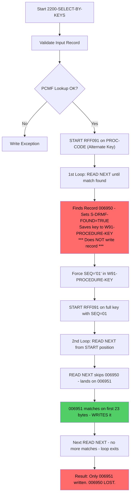

# MFR191 Investigation: Missing Second Record in RFF092D Output

## Problem Statement

**Input (YIRFF091)** has **two records** for procedure code `Q2042`:

| Record# | REC-TYPE | PROC-CODE | PROC-TYPE | FROM-DATE  | THRU-DATE  | SEQ |
|---------|----------|-----------|-----------|------------|------------|-----|
| 006950  | PI       | Q2042     | M         | 2019010101 | 20250630   | 01  |
| 006951  | PI       | Q2042     | M         | 2025070101 | 20691231   | 01  |

**Output (RFF092D)** has **only 1 record** (record 006950). Record 006951 is missing.

---

## Root Cause

The bug is at **lines 739-758** in the second `START/READ NEXT` loop.

After the first `PERFORM UNTIL` loop (lines 712-738) finds the **first matching record** and sets `S-DRMF-FOUND = TRUE` the code enters a second loop at line 747:

```cobol
IF S-DRMF-FOUND THEN
   MOVE '01' TO W91-PROCEDURE-KEY(24:2)          *> Force SEQ to '01'
   MOVE W91-PROCEDURE-KEY TO R91-PROCEDURE-KEY
   START I-PCMF-DIAG-RNGS-FILE
         KEY IS EQUAL R91-PROCEDURE-KEY
    NOT INVALID
     PERFORM UNTIL W91-PROCEDURE-KEY(1:23)
                   NOT = R91-PROCEDURE-KEY(1:23)
      READ I-PCMF-DIAG-RNGS-FILE
           NEXT RECORD
      END-READ
      IF W91-PROCEDURE-KEY(1:23) =
         R91-PROCEDURE-KEY(1:23)
         ADD +1 TO A-DRNGS-CNT
         ADD +1 TO A-TXNS-REC-OUT-CNTI
         PERFORM 5000-CREATE-TRAN-RECORD
      END-IF
     END-PERFORM
   END-START
END-IF
```

### What Goes Wrong Step-by-Step

1. First loop (lines 712-738) reads records sequentially. It finds **record 006950** (FROM-DATE=2019010101 SEQ=01) and sets `S-DRMF-FOUND = TRUE`. It also saves the full key into `W91-PROCEDURE-KEY`.

2. At line 740 the code **overwrites positions 24-25** of `W91-PROCEDURE-KEY` with `'01'` (forcing SEQ-NO to 01).

3. At line 741-743 it repositions the VSAM file pointer using `START KEY IS EQUAL R91-PROCEDURE-KEY` with this forced-SEQ key.

4. The second loop (lines 747-758) then reads forward comparing `W91-PROCEDURE-KEY(1:23)` to `R91-PROCEDURE-KEY(1:23)` (the first 23 bytes minus the SEQ portion).

5. **Here is the critical problem**: Both input records 006950 and 006951 share `SEQ-NO = '01'`. The `START` at line 742 repositions to the record matching the full 25-byte key (including SEQ=01). The `READ NEXT` at line 749 immediately advances **past** the record that was just START-positioned and reads the **next** record (006951).

6. The `IF` at line 752 checks if `W91-PROCEDURE-KEY(1:23) = R91-PROCEDURE-KEY(1:23)`. Since record 006951 shares the same first 23 bytes it matches and gets written via `5000-CREATE-TRAN-RECORD`.

7. The next `READ NEXT` moves past 006951 and the 23-byte comparison fails so the loop exits.

**Net result**: The first matching record (006950) was consumed by the first loop (lines 712-738) **but never written** because `5000-CREATE-TRAN-RECORD` is only called in the second loop. The first loop only sets `S-DRMF-FOUND` and saves the key. So **record 006950 never gets output**.

---

## Flow Diagram



---

## Fix Recommendation

The first loop should **also write** the matched record before entering the second loop. Add a `PERFORM 5000-CREATE-TRAN-RECORD` right after `S-DRMF-FOUND` is set to TRUE (after line 736):

```cobol
*> After line 736: MOVE R91-PROCEDURE-KEY TO W91-PROCEDURE-KEY
*> ADD the following lines:
                        ADD +1 TO A-DRNGS-CNT
                        ADD +1 TO A-TXNS-REC-OUT-CNTI
                        PERFORM 5000-CREATE-TRAN-RECORD
```

This ensures the first matching record is written to both RFF092O and RFF092D before the second loop processes remaining records with the same 23-byte key prefix.

**Impact**: All records sharing the same procedure code base key will now be extracted.

---

## Summary

| Item | Detail |
|------|--------|
| **Program** | MFR191 |
| **Bug Location** | Lines 712-760 in paragraph 2200-SELECT-BY-KEYS |
| **Root Cause** | First PERFORM UNTIL loop finds and saves the matching record but never calls 5000-CREATE-TRAN-RECORD to write it |
| **Missing Record** | 006950 (FROM-DATE=2019010101 THRU-DATE=20250630) |
| **Written Record** | 006951 (FROM-DATE=2025070101 THRU-DATE=20691231) |
| **Fix** | Add PERFORM 5000-CREATE-TRAN-RECORD after S-DRMF-FOUND is set in the first loop |
